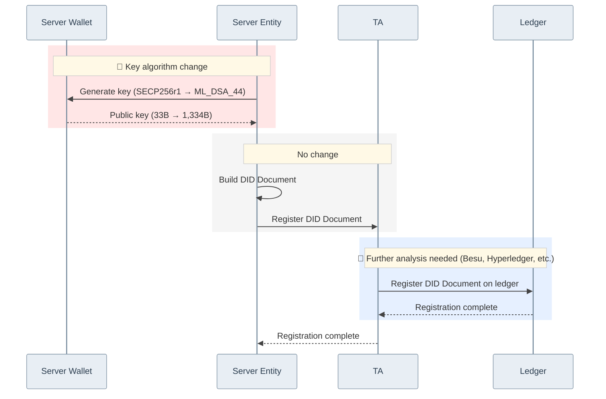

# DID Document Creation Sequence: Secp256r1 → ML-DSA-44

> The sequence below assumes the PQC modules are applied to `did-core-sdk-server`, `did-crypto-sdk-server`, `did-datamodel-sdk-server`, and `did-wallet-sdk-server`.

## Change Summary

| Stage | Changed? | Detail |
|-------|----------|--------|
| 🔴 Key generation · public key | **Changed** | Algorithm change, public key 40.4× larger (33B → 1,334B), key generation ~7× faster |
| DID Doc build · registration | No change | Same flow |
| 🔵 Ledger registration | **Further analysis needed** | TA → Ledger DID Document registration |
