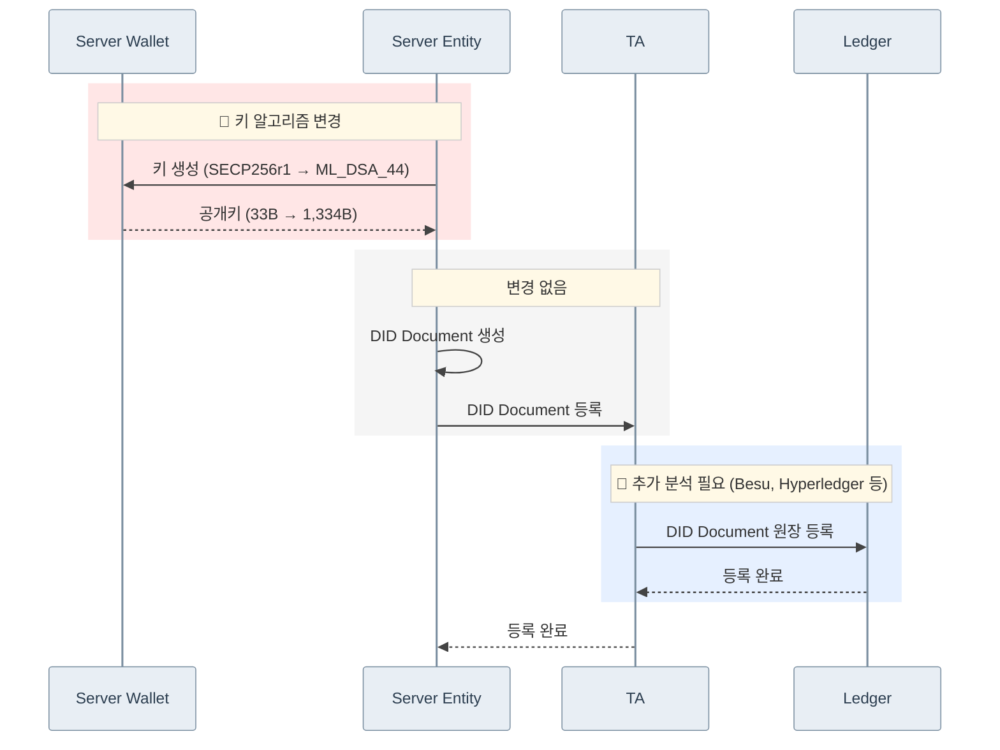

# DID Document 생성 시퀀스: Secp256r1 → ML-DSA-44

> 아래 시퀀스는 PQC 모듈이 적용된 `did-core-sdk-server`, `did-crypto-sdk-server`, `did-datamodel-sdk-server`, `did-wallet-sdk-server` 적용된 것을 전제로 합니다.

## 변경 요약

| 구간 | 변경 여부 | 상세 |
|------|-----------|------|
| 🔴 키 생성 · 공개키 | **변경** | 키 알고리즘 변경, 공개키 40.4x 증가 (33B → 1,334B), 키 생성 ~7배 빠름 |
| DID Doc 생성 · 등록 | 변경 없음 | 동일 흐름 |
| 🔵 원장 등록 | **추가 분석 필요** | TA → Ledger DID Document 등록 |
