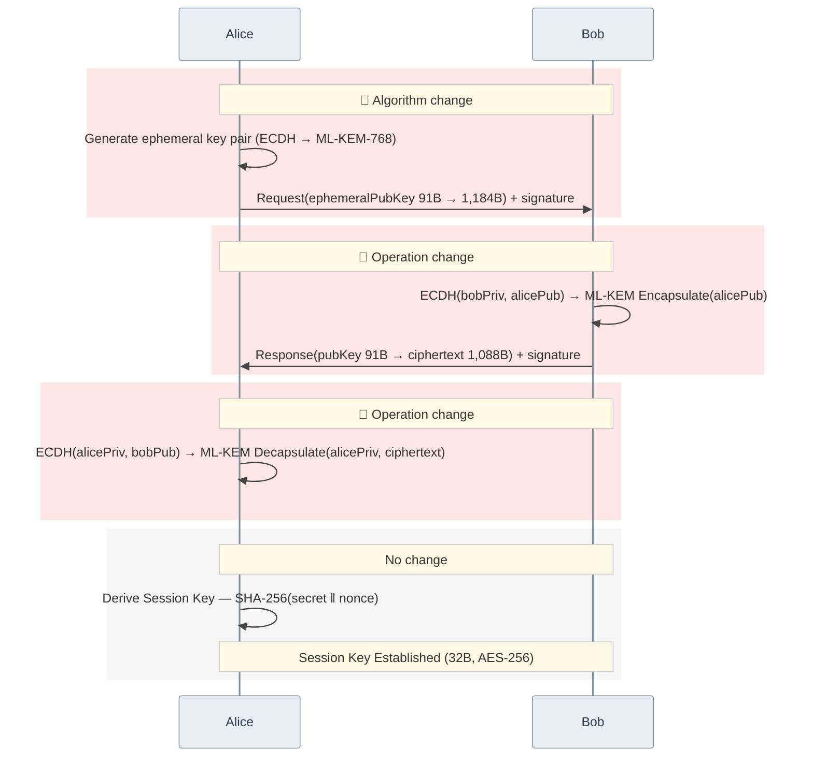

# Key Agreement Sequence: ECDH → ML-KEM-768

> The sequence below assumes the PQC modules are applied to `did-core-sdk-server`, `did-crypto-sdk-server`, `did-datamodel-sdk-server`, and `did-wallet-sdk-server`.

## Change Summary

| Stage | Changed? | Detail |
|-------|----------|--------|
| 🔴 Request | **Changed** | ephemeralPubKey 91B → 1,184B |
| 🔴 Response | **Changed** | ECDH → ML-KEM encapsulate, response 91B → 1,088B |
| 🔴 Key Derive | **Changed** | ECDH → ML-KEM decapsulate |
| Session Key derivation | No change | Same method; protocol ~2.6× faster overall |
