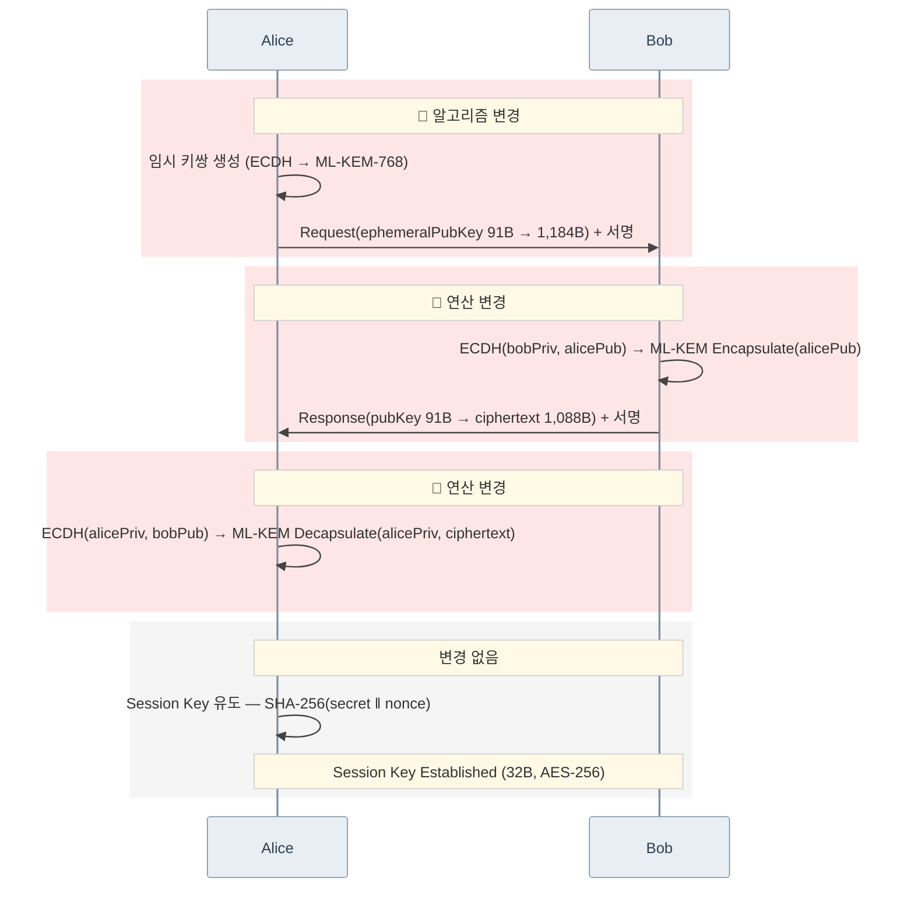

# Key Agreement 시퀀스: ECDH → ML-KEM-768

> 아래 시퀀스는 PQC 모듈이 적용된 `did-core-sdk-server`, `did-crypto-sdk-server`, `did-datamodel-sdk-server`, `did-wallet-sdk-server` 적용된 것을 전제로 합니다.

## 변경 요약

| 구간 | 변경 여부 | 상세 |
|------|-----------|------|
| 🔴 Request | **변경** | ephemeralPubKey 91B → 1,184B |
| 🔴 Response | **변경** | ECDH → ML-KEM encapsulate, 응답 91B → 1,088B |
| 🔴 Key Derive | **변경** | ECDH → ML-KEM decapsulate |
| Session Key 유도 | 변경 없음 | 동일 방식, 프로토콜 2.6배 빠름 |
