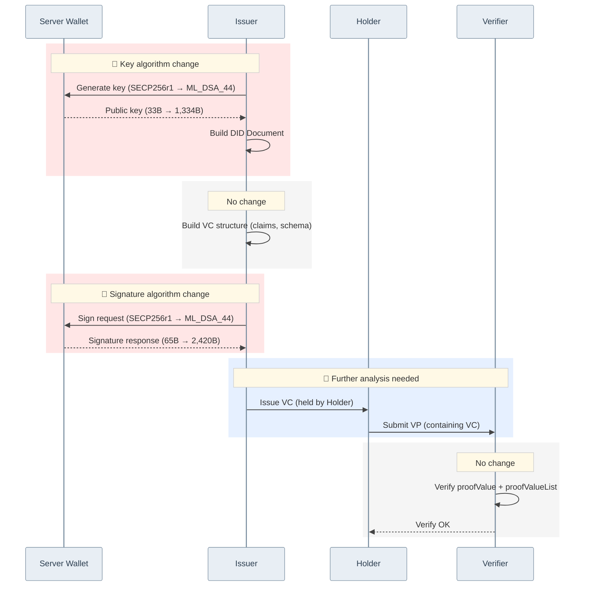

# VC Issue/Verify Sequence: Secp256r1 → ML-DSA-44

> The sequence below assumes the PQC modules are applied to `did-core-sdk-server`, `did-crypto-sdk-server`, `did-datamodel-sdk-server`, and `did-wallet-sdk-server`.

## Change Summary

| Stage | Changed? | Detail |
|-------|----------|--------|
| 🔴 Key algorithm change | **Changed** | Public key 40.4× larger (33B → 1,334B) |
| VC structure build | No change | claims, schema unchanged |
| 🔴 Signature algorithm change | **Changed** | Signature 37.2× larger (65B → 2,420B), signing ~4× slower |
| 🔵 VC issuance · VP submission | **Further analysis needed** | Holder storage, VP composition flow |
| VC verification | No change | Same flow |
