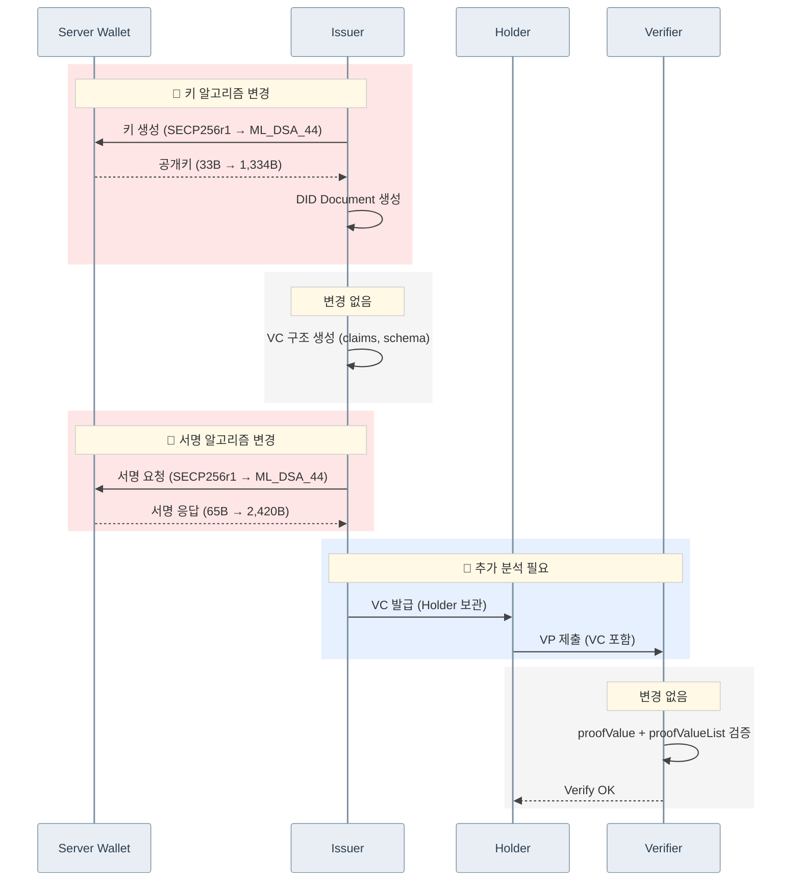

# VC Issue/Verify 시퀀스: Secp256r1 → ML-DSA-44

> 아래 시퀀스는 PQC 모듈이 적용된 `did-core-sdk-server`, `did-crypto-sdk-server`, `did-datamodel-sdk-server`, `did-wallet-sdk-server` 적용된 것을 전제로 합니다.

## 변경 요약

| 구간 | 변경 여부 | 상세 |
|------|-----------|------|
| 🔴 키 알고리즘 변경 | **변경** | 공개키 40.4x 증가 (33B → 1,334B) |
| VC 구조 생성 | 변경 없음 | claims, schema 동일 |
| 🔴 서명 알고리즘 변경 | **변경** | 서명 37.2x 증가 (65B → 2,420B), 서명 시간 ~4x 느림 |
| 🔵 VC 발급 · VP 제출 | **추가 분석 필요** | Holder 보관, VP 구성 흐름 |
| VC 검증 | 변경 없음 | 동일 흐름 |
