---
puppeteer:
    pdf:
        format: A4
        displayHeaderFooter: true
        landscape: false
        scale: 0.8
        margin:
            top: 1.2cm
            right: 1cm
            bottom: 1cm
            left: 1cm
    image:
        quality: 100
        fullPage: false
---

Open DID TA Admin Console Guide
==

- Date: 2025-04-24
- Version: v1.0.1

Revision History
==
| Version | Date       | Changes                                                |
| ------- | ---------- | ------------------------------------------------------ |
| v1.0.0  | 2025-03-31 | Initial version                                        |
| v1.0.1  | 2025-04-24 | Updated formal registration procedure in `3.1.1. TA Registration` |
|         |            | Removed `3.2. Entity Registration` section            |
|         |            | Modified `3.2. Entity Details` section                |
|         |            | Added `3.1.15. User Management` section               |
|         |            | Added `3.1.16. User List` section                     |
|         |            | Added `3.1.17. App List` section                      |
|         |            | Added `3.1.18. Wallet List` section                   |

Table of Contents
==

- [Open DID TA Admin Console Guide](#open-did-ta-admin-console-guide)
- [Revision History](#revision-history)
- [Table of Contents](#table-of-contents)
- [1. Introduction](#1-introduction)
  - [1.1. Overview](#11-overview)
  - [1.2. Admin Console Definition](#12-admin-console-definition)
- [2. Basic Manual](#2-basic-manual)
  - [2.1. Login](#21-login)
  - [2.2. Main Screen Configuration](#22-main-screen-configuration)
  - [2.3. Menu Configuration](#23-menu-configuration)
    - [2.3.1. TA Unregistered State](#231-ta-unregistered-state)
    - [2.3.2. TA Registered State](#232-ta-registered-state)
  - [2.4. Password Change Management](#24-password-change-management)
- [3. Feature-Specific Detailed Manual](#3-feature-specific-detailed-manual)
  - [3.1. TA Management](#31-ta-management)
    - [3.1.1. TA Registration](#311-ta-registration)
    - [3.1.2. Registered TA Management](#312-registered-ta-management)
  - [3.2. Entity Management](#32-entity-management)
    - [3.2.1. Entity List Inquiry](#321-entity-list-inquiry)
    - [3.2.2. Entity Details](#322-entity-details)
  - [3.3. KYC Settings](#33-kyc-settings)
  - [3.4. API Settings](#34-api-settings)
  - [3.5. Expiration Settings](#35-expiration-settings)
  - [3.6. Key Exchange Policy](#36-key-exchange-policy)
  - [3.7. Notification Provider Settings](#37-notification-provider-settings)
  - [3.8. Email Server Settings](#38-email-server-settings)
  - [3.9. Email Template Settings](#39-email-template-settings)
  - [3.10. Push Server Settings](#310-push-server-settings)
  - [3.11. List Provider Settings](#311-list-provider-settings)
  - [3.12. Allowed CA Management](#312-allowed-ca-management)
    - [3.12.1. Allowed CA List Inquiry](#3121-allowed-ca-list-inquiry)
    - [3.12.2. Allowed CA Registration](#3122-allowed-ca-registration)
    - [3.12.3. Allowed CA Details](#3123-allowed-ca-details)
    - [3.12.4. Allowed CA Modification](#3124-allowed-ca-modification)
  - [3.13. VC Schema Management](#313-vc-schema-management)
    - [3.13.1 VC Schema List Inquiry](#3131-vc-schema-list-inquiry)
    - [3.13.2 VC Schema Details](#3132-vc-schema-details)
  - [3.14. VC Plan Management](#314-vc-plan-management)
    - [3.14.1 VC Plan List Inquiry](#3141-vc-plan-list-inquiry)
    - [3.14.2 VC Plan Details](#3142-vc-plan-details)
  - [3.15. Credential Schema Management](#315-credential-schema-management)
    - [3.15.1 Credential Schema List Inquiry](#3151-credential-schema-list-inquiry)
    - [3.15.2 Credential Schema Details](#3152-credential-schema-details)
  - [3.16. Credential Definition Management](#316-credential-definition-management)
    - [3.16.1 Credential Definition List Inquiry](#3161-credential-definition-list-inquiry)
    - [3.16.2 Credential Definition Details](#3162-credential-definition-details)
  - [3.17. User Management](#317-user-management)
  - [3.18. User List](#318-user-list)
    - [3.18.1. User List Inquiry](#3181-user-list-inquiry)
    - [3.18.2. User Details Information](#3182-user-details-information)
  - [3.19. App List](#319-app-list)
    - [3.19.1. App List Inquiry](#3191-app-list-inquiry)
    - [3.19.2. App Details Information](#3192-app-details-information)
  - [3.20. Wallet List](#320-wallet-list)
    - [3.20.1. Wallet List Inquiry](#3201-wallet-list-inquiry)
    - [3.20.2. Wallet Details Information](#3202-wallet-details-information)
  - [3.21. Admin Management](#321-admin-management)
    - [3.21.1. Admin List Inquiry](#3211-admin-list-inquiry)
    - [3.21.2. Admin Registration](#3212-admin-registration)

# 1. Introduction

## 1.1. Overview

This document guides the installation and operation of the Open DID TA Admin Console.  
It is structured to provide step-by-step explanations from basic usage to detailed manuals for each function, enabling users to efficiently utilize the console.

Please refer to the [Open DID Installation Guide] for the complete installation guide of OpenDID.

<br/>

## 1.2. Admin Console Definition

The TA Admin Console is a web-based administrator tool for managing TA servers within the Open DID system.  

In the current version, the TA server performs not only its standalone functions but also the roles of Notification Provider and List Provider.  
Therefore, settings for these providers can also be managed together.

The main items that can be configured in the TA Admin Console are as follows:
- TA Provider Settings
  - TA server registration
  - Entity server registration
  - Transaction validity time and key exchange policy settings
- Notification Provider Settings
  - Email server settings
  - Push server settings
- List Provider Settings
  - Allowed CA list settings
  - VC Schema list management
  - VC plan list management
  - Credential Schema list management
  - Credential Definition list management

<br/>

# 2. Basic Manual

This chapter guides the basic usage of the Open DID TA Admin Console.

## 2.1. Login

To access the Admin Console, follow these steps:

1. Open a web browser and access the TA Admin Console URL.

   ```
   http://<ta_domain>:<port>
   ```

2. Enter the administrator account email and password on the login screen.
   - Default administrator account: <admin@opendid.omnione.net>
   - Initial password: password (change required upon first login)

3. Click the 'Login' button.

> **Note**:  
> For security reasons, password change is required upon first login.

<br/>

## 2.2. Main Screen Configuration

The main screen displayed after login consists of the following elements:


| No. | Area              | Description                                                                                                            |
| --- | ----------------- | ---------------------------------------------------------------------------------------------------------------------- |
| 1   | Header Area       | You can navigate to the password change screen through the `SETTING` button in the upper right corner.                |
| 2   | Content Area      | The title and corresponding content of the currently selected menu are displayed. Screen content changes by each menu. |
| 3   | Side Menu         | Located on the left side of the screen, main menu items are arranged vertically. Selected menus are highlighted, and submenus expand when necessary. |
| 4   | User Info Area    | The email address of the currently logged-in administrator and the 'Sign Out' button are displayed.                   |

<br/>

## 2.3. Menu Configuration

The sidebar menu of the TA Admin Console **differs in screen configuration depending on the TA registration status**.

<br/>

### 2.3.1. TA Unregistered State

In the initial state where the TA server has not yet been registered,  
only the `TA Registration` item is displayed in the menu.

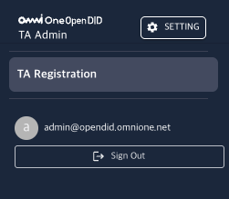

### 2.3.2. TA Registered State

Once TA registration is complete, all management functions are activated, and the sidebar menu is configured as follows:

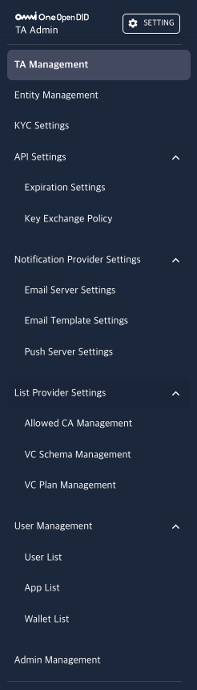

| No. | Menu Name                          | Depth | Description                                                                            |
| --- | ---------------------------------- | ----- | -------------------------------------------------------------------------------------- |
| 1   | **TA Management**                  | 1     | Menu for checking and managing basic TA server information (DID, URL, etc.).          |
| 2   | **Entity Management**              | 1     | Menu for registering and managing Entity servers such as Issuer, Verifier, etc.       |
| 3   | **KYC Settings**                   | 1     | Menu for managing KYC-related settings.                                               |
| 4   | **API Settings**                   | 1     | Parent menu for setting API operation policies.                                       |
| 5   | **Sender**                   | Sender email address.                                                         |
| 6   | **Enable STARTTLS**          | Whether to use STARTTLS secure transmission.                                 |
| 7   | **Enable SSL**               | Whether to use SSL secure transmission.                                      |
| 8   | **Connection Timeout (sec)** | Time limit for connection attempts.                                          |
| 9   | **Read Timeout (sec)**       | Maximum time to wait for response.                                           |
| 10  | **Write Timeout (sec)**      | Time limit for request transmission.                                         |
| 11  | **Turn Off SSL Check**       | Can disable SSL verification for testing purposes. (Not recommended for production) |
| 12  | **REGISTER Button**          | Save entered email configuration information.                                |
| 13  | **RESET Button**             | Initialize all input fields.                                                 |
| 14  | **TEST Button**              | Only works when all settings are properly entered. <br/>When clicked, `Send Test Email` popup appears, allowing you to directly enter email address to receive test mail. <br/>Test mail includes simple confirmation message. |

---
> **Note:**  
> `Enable STARTTLS` and `Enable SSL` **cannot be activated simultaneously.**      
> Both are methods for secure connection during email transmission, but **STARTTLS upgrades existing connection to encryption**,  
> while **SSL uses encrypted connection from the beginning**, so only one should be selected according to email server settings to avoid conflicts.
---

<br/>

## 3.9. Email Template Settings

`Email Template Settings` is a menu where you can register and modify email templates sent from TA server in HTML format.  
Each template can be managed individually by separating tabs according to sending purpose.

TA sends emails to users in the following two cases:

- When issuing VC, sending VC issuance request email to users
- During DID recovery, sending DID recovery request email to users

Email templates are in a format that includes **keywords** that can be dynamically replaced in fixed email content.   
When external systems deliver values corresponding to each keyword along with template type,   
TA replaces those values with keywords to generate and send final emails.

This approach was introduced to reduce server load and   
enable more efficient email sending processing when email content is long or   
contains a lot of dynamically changing information.

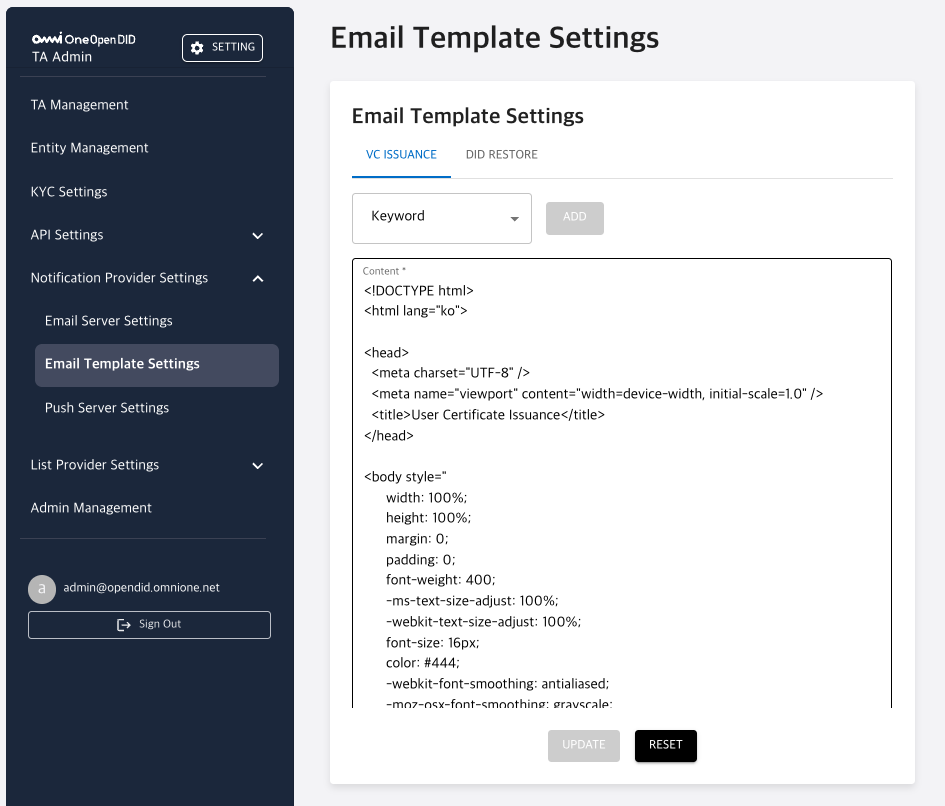

| No. | Item            | Description                                                                    |
| --- | --------------- | ------------------------------------------------------------------------------ |
| 1   | **Tab Selection** | Manage templates separately according to sending scenarios like VC issuance, DID recovery, etc. |
| 2   | **Keyword**     | Select keywords to add within template.                                        |
| 3   | **Add Button**  | Add keyword to where keyboard pointer is located in Content.                   |
| 4   | **Content**     | Area to enter HTML content of email body.                                     |
| 5   | **UPDATE Button** | Save template.                                                               |
| 6   | **RESET Button** | Return changed content to initial state.                                     |

<br/>

🔸 Available Keyword List

Below is a table organizing keywords available in each template and the meaning of each keyword.  
At sending time, keywords are automatically replaced with values delivered from external sources and inserted into email body.

| Keyword           | Description                                       | Usage Scenario    |
| ----------------- | ------------------------------------------------- | ----------------- |
| `{issuerName}`    | Name of Issuer issuing VC.                       | VC Issuance       |
| `{qrImg}`         | QR code image that user needs to scan.           | VC Issuance, DID Recovery |
| `{vcSchemaName}`  | Name or schema name of VC being issued.          | VC Issuance       |
| `{qrExpiredDate}` | Date and time when QR code expires.              | VC Issuance       |

---
> **Note:** All **keywords** available in each scenario must be included in template body for saving to be possible.  
> For example, in VC issuance scenario, all of `{issuerName}`, `{qrImg}`, `{vcSchemaName}`, `{qrExpiredDate}` must be included.
---

<br/>

## 3.10. Push Server Settings

`Push Server Settings` is a menu for registering FCM server configuration files for mobile app push notifications.  
In this menu, you can upload **Google Firebase Cloud Messaging (FCM)** configuration file (JSON) to  
configure integration with push server.

Notifications sent through Push server are used **when requesting VC issuance to users**.

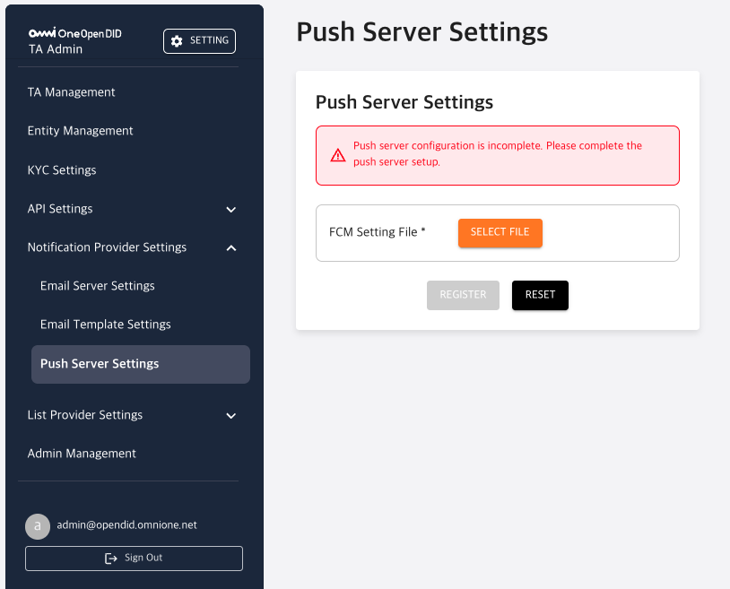

| No. | Item                 | Description                                                                                                                                                       |
| --- | -------------------- | ----------------------------------------------------------------------------------------------------------------------------------------------------------------- |
| 1   | **Warning Message**  | When configuration is not complete, warning message is displayed in **red box**. <br/>When configuration is complete, message indicating completion is displayed in **green box**. |
| 2   | **SELECT FILE Button** | Upload configuration JSON file issued from Firebase.                                                                                                             |
| 3   | **REGISTER Button**  | Save push server information based on uploaded configuration file.                                                                                               |
| 4   | **RESET Button**     | Initialize entered content.                                                                                                                                      |

<br/>

## 3.11. List Provider Settings

In the Open DID system, the TA server also performs the role of List Provider.  
List Provider provides list information necessary for each Entity participating in Open DID to perform their roles.  
For example, schema lists for VC issuance, trusted CA lists, VC issuance plans, etc. correspond to this.

`List Provider Settings` is a menu for managing these lists,  
where you can register and modify allowed CA lists, VC schema lists, VC issuance plans, etc.

Sub-menus are as follows:

- [3.12. Allowed CA Management](#312-allowed-ca-management)
- [3.13. VC Schema Management](#313-vc-schema-management)
- [3.14. VC Plan Management](#314-vc-plan-management)

<br/>

## 3.12. Allowed CA Management

Allowed CA Management is a function for managing the list of CAs allowed for use by specific Wallets.  
Wallets are restricted to use VCs only from CAs included in this list.  
That is, the allowed CA list is used as a criterion for determining **trust in CAs that issued VCs**.

TA can register and modify allowed CA lists by Wallet Identifier, and these lists are used by Wallet SDK.

<br/>

### 3.12.1. Allowed CA List Inquiry

When entering the `Allowed CA Management` menu, the allowed CA list by Wallet Identifier is displayed in table format.  
You can manage the list of CAs that each Wallet can trust through register, modify, and delete functions.

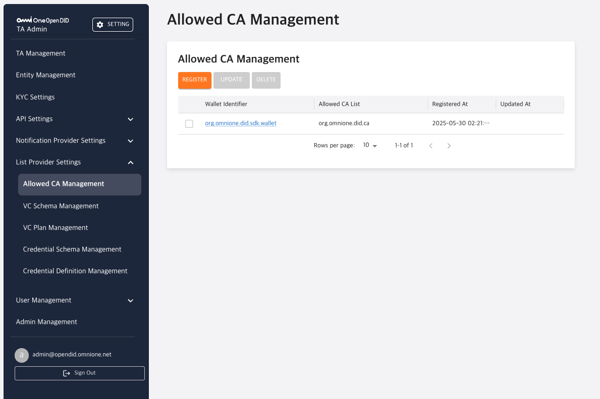

| No. | Item                       | Description                                                                 |
| --- | -------------------------- | --------------------------------------------------------------------------- |
| 1   | **REGISTER Button**        | Register new Wallet Identifier and allowed CA list.                        |
| 2   | **UPDATE Button**          | Modify allowed CA list of selected Wallet Identifier.                      |
| 3   | **DELETE Button**          | Delete selected Wallet Identifier item.                                    |
| 4   | **Wallet Identifier**      | Identifier of target Wallet where CA allow list will be applied.           |
| 5   | **Allowed CA List**        | List of CA DIDs that the Wallet can trust.                                 |
| 6   | **Registered At**          | Registration time.                                                          |
| 7   | **Updated At**             | Last modification time.                                                     |

---
> **Note:** Default Wallet SDK and CA identifiers provided by Open DID are  
> automatically registered as follows during initial installation:   
> - **Wallet Identifier**: `org.omnione.did.sdk.wallet`  
> - **CA**: `org.omnione.did.ca`
---

<br/>

### 3.12.2. Allowed CA Registration

When you click the **REGISTER** button on the `Allowed CA Management` screen, you move to the registration screen below

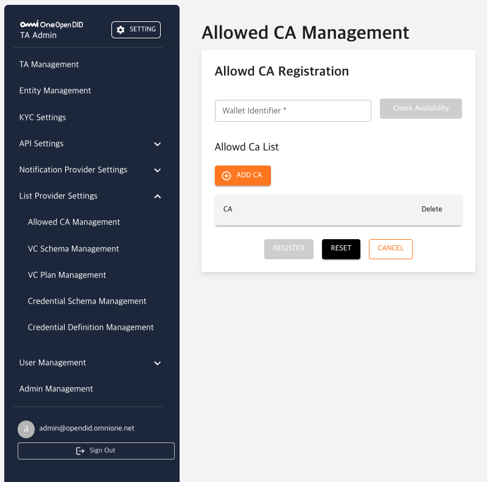

| No. | Item                   | Description                                                           |
| --- | ---------------------- | --------------------------------------------------------------------- |
| 1   | **Wallet Identifier**  | Target Wallet identifier.                                             |
| 2   | **Check Availability** | Check for duplicate Wallet Identifier.                               |
| 3   | **ADD CA Button**      | When clicked, new input row is added to CA list table below.         |
| 4   | **Delete Icon**        | Displayed on right side of each CA input row, can delete that row.   |
| 5   | **REGISTER Button**    | Register entered content.                                             |
| 6   | **RESET Button**       | Initialize entered content.                                           |
| 7   | **CANCEL Button**      | Cancel registration and return to previous page.                     |

<br/>

### 3.12.3. Allowed CA Details

When you click Wallet Identifier in the `Allowed CA Management` list, you move to the detail screen below.

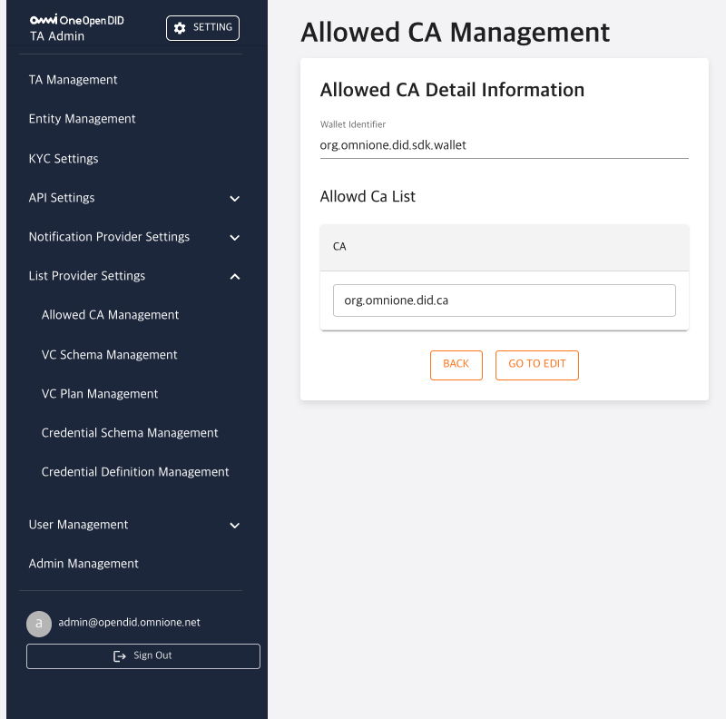

| No. | Item                  | Description                                                 |
| --- | --------------------- | ----------------------------------------------------------- |
| 1   | **Wallet Identifier** | Identifier of Wallet currently viewing detailed information. |
| 2   | **Allowed CA List**   | List of CAs allowed for that Wallet.                       |
| 3   | **BACK Button**       | Return to list screen.                                      |
| 4   | **GO TO EDIT Button** | Move to edit screen where you can modify that item.        |

<br/>

### 3.12.4. Allowed CA Modification

When you **click GO TO EDIT button on detail page of `Allowed CA Management`** or  
**click UPDATE button on list page**, you move to the modification screen below.  

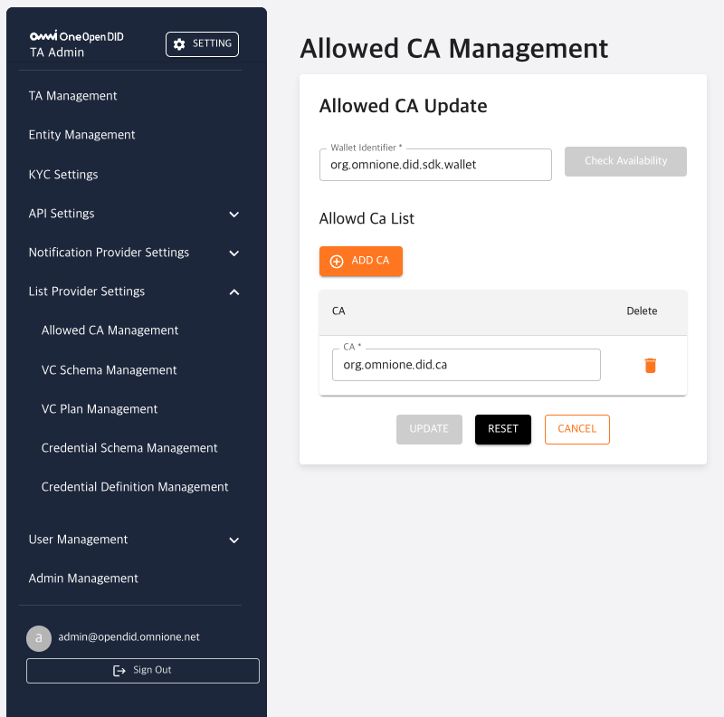

| No. | Item                   | Description                                             |
| --- | ---------------------- | ------------------------------------------------------- |
| 1   | **Wallet Identifier**  | Identifier of target Wallet to modify.                 |
| 2   | **Check Availability** | Re-check for duplicate Wallet Identifier.              |
| 3   | **ADD CA Button**      | Add CA identifier to allow.                             |
| 4   | **Delete Icon**        | Delete CA item in that row.                             |
| 5   | **UPDATE Button**      | Save modified content.                                  |
| 6   | **RESET Button**       | Initialize entered content.                             |
| 7   | **CANCEL Button**      | Cancel modification and return to previous page.       |

<br/>

## 3.13. VC Schema Management

When entering the `VC Schema Management` menu, the list of VC (Verifiable Credential) schemas available for issuance in the Open DID system is displayed in table format.  

VC schemas define the structure and content of each Credential,  
and are referenced when user's Wallet verifies the validity of issued VCs.

After VC Schema is created on Issuer Admin page,  
it is sent to TA Admin server for final registration.

VC Schema is registered on TA server, and administrators can view this list or check detailed content.

<br/>

### 3.13.1 VC Schema List Inquiry

When entering `List Provider Settings > VC Schema Management` menu, the list of registered VC schemas is displayed in table format.

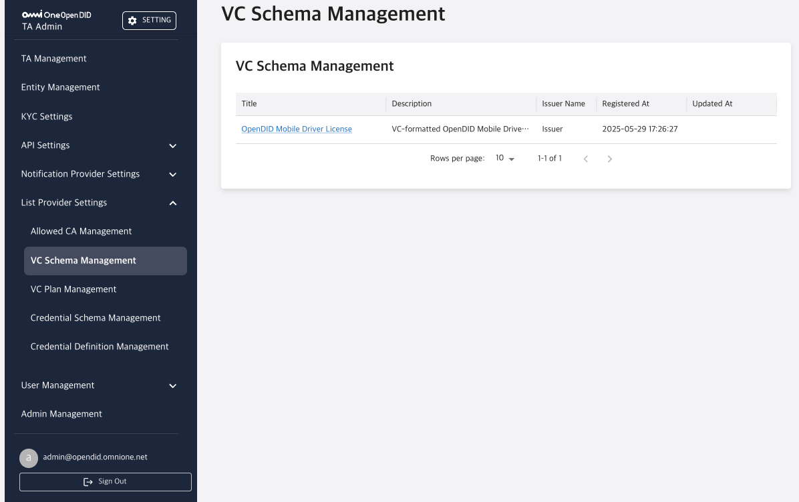

| No. | Item              | Description                                                          |
| --- | ----------------- | -------------------------------------------------------------------- |
| 1   | **Title**         | VC schema title. Click to go to detail information page.            |
| 2   | **Description**   | Brief description of VC schema.                                      |
| 3   | **Issuer Name**   | Name of Issuer that issues this schema.                             |
| 4   | **Registered At** | Date and time when VC schema was first registered.                  |
| 5   | **Updated At**    | Date and time when VC schema was last modified.                     |

<br/>

### 3.13.2 VC Schema Details

When you click VC schema title in `VC Schema list`, you move to screen where you can check detailed information as below.

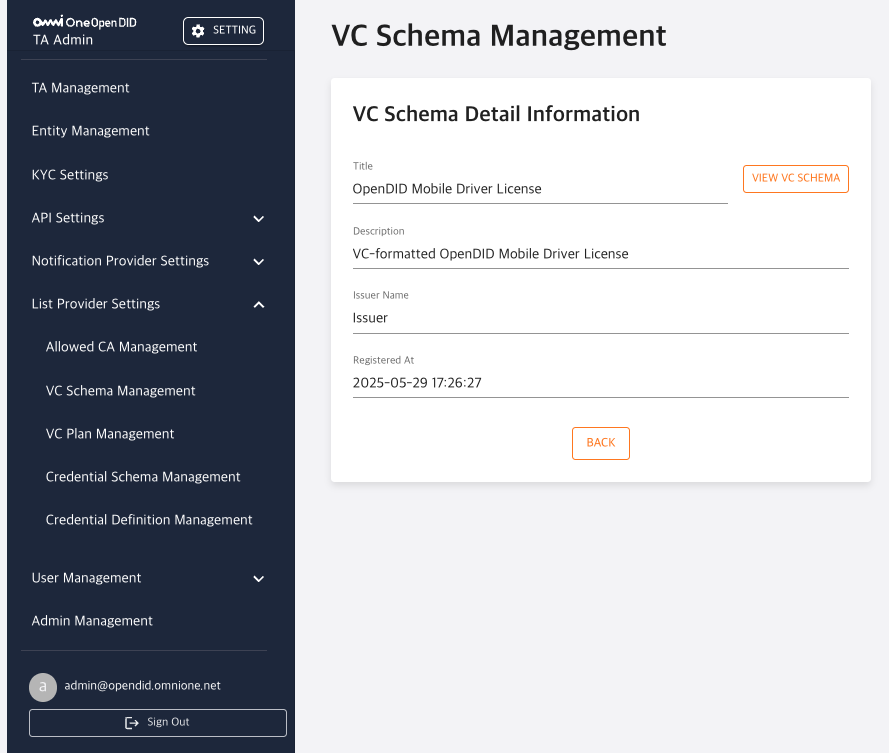

| No. | Item                        | Description                                                                   |
| --- | --------------------------- | ----------------------------------------------------------------------------- |
| 1   | **Title**                   | VC schema title.                                                              |
| 2   | **Description**             | Description of this schema.                                                   |
| 3   | **Issuer Name**             | Name of Issuer that registered this VC schema.                               |
| 4   | **Registered At**           | Date and time when VC schema was first registered.                           |
| 5   | **VIEW VC SCHEMA Button**   | Button to check actual JSON structure of this VC schema. Displayed in popup. |
| 6   | **BACK Button**             | Return to list screen.                                                        |

<br/>

## 3.14. VC Plan Management

In the `VC Plan Management` menu, you can check the list of VC Plans available for issuance in the Open DID system.

VC Plan is a configuration that defines policies for how VCs will actually be issued for VC schemas created by Issuer.  
For example, policies such as whether issuance can be started directly from app (`allowUserInit`), whether Issuer can start issuance through QR code or push message (`allowIssuerInit`) are included.

VC Plan is created on Issuer Admin server, and created Plan is sent to TA Admin server for registration.  
Externally, knowing only `vcPlanId` allows checking what VC is issued in what way.

---
> **Note:** VC Plan is utilized in the following ways:
>
> - When user requests VC issuance from Issuer's existing issuance system (e.g., website),  
>   that site can deliver `vcPlanId` to TA server to query related issuance policies and start issuance procedure based on this.
>
> - User app queries VC Plan list from TA server,  
>   and when user selects desired VC, issuance procedure starts according to that Plan.
---

<br/>

### 3.14.1 VC Plan List Inquiry

When entering `VC Plan Management` menu, the list of registered VC Plans is displayed as below.  
Clicking each VC Plan ID moves to screen where you can check detailed information.

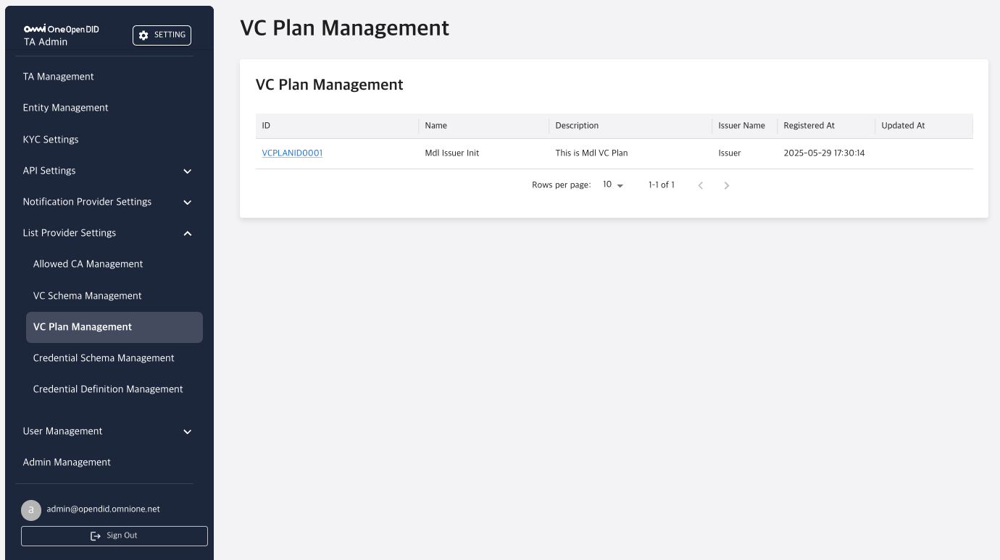

| No. | Item              | Description                                                                 |
| --- | ----------------- | ----------------------------------------------------------------------- |
| 1   | **ID**            | VC Plan unique identifier. Click to go to detail information screen.   |
| 2   | **Name**          | VC Plan name.                                                           |
| 3   | **Description**   | Description of VC Plan.                                                 |
| 4   | **Issuer Name**   | Name of Issuer that created this VC Plan.                              |
| 5   | **Registered At** | Initial registration time.                                              |
| 6   | **Updated At**    | Last modification time.                                                 |

<br/>

### 3.14.2 VC Plan Details

When you click ID in VC Plan list, you move to detail information screen of that VC Plan.

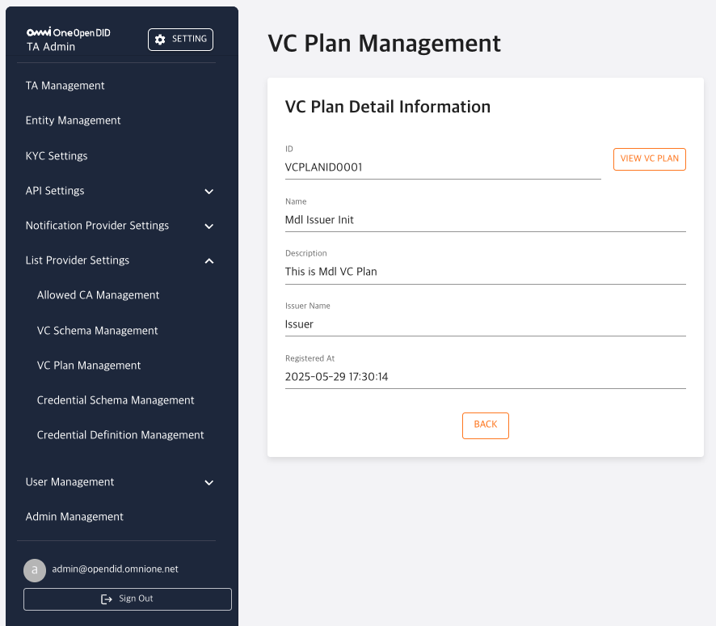

| No. | Item                  | Description                                                  |
| --- | --------------------- | ------------------------------------------------------------ |
| 1   | **ID**                | VC Plan unique identifier.                                   |
| 2   | **VIEW VC PLAN Button** | Check VC Plan JSON original text in popup format.         |
| 3   | **Name**              | VC Plan display name.                                        |
| 4   | **Description**       | Brief description of VC Plan.                                |
| 5   | **Issuer Name**       | Name of Issuer that created this Plan.                       |
| 6   | **Registered At**     | Registration date and time.                                  |
| 7   | **BACK Button**       | Return to previous screen.                                   |

<br/>

## 3.15. Credential Schema Management

In the `Credential Schema Management` menu, you can check the list of Credential Schemas available for issuance in the Open DID system.  
Credential Schema is a structure that defines claim names, attributes, etc. for issuing VCs using ZKP method,  
and is connected 1:1 with each Credential Definition.

After Credential Schema is created on Issuer Admin page,  
it is sent to TA Admin server for final registration.

Credential Schema is registered on TA server, and administrators can view this list or check detailed content.

<br/>

### 3.15.1 Credential Schema List Inquiry

When entering `List Provider Settings > Credential Schema Management` menu, the list of registered Credential Schemas is displayed in table format.

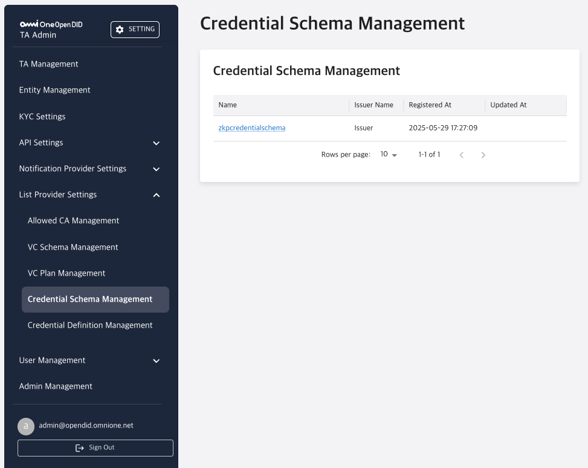

| No. | Item              | Description                                                        |
| --- | ----------------- | ------------------------------------------------------------------ |
| 1   | **Name**          | Credential Schema name. Click to go to detail information.        |
| 2   | **Issuer Name**   | Name of Issuer that registered this schema.                       |
| 3   | **Registered At** | Initial registration time.                                         |
| 4   | **Updated At**    | Last modification time. (Empty if none)                           |

<br/>

### 3.15.2 Credential Schema Details

When you click name (Name) in Credential Schema list, you move to detail information screen.

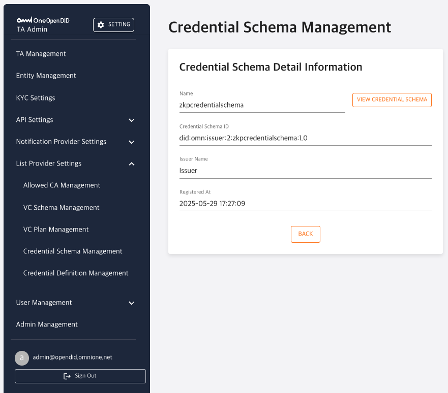

| No. | Item                            | Description                                                                          |
| --- | ------------------------------- | ------------------------------------------------------------------------------------ |
| 1   | **Name**                        | Credential Schema name.                                                              |
| 2   | **Credential Schema ID**        | Unique identifier (DID format) of this schema.                                      |
| 3   | **Issuer Name**                 | Name of Issuer that registered this Credential Schema.                              |
| 4   | **Registered At**               | Date and time when Credential Schema was first registered.                          |
| 5   | **VIEW CREDENTIAL SCHEMA Button** | Check Credential Schema JSON original text in popup format.                       |
| 6   | **BACK Button**                 | Return to list screen.                                                               |

---

## 3.16. Credential Definition Management

In the `Credential Definition Management` menu, you can check the list of registered Credential Definitions.

Credential Definition is a definition for actually issuing VCs using ZKP method based on Credential Schema.  
Credential Definition has 1:1 relationship with each Credential Schema and includes metadata necessary for Issuer to create VCs.

<br/>

### 3.16.1 Credential Definition List Inquiry

When entering `List Provider Settings > Credential Definition Management` menu, Credential Definition list is displayed.

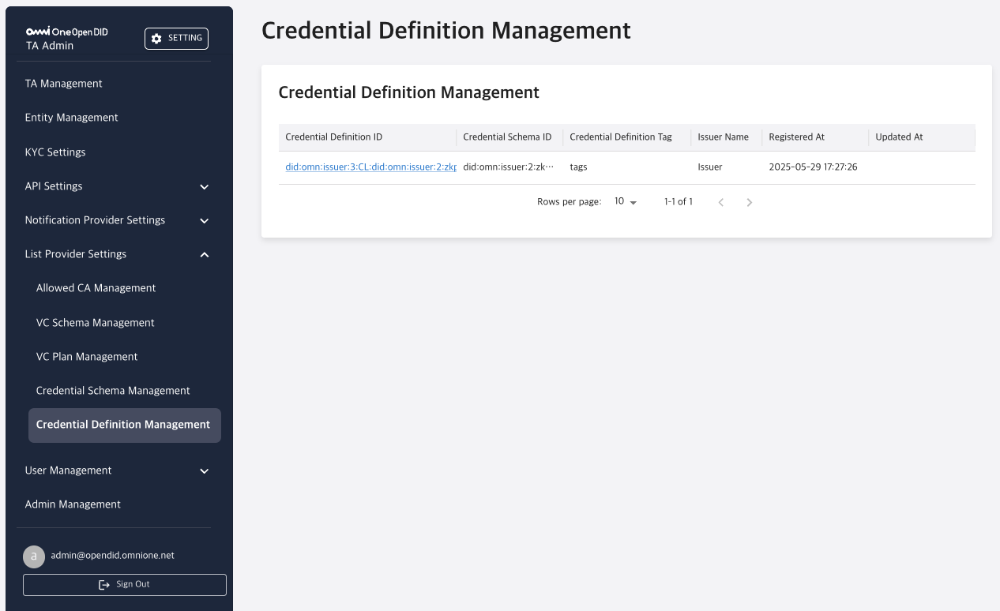

| No. | Item                          | Description                                                                 |
| --- | ----------------------------- | --------------------------------------------------------------------------- |
| 1   | **Credential Definition ID**  | DID identifier of this Credential Definition. Click to go to detail view.  |
| 2   | **Credential Schema ID**      | DID identifier of connected Credential Schema.                             |
| 3   | **Credential Definition Tag** | Tag value assigned to Definition.                                           |
| 4   | **Issuer Name**               | Name of Issuer that registered this Credential Definition.                 |
| 5   | **Registered At**             | Time when Credential Definition was first registered.                       |
| 6   | **Updated At**                | Last modification time. (Empty if none)                                    |

<br/>

### 3.16.2 Credential Definition Details

When you click ID in Credential Definition list, you move to detail information screen.

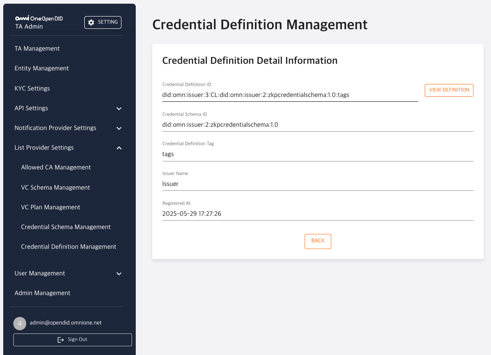

| No. | Item                           | Description                                                                 |
| --- | ------------------------------ | --------------------------------------------------------------------------- |
| 1   | **Credential Definition ID**   | DID format identifier of Credential Definition.                            |
| 2   | **Credential Schema ID**       | DID identifier of connected Credential Schema.                             |
| 3   | **Credential Definition Tag**  | Tag value assigned when creating Definition.                                |
| 4   | **Issuer Name**                | Name of Issuer that registered this Definition.                            |
| 5   | **Registered At**              | Time when Credential Definition was first registered.                       |
| 6   | **VIEW DEFINITION Button**     | Check Credential Definition original text (JSON) in popup.                 |
| 7   | **BACK Button**                | Return to list screen.                                                      |

<br/>

## 3.17. User Management

In the `User Management` menu, you can view information of users registered in the Open DID system.   

Users are registered based on DID, and related information is managed separately in the following three categories:

- User: User identification information (DID, PII, etc.)
- App: User device (App) unique identification information (App ID, Push Token, etc.)
- Wallet: User wallet information (Wallet DID, Wallet ID, etc.)
  
Each item can be viewed individually in separate menus, and sub-menus are as follows:

- [3.18. User List](#318-user-list)
- [3.19. App List](#319-app-list)
- [3.20. Wallet List](#320-wallet-list)

<br/>

## 3.18. User List

`User List` is a menu where you can check DID and PII information of users registered in the Open DID system.

### 3.18.1. User List Inquiry

When entering `User List` menu, the list of registered users is displayed in table format.  
You can search user information by DID or PII criteria through search function.

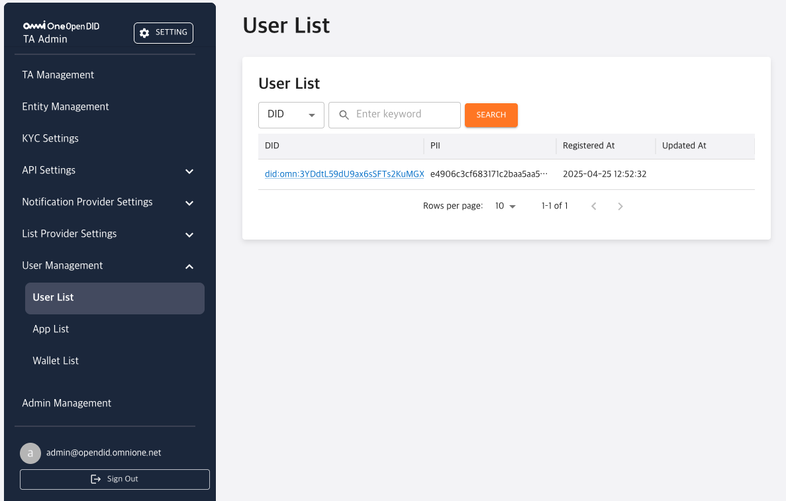

| No. | Item              | Description                                                            |
| --- | ----------------- | ---------------------------------------------------------------------- |
| 1   | **DID**           | User's unique DID identifier. Click to go to detail screen.           |
| 2   | **PII**           | User's PII (Personal Identifiable Info) value.                        |
| 3   | **Registered At** | Date and time when user was first registered.                         |
| 4   | **Updated At**    | Date when user information was last modified.                         |

<br/>

### 3.18.2. User Details Information

When you click DID in User list, you move to detail information screen of that User.

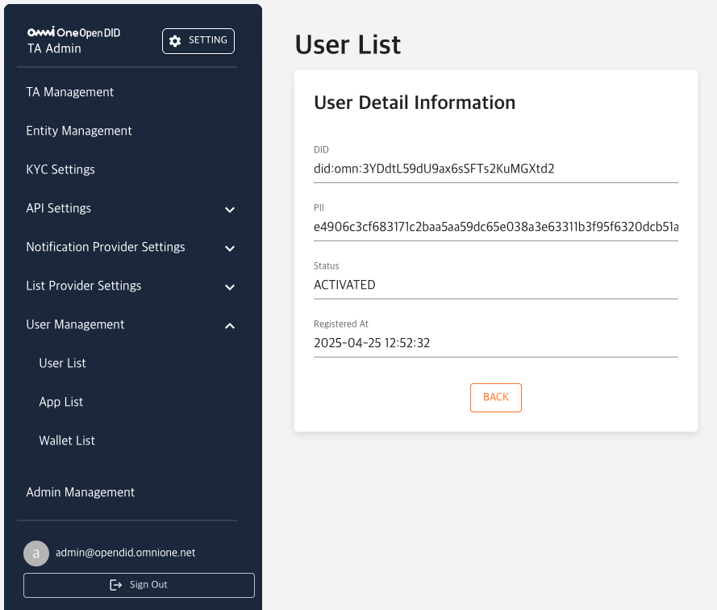

| No. | Item              | Description                                        |
| --- | ----------------- | -------------------------------------------------- |
| 1   | **DID**           | User's unique DID identifier.                      |
| 2   | **PII**           | Identification information for user identity verification. |
| 3   | **Status**        | User's current status. <br/>Status types are as follows:<br/>- `ACTIVATED`: Active state<br/>- `DEACTIVATED`: Inactive state<br/>- `REVOKED`: User's DID has been revoked |
| 4   | **Registered At** | Date and time when user was first registered.     |
| 5   | **Updated At**    | Date when user information was last modified.     |
| 6   | **BACK Button**   | Return to list screen.                             |

<br/>

## 3.19. App List

`App List` is a menu where you can check Push Token and status of Apps registered in the Open DID system.

### 3.19.1. App List Inquiry

When entering `App List` menu, the list of Apps registered in Open DID system is displayed in table format.  

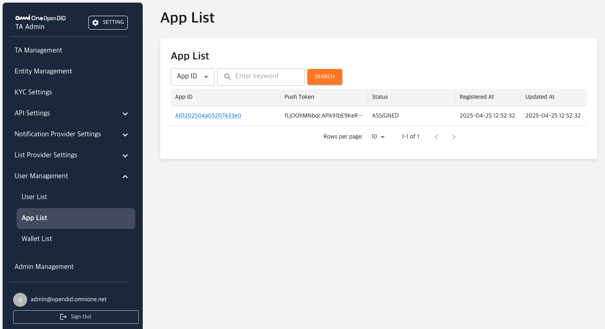

| No. | Item              | Description                                                                                                                                    |
| --- | ----------------- | ---------------------------------------------------------------------------------------------------------------------------------------------- |
| 1   | **App ID**        | App's unique ID. Click to go to detail screen.                                                                                                |
| 2   | **Push Token**    | Push token registered by this App.                                                                                                            |
| 3   | **Status**        | App's registration status.<br/>Status types are as follows:<br/>- `ASSIGNED`: Assigned to user<br/>- `CANCELLED`: Registration cancelled    |
| 4   | **Registered At** | Date and time when App was first registered.                                                                                                  |
| 5   | **Updated At**    | Time when App information was last modified.                                                                                                  |

<br/>

### 3.19.2. App Details Information

When you click App ID in App list, you move to detail information screen of that App.

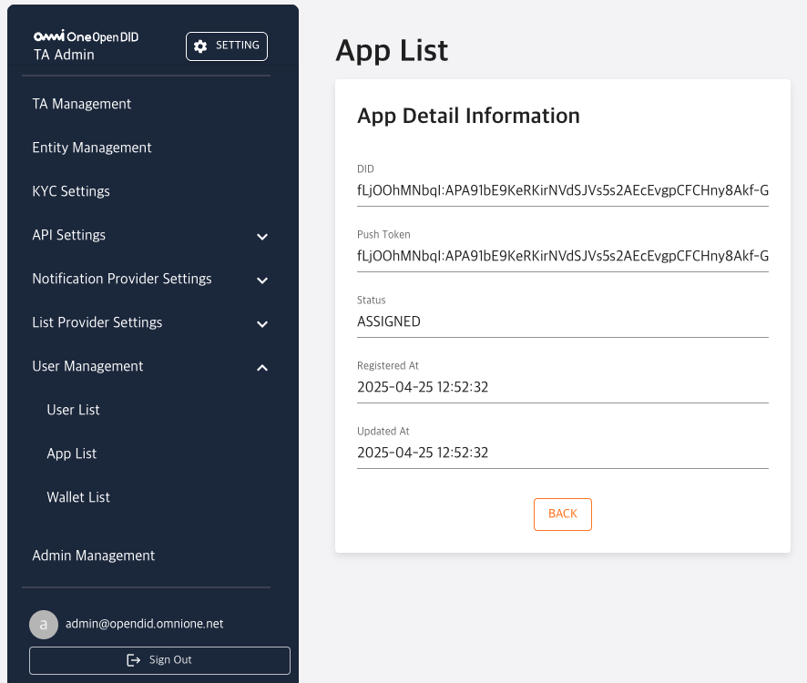

| No. | Item              | Description                                                                                                                                    |
| --- | ----------------- | ---------------------------------------------------------------------------------------------------------------------------------------------- |
| 1   | **DID**           | App's unique DID.                                                                                                                              |
| 2   | **Push Token**    | Push token registered by App.                                                                                                                  |
| 3   | **Status**        | App's registration status.<br/>Status types are as follows:<br/>- `ASSIGNED`: Assigned to user<br/>- `CANCELLED`: Registration cancelled    |
| 4   | **Registered At** | Date and time when App was first registered.                                                                                                  |
| 5   | **Updated At**    | Time when App information was last modified.                                                                                                  |
| 6   | **BACK Button**   | Return to list screen.                                                                                                                         |

<br/>

## 3.20. Wallet List

`Wallet List` is a menu for viewing Wallet information (DID, Wallet ID, etc.) registered in the Open DID system.

### 3.20.1. Wallet List Inquiry

When entering `Wallet List` menu, the list of registered Wallets is displayed in table format.

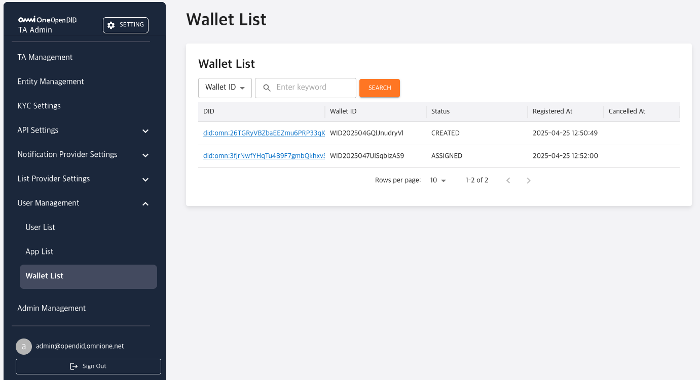

| No. | Item              | Description                                                                                                                                                        |
| --- | ----------------- | ------------------------------------------------------------------------------------------------------------------------------------------------------------------ |
| 1   | **DID**           | Wallet's unique DID identifier.                                                                                                                                    |
| 2   | **Wallet ID**     | Wallet identifier.                                                                                                                                                 |
| 3   | **Status**        | Wallet's registration status.<br/>Status types are as follows:<br/>- `CREATED`: Created<br/>- `ASSIGNED`: Assigned to user<br/>- `CANCELLED`: Registration cancelled |
| 4   | **Registered At** | Time when Wallet was first registered.                                                                                                                            |
| 5   | **Cancelled At**  | Time when Wallet was cancelled if applicable.                                                                                                                     |

<br/>

### 3.20.2. Wallet Details Information

When you click DID in Wallet list, you move to detail information screen of that Wallet.

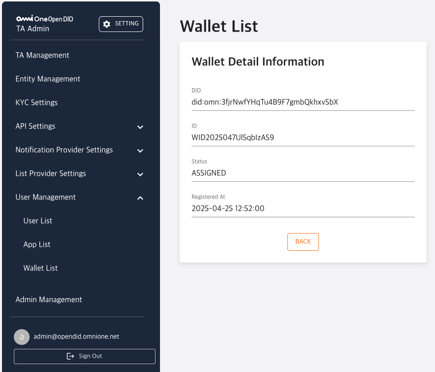

| No. | Item              | Description                                                                                                                                                        |
| --- | ----------------- | ------------------------------------------------------------------------------------------------------------------------------------------------------------------ |
| 1   | **DID**           | Wallet's unique DID identifier.                                                                                                                                    |
| 2   | **ID**            | Wallet identifier.                                                                                                                                                 |
| 3   | **Status**        | Wallet's registration status.<br/>Status types are as follows:<br/>- `CREATED`: Created<br/>- `ASSIGNED`: Assigned to user<br/>- `CANCELLED`: Registration cancelled |
| 4   | **Registered At** | Time when Wallet was first registered.                                                                                                                            |
| 5   | **BACK Button**   | Return to list screen.                                                                                                                                             |

<br/>

## 3.21. Admin Management

The `Admin Management` menu is a function for managing administrator accounts that can access the TA Admin Console.  

When TA server is installed, the `admin@opendid.omnione.net` account is automatically created with ROOT privileges by default.  
This account is the only ROOT account in the system and cannot be deleted.

Administrator accounts are divided into two privilege types: **ROOT** and **Normal Admin**.  
ROOT account can perform all functions in the `Admin Management` menu, while Normal Admin can only perform general inquiry functions.

---
> **Note:** Currently, the privilege difference between ROOT account and Normal Admin account is  
> only the difference in buttons displayed in the `Admin Management` menu (only Root can REGISTER / DELETE / CHANGE PASSWORD).  
> Access privileges or functional restrictions to other system menus are not yet applied.
---

<br/>

### 3.21.1. Admin List Inquiry

When entering the `Admin Management` menu, the list of registered administrator accounts is displayed in table format.

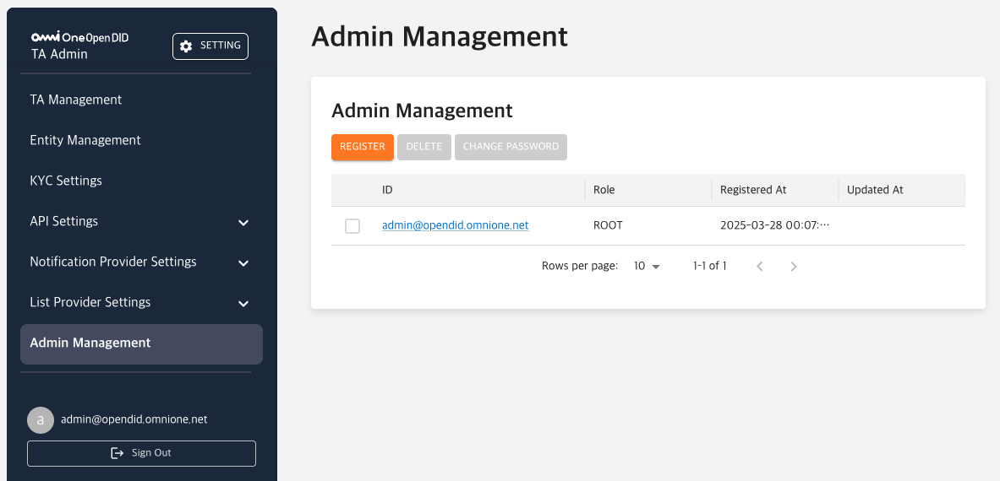

| No. | Item                        | Description                                                             |
| --- | --------------------------- | ----------------------------------------------------------------------- |
| 1   | **REGISTER Button**         | Move to registration page where you can register new administrator account. |
| 2   | **DELETE Button**           | Delete selected administrator account. (Only ROOT administrator can)    |
| 3   | **CHANGE PASSWORD Button**  | Change password of selected administrator account.                      |
| 4   | **ID**                      | Email ID of registered administrator account.                           |
| 5   | **Role**                    | Role of administrator account. (e.g., ROOT, Normal Admin, etc.)         |
| 6   | **Registered At**           | Time when account was first registered.                                 |
| 7   | **Updated At**              | Last modification time.                                                 |

<br/>

### 3.21.2. Admin Registration

When you click **REGISTER** button on `Admin Management` screen, you move to registration screen as below.

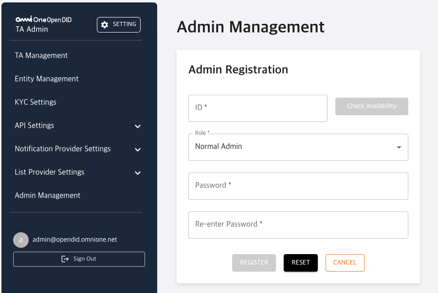

| No. | Item                        | Description                                                                |
| --- | --------------------------- | -------------------------------------------------------------------------- |
| 1   | **ID**                      | ID of administrator account to register. Must use email format.           |
| 2   | **Check Availability Button** | Check if entered ID is not duplicated.                                   |
| 3   | **Role**                    | Select privilege of administrator account to register. (e.g., Normal Admin) |
| 4   | **Password**                | Enter password to use for login.                                           |
| 5   | **Re-enter Password**       | Enter password again to check consistency.                                 |
| 6   | **REGISTER Button**         | Register administrator account based on entered information.               |
| 7   | **RESET Button**            | Initialize all input values.                                               |
| 8   | **CANCEL Button**           | Cancel registration and return to previous screen.                        |

[Open DID Installation Guide]: https://github.com/OmniOneID/did-release/blob/develop/release-V2.0.0.0/OpenDID_Installation_Guide-V2.0.0.0_ko.md └ Expiration Settings              | 2     | Set the validity time (expiration time) for API requests.                             |
| 6   | └ Key Exchange Policy              | 2     | Set policies for key exchange.                                                         |
| 7   | **Notification Provider Settings** | 1     | Parent menu for configuring Notification Provider settings.                           |
| 8   | └ Email Server Settings            | 2     | Menu for configuring outgoing email server information.                               |
| 9   | └ Email Template Settings          | 2     | Menu for configuring email templates to be sent.                                      |
| 10  | └ Push Server Settings             | 2     | Menu for configuring push notification server information.                            |
| 11  | **List Provider Settings**         | 1     | Parent menu for configuring List Provider settings.                                   |
| 12  | └ Allowed CA Management            | 2     | Menu for configuring the list of allowed Certificate Authorities (CA).               |
| 13  | └ VC Schema Management             | 2     | Menu for managing VC schemas used for VC issuance.                                    |
| 14  | └ VC Plan Management               | 2     | Menu for configuring VC issuance plans.                                               |
| 15  | **User Management**                | 1     | Menu for managing user information.                                                    |
| 16  | └ User List                        | 2     | Menu for viewing the list of users registered in Open DID.                           |
| 17  | └ App List                         | 2     | Menu for viewing App information of users registered in Open DID.                     |
| 18  | └ Wallet List                      | 2     | Menu for viewing wallet information of users registered in Open DID.                 |
| 19  | **Admin Management**               | 1     | Menu for managing administrator accounts and permissions.                              |

> **Note**:  
> Detailed usage instructions for each function in the above menu configuration  
> are explained in order in [Chapter 3. Feature-Specific Detailed Manual](#3-feature-specific-detailed-manual).

<br/>

## 2.4. Password Change Management

User password change can be performed through the following steps:

1. Click the 'SETTING' button in the header area.
2. Select 'Change Password' from the settings menu.
3. On the password change screen:
   - Enter current password
   - Enter new password
   - Confirm new password
4. Click the 'Save' button to apply changes.

> **Note**: Password must be 8-64 characters long and include uppercase/lowercase letters, numbers, and special characters.

<br/>

# 3. Feature-Specific Detailed Manual

This chapter provides detailed usage instructions for the main functions of the TA Admin Console.

## 3.1. TA Management

TA Management is a function for registering and managing the status of TA servers.  

The TA server is a central component responsible for establishing and operating the trust chain in the Open DID system.  
TA must be registered in the system first before other Entity servers can be properly registered and operated. 

TA registration is performed only once initially,  
and thereafter, the registered status can be checked on the management screen.

<br/>

### 3.1.1. TA Registration

In the initial state where the TA server has not yet been registered in the Open DID system,  
only the `TA Registration` item is displayed in the left menu of the TA Admin Console.  

TA registration proceeds sequentially through a total of 4 steps.

<br/>

**Step 1 - Enter TA Password**

In this step, enter the **registration password** to be used in the final stage of TA registration.  
The password must be entered identically to the password preset in the **Trust Agent server configuration file**.

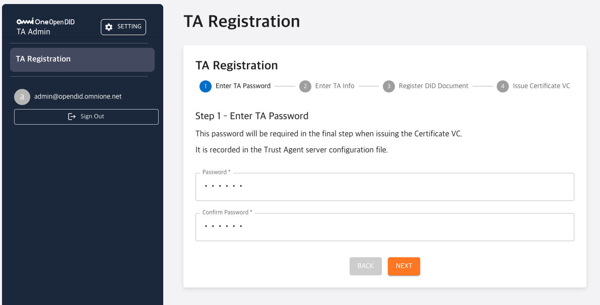

| Item                 | Description                                                  |
| -------------------- | ------------------------------------------------------------ |
| **Password**         | Enter the password to be used for TA registration           |
| **Confirm Password** | Re-enter the same value as the password entered above       |
| **NEXT Button**      | Move to the next step.                                       |

<br/>

**Step 2 - Enter TA Info**

This is the step to enter TA information.

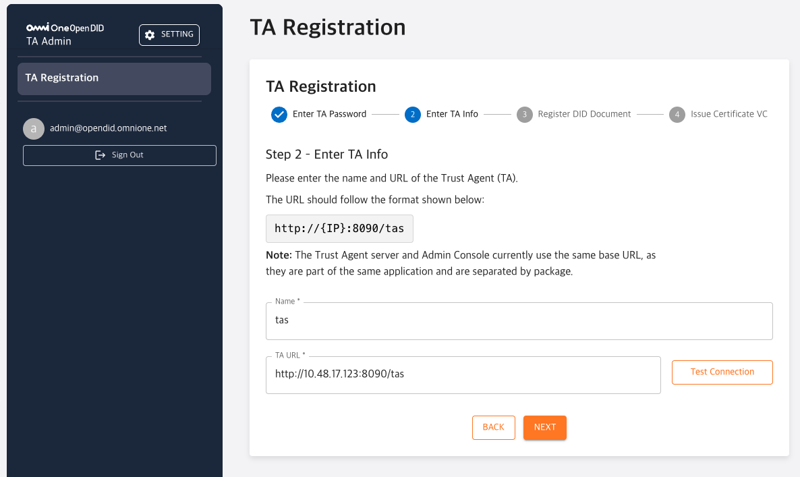

| Item                     | Description                                                                    |
| ------------------------ | ------------------------------------------------------------------------------ |
| **Name**                 | Enter the name of the TA. Example: `tas`                                      |
| **TA URL**               | TA server call URL. Must be entered in the format `http://<IP>:8090/tas`      |
| **Test Connection Button** | Test server connection with the entered URL                                  |
| **BACK Button**          | Move to the previous step                                                      |
| **NEXT Button**          | Move to the next step                                                          |

<br/>

**Step 3 - Register DID Document**

In this step, generate the TA's DID Document and register it on the blockchain.  
Once registered, the DID Document **cannot be changed or re-registered**.

▶ **Step 3-1: Generate DID Document**

Generate the TA's DID Document.  

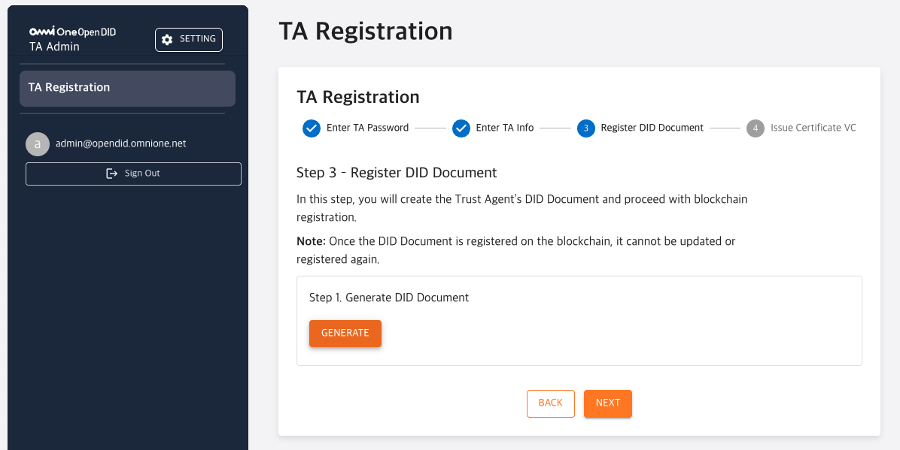

| Item               | Description                                    |
| ------------------ | ---------------------------------------------- |
| **GENERATE Button** | Generate the TA's DID Document.               |

When the DID Document is successfully generated, **Step 3-2 area is automatically displayed on the screen.**

<br/>

▶ **Step 3-2 - Register to Blockchain**

Register the generated DID Document on the blockchain.  

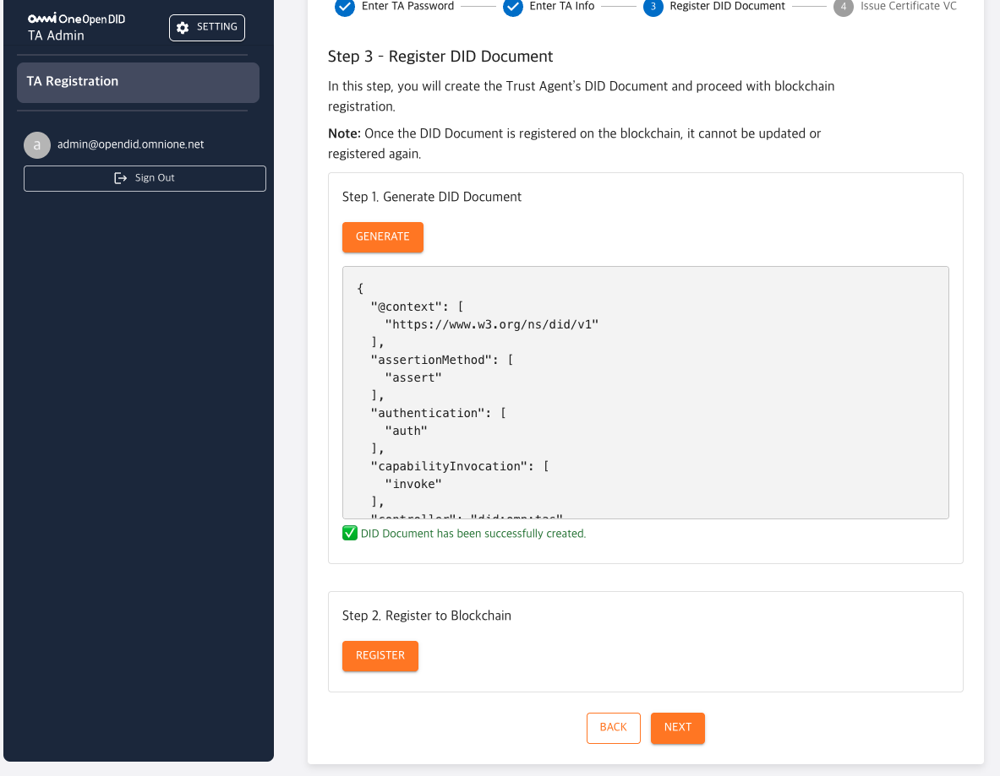
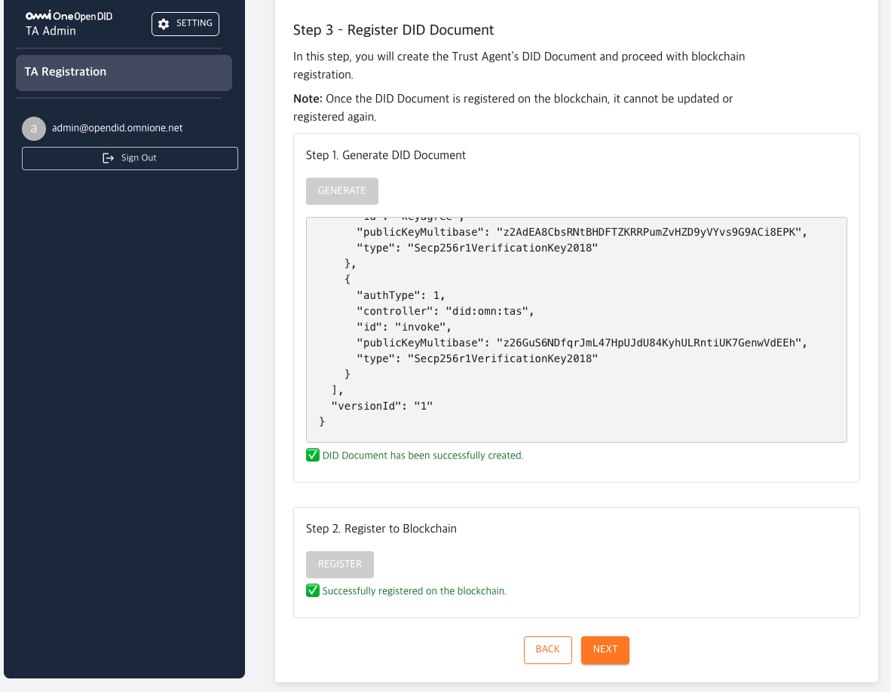

| Item               | Description                                              |
| ------------------ | -------------------------------------------------------- |
| **REGISTER Button** | Register the generated DID Document on the blockchain  |
| **BACK Button**    | Move to the previous step (Generate DID Document)       |
| **NEXT Button**    | Move to the next step (Issue Certificate VC)            |

<br/>

**Step 4 - Issue Certificate VC**

In this step, generate and register **TA's Certificate VC** on the blockchain.  
Certificate VC is **a certificate proving that the TA is officially registered in the OpenDID system**.  

In the OpenDID system, TA issues a certificate to itself (self-signed).  
The Certificate VC includes the TA's unique identifier **DN (Distinguished Name)**,  
which must have a unique value within the system.

▶ **Step 4-1 - Generate Certificate VC**

Enter DN and generate Certificate VC.  

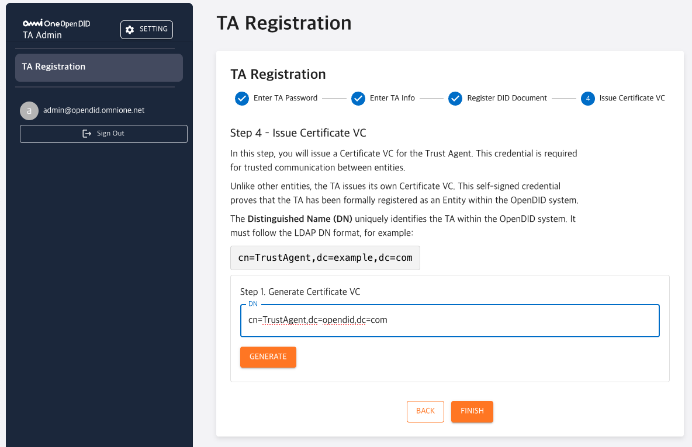

| Item               | Description                                                                      |
| ------------------ | -------------------------------------------------------------------------------- |
| **DN**             | Value that serves as the TA's unique identifier. Example: `cn=TrustAgent,dc=opendid,dc=com` |
| **GENERATE Button** | Generate Certificate VC based on the entered DN information.                    |

When Certificate VC is generated, **Step 2 area is displayed on the screen.**

<br/>

▶ **Step 4-2 - Register to Blockchain**

Register the generated Certificate VC on the blockchain.  

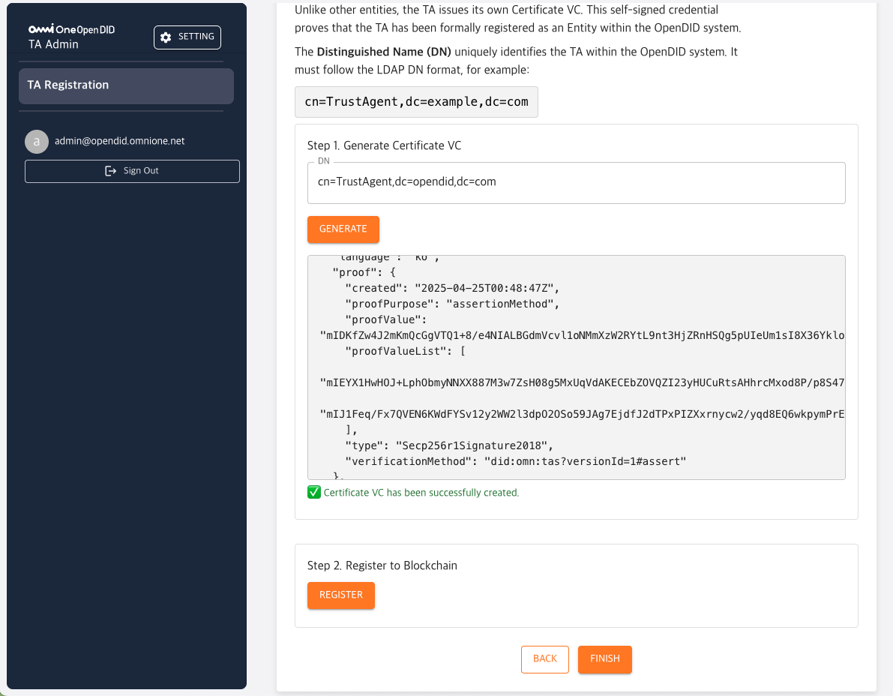
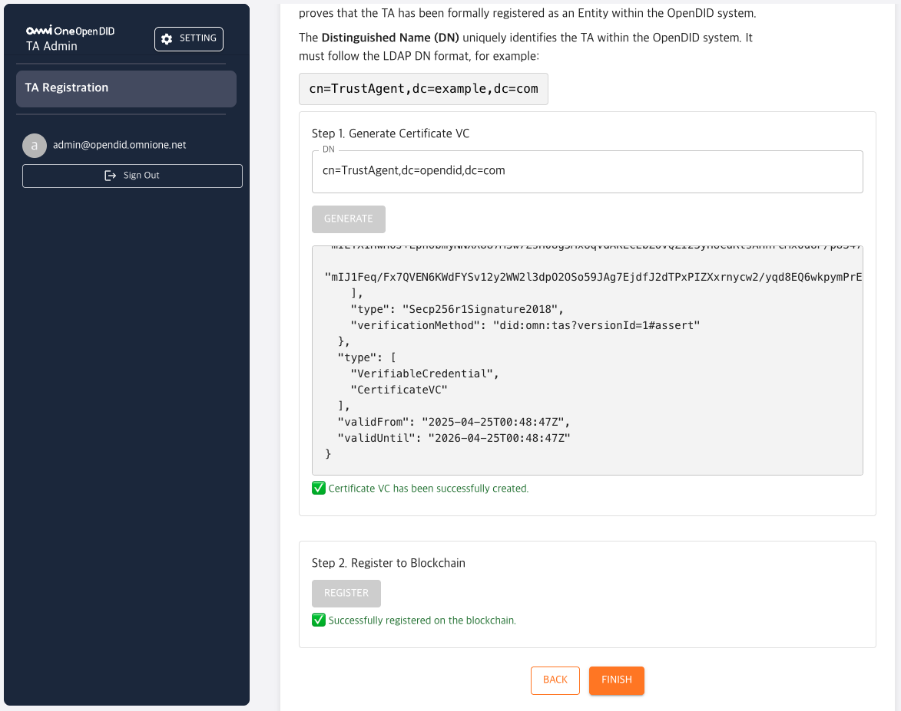

| Item               | Description                                              |
| ------------------ | -------------------------------------------------------- |
| **REGISTER Button** | Register the generated Certificate VC on the blockchain. |
| **BACK Button**    | Move to the previous step.                               |
| **FINISH Button**  | Complete registration and move to the final completion screen. |

<br/>

### 3.1.2. Registered TA Management

Once TA registration is complete, the `TA Management` menu is activated,  
and you can check the registered TA's DID information, status, URL, etc.


| No. | Item                  | Description                                                                   |
| --- | --------------------- | ----------------------------------------------------------------------------- |
| 1   | **DID**               | TA's unique identifier. Displayed in format like 'did:omn:tas'.              |
| 2   | **Name**              | TA's name.                                                                    |
| 3   | **Status**            | TA's current registration status. <br/>Status types are as follows:<br/>- `DID_DOCUMENT_REQUIRED`: DID Document not yet registered<br/>- `CERTIFICATE_VC_REQUIRED`: DID Document registered but Certificate VC not yet issued<br/>- `COMPLETED`: TA registration completed |
| 4   | **URL**               | TA server's base URL address.                                                 |
| 5   | **Certificate URL**   | URL address where TA's certificate can be verified.                          |
| 6   | **Registered At**     | Date and time when TA was registered in Open DID.                           |
| 7   | **VIEW DID DOCUMENT** | Button to check DID Document. When clicked, DID document information registered on blockchain is displayed in popup format. |
| 8   | **DID Document Content** | Content of the DID Document displayed when VIEW DID DOCUMENT button is clicked. Includes TA's DID information, controller, creation time, verification methods, etc. in JSON format. |

<br/>

## 3.2. Entity Management

In the `Entity Management` menu, you can register and manage Entity servers such as Issuer, Verifier, CA, Wallet  
that participate in the Open DID system.

> The formal Entity registration function is not fully implemented in the current Open DID system.  
> Therefore, in most cases, it is recommended to use the `QUICK REGISTER` function to register servers.  

When entering the menu, you can check the list of registered Entities in table format,  
and add server information through new registration or batch registration functions.

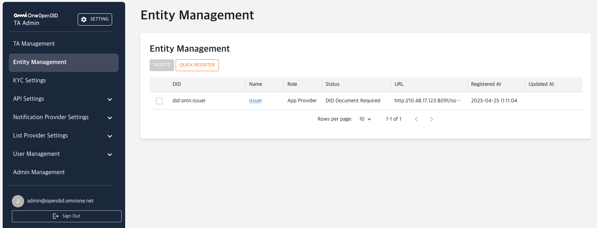

<br/>

### 3.2.1. Entity List Inquiry

In the `Entity Management` menu, you can register and manage Entity servers such as Issuer, Verifier, CA, Wallet  
that participate in the Open DID system.

Entity server registration generally follows these procedures:

1. Entity Admin generates DID Document and sends registration request to TA Admin.
2. When TA administrator approves the registration request, DID Document is registered on blockchain.
3. Subsequently, Entity Admin requests Certificate VC issuance to TA Server.

---
> **Note:**  
> TA Admin can automate the above process through the `QUICK REGISTER` function.   
> This function automatically registers all Entity DID Documents from TA Admin and issues and delivers Certificate VCs.  
> However, it only works normally when all servers are running through the Orchestrator.
---

The Entity list is provided in table format, allowing you to check the main information of registered servers at a glance.

| No. | Item                    | Description                                                                |
| --- | ----------------------- | -------------------------------------------------------------------------- |
| 1   | **DELETE Button**       | Delete Entity information.                                                 |
| 2   | **QUICK REGISTER Button** | Function to register all Entities at once for testing purposes.          |
| 3   | **DID**                 | Entity's unique DID identifier.                                            |
| 4   | **Name**                | Entity's name. Click to go to detail page.                                |
| 5   | **Role**                | Entity's role (e.g., Issuer, Verifier, Wallet, etc.).                     |
| 6   | **Status**              | Entity's registration status. <br/>Status types are as follows:<br/>- `DID_DOCUMENT_REQUIRED`: DID Document not yet registered<br/>- `CERTIFICATE_VC_REQUIRED`: DID Document registered but Certificate VC not yet issued<br/>- `COMPLETED`: Entity registration completed |
| 7   | **URL**                 | Entity server's base call URL.                                             |
| 8   | **Registered At**       | Date and time when Entity was first registered.                            |
| 9   | **Updated At**          | Date and time when Entity information was last modified.                   |

---

🔸 `DELETE` Button

Delete Entity information.   
However, Entity can only be deleted when its DID Document has not yet been registered on blockchain (DID Document Required state).

<br/>

🔸 `QUICK REGISTER` Button

The `QUICK REGISTER` function is a temporary feature for testing convenience.  
When this button is clicked, the following tasks are automatically performed for all Entity servers installed in the Orchestrator:

- Register each Entity server's DID Document  
- Issue membership certificates (VC)  
- Deliver issued membership certificates to the corresponding server

For TA to deliver membership certificates to corresponding Entity servers, each server must be **pre-executed**.   

If registration proceeded while servers were not running,   
after running servers later, executing `QUICK REGISTER` again will make TA perform **only certificate delivery**.

The figure below shows the screen after executing the `QUICK REGISTER` function.  
You can see that registered Issuer, Verifier, CA, Wallet servers have been automatically added to the table.

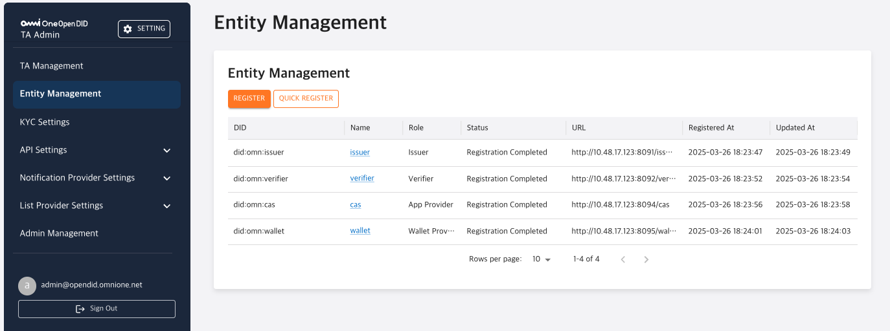

<br/>

### 3.2.2. Entity Details

When you click on a specific Entity name in the `Entity Management` screen list,  
you move to a page where you can check detailed information about that server.

On the detail page, you can check main information such as registered Entity's DID, name, role, status, call URL, etc.

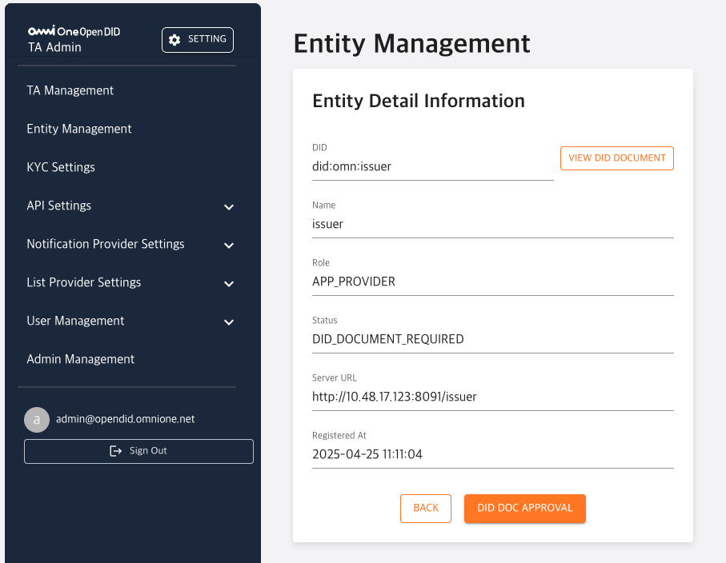

| No. | Item                      | Description                                                                          |
| --- | ------------------------- | ------------------------------------------------------------------------------------ |
| 1   | **DID**                   | Entity's unique DID identifier.                                                      |
| 2   | **Name**                  | Entity's name. Click to go to detail page.                                          |
| 3   | **Role**                  | Entity's role (e.g., Issuer, Verifier, Wallet, etc.).                               |
| 4   | **Status**                | Entity's registration status. <br/>Status types are as follows:<br/>- `DID_DOCUMENT_REQUIRED`: DID Document not yet registered<br/>- `CERTIFICATE_VC_REQUIRED`: DID Document registered but Certificate VC not yet issued<br/>- `COMPLETED`: Entity registration completed |
| 5   | **URL**                   | Entity server's base call URL.                                                      |
| 6   | **Registered At**         | Date and time when Entity was first registered.                                     |
| 7   | **Updated At**            | Date and time when Entity information was last modified.                            |
| 8   | **BACK Button**           | Close detail screen and return to previous page.                                    |
| 8   | **DID DOC APPROVAL Button** | Approve DID Document registration request. <br/> Only displayed when Status is in DID Document Required state (not yet registered on blockchain). |

---

🔸 `DID DOC APPROVAL` Button

Approve Entity's DID Document registration request.   
When button is clicked, DID Document is registered on blockchain, and Entity's status changes to **CERTIFICATE VC REQUIRED**.

Subsequently, Entity administrator must request Certificate VC issuance to TA server through Entity Admin.

<br/>

## 3.3. KYC Settings

The `KYC Settings` menu is a configuration function for retrieving user's identity information (PII: Personally Identifiable Information)  
from a pre-linked KYC server when issuing user DIDs.

The Open DID system does not provide KYC server functionality itself,  
and since the CA server also serves as a KYC server, CA server information must be entered in this setting.

| No. | Item                     | Description                                                                       |
| --- | ------------------------ | --------------------------------------------------------------------------------- |
| 1   | **Name**                 | Enter KYC server name. Generally use CA server name. Example: `cas`              |
| 2   | **Server URL**           | Call URL of CA server to be used as KYC server. Example: `http://<IP>:8094/cas`  |
| 3   | **Test Connection Button** | Test connection with entered server URL.                                        |
| 4   | **REGISTER Button**      | Save entered KYC information.                                                     |
| 5   | **RESET Button**         | Initialize all entered content.                                                   |

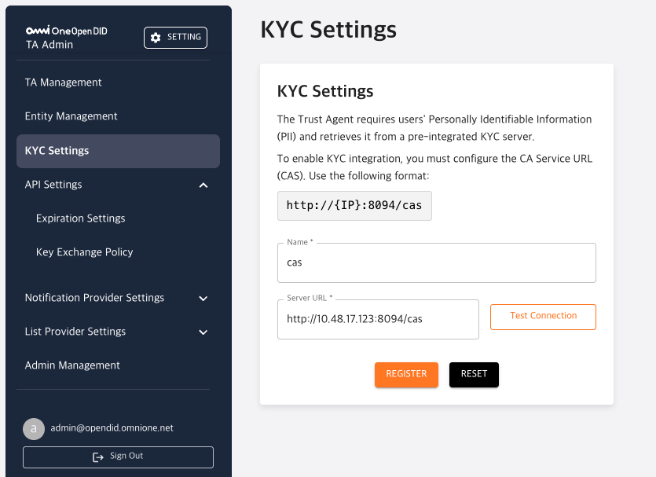

<br/>

## 3.4. API Settings

`API Settings` is a parent menu for configuring API operation policies used by Trust Agent.  
Actual configuration is done in sub-items [3.5. Expiration Settings](#35-expiration-settings) and [3.6. Key Exchange Policy](#36-key-exchange-policy) menus.

<br/>

## 3.5. Expiration Settings

In the `Expiration Settings` menu, you can configure expiration time-related settings used by the TA server.  
Set **token expiration time** and **transaction expiration time**, which play important roles in TA protocol operations.

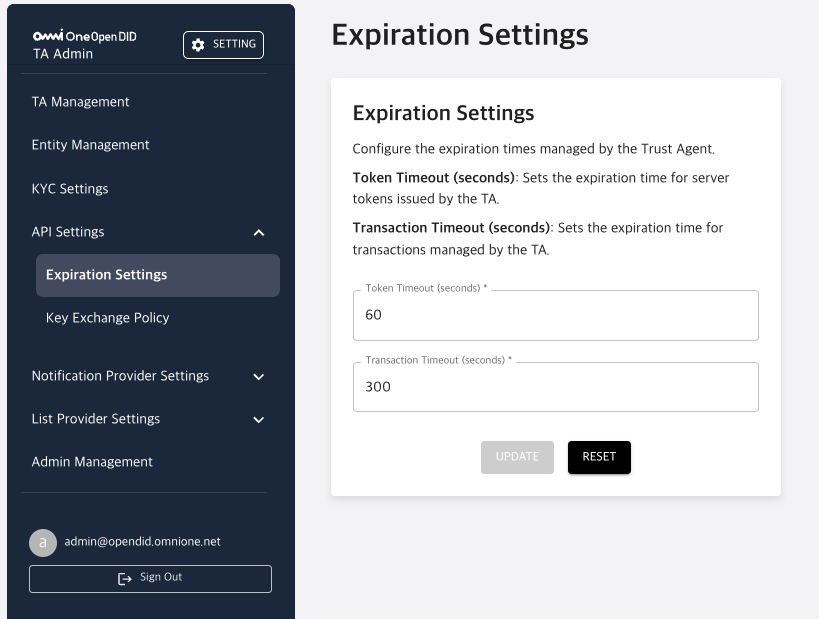

| No. | Item                          | Description                                                                                                                                                                                                                                                                 |
| --- | ----------------------------- | --------------------------------------------------------------------------------------------------------------------------------------------------------------------------------------------------------------------------------------------------------------------------- |
| 1   | **Token Timeout (seconds)**       | Set expiration time in seconds for **server tokens** issued by TA. Clients (Entity, App, etc.) must obtain server tokens when using TA's main protocols (e.g., Entity registration, user registration, VC issuance, etc.), and this setting means the validity period of such tokens. Default is **60 seconds**.        |
| 2   | **Transaction Timeout (seconds)** | Set **transaction-level expiration time**. One protocol consists of multiple API calls, and this item is the validity period for the entire protocol execution time. For example, if DID registration protocol consists of 5 APIs, this means the validity time for this entire flow. Default is **300 seconds**. |
| 3   | **UPDATE Button**                        | Save entered setting values.                                                                                                                                                                                                                                            |
| 4   | **RESET Button**                         | Initialize entered content.                                                                                                                                                                                                                                             |

---
> **Note:** Even without separate settings, Token Timeout defaults to 60 seconds and Transaction Timeout defaults to 300 seconds. 
---

<br/>

## 3.6. Key Exchange Policy

In the `Key Exchange Policy` menu, you can set encryption policies to be used when TA server performs **ECDH key exchange** with external Entities (Clients).  

This setting becomes the foundation for performing **session-level encrypted communication** with clients in major protocols provided by TA (e.g., Entity registration, user registration, VC issuance, etc.).

Most protocols include key exchange APIs, where both sides exchange information to generate encryption keys using ECDH method.  
Through this menu, you can specify **encryption algorithms and padding methods** to be used during key exchange.

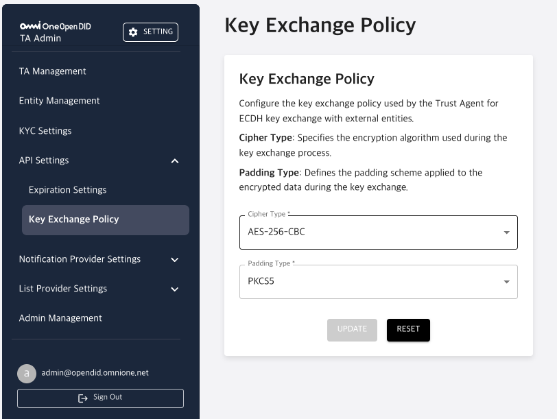

| No. | Item             | Description                                                                                                             |
| --- | ---------------- | ----------------------------------------------------------------------------------------------------------------------- |
| 1   | **Cipher Type**  | Select **encryption algorithm** to be used for key exchange. <br>Supported options: `AES-256-CBC`, `AES-128-CBC`, `AES-256-ECB`, `AES-128-ECB` |
| 2   | **Padding Type** | Select **padding method** to be applied to encrypted data. <br>Supported options: `NOPAD`, `PKCS5`                     |
| 3   | **UPDATE Button**  | Save configured encryption policy.                                                                                      |
| 4   | **RESET Button**   | Initialize entered content.                                                                                             |

---
> **Note:** Even without separate settings, Cipher Type defaults to AES-256-CBC and Padding Type defaults to PKCS5. 
---

<br/>

## 3.7. Notification Provider Settings

In the Open DID system, the TA server also performs the role of Notification Provider.  
Therefore, TA Admin Console can also manage settings for Notification Provider together.

`Notification Provider Settings` is a menu for configuring email and push notification functions in the Open DID system.  
Email server, template, and push server configuration functions are included as sub-menus.

---
> **Note:** Configuration methods for each function are explained in detail in the sub-menu items below:  
> - [3.8 Email Server Settings](#38-email-server-settings)  
> - [3.9 Email Template Settings](#39-email-template-settings)  
> - [3.10 Push Server Settings](#310-push-server-settings)
---

<br/>

## 3.8. Email Server Settings

`Email Server Settings` is a menu for configuring outgoing email servers in the Open DID system.  
You can configure the email sending environment by entering SMTP server information, authentication information, SSL settings, timeout options, etc.

Once configuration is complete, you can send test emails to verify that the configured values work properly.  

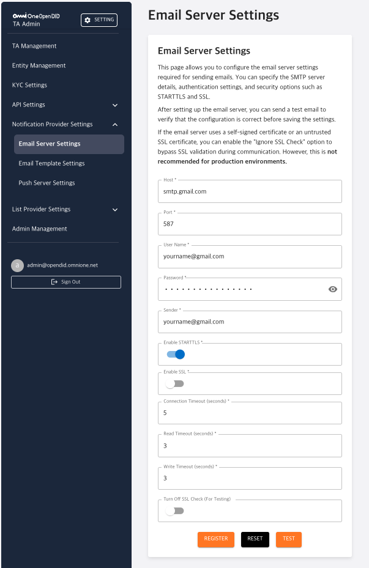

| No. | Item                         | Description                                                                   |
| --- | ---------------------------- | ----------------------------------------------------------------------------- |
| 1   | **Host**                     | SMTP server host address.                                                    |
| 2   | **Port**                     | SMTP server port number.                                                     |
| 3   | **User Name**                | Email account for authentication.                                            |
| 4   | **Password**                 | Password for email account.                                                   |
| 5    | **Sender**                   | Sender email address.                                             |
| 6    | **Enable STARTTLS**          | Whether to use STARTTLS secure transmission.                                   |
| 7    | **Enable SSL**               | Whether to use SSL secure transmission.                                        |
| 8    | **Connection Timeout (sec)** | Time limit for connection attempts.                                     |
| 9    | **Read Timeout (sec)**       | Maximum time to wait for response.                                      |
| 10   | **Write Timeout (sec)**      | Time limit for request transmission.                                     |
| 11   | **Turn Off SSL Check**       | Can disable SSL verification for testing purposes. (Not recommended for production environment) |
| 12   | **REGISTER Button**            | Save entered email configuration information.                                 |
| 13   | **RESET Button**               | Initialize all input fields.                                        |
| 14   | **TEST Button**                | Only works when all settings are properly entered. <br/>When clicked, `Send Test Email` popup appears, allowing you to directly enter email address to receive test mail. <br/>Test mail includes simple confirmation message. |

---
> **Note:**  
> `Enable STARTTLS` and `Enable SSL` **cannot be activated simultaneously.**      
> Both are methods for secure connection during email transmission, but **STARTTLS upgrades existing connection to encryption**,  
> while **SSL uses encrypted connection from the beginning**, so only one should be selected according to email server settings to avoid conflicts.
---

## 3.9. Email Template Settings

`Email Template Settings` is a menu where you can register and modify email templates sent from TA server in HTML format.  
Each template can be managed individually by separating tabs according to sending purpose.

TA sends emails to users in the following two cases:

- When issuing VC, sending VC issuance request email to users
- During DID recovery, sending DID recovery request email to users

Email templates are in a format that includes **keywords** that can be dynamically replaced in fixed email content.   
When external systems deliver values corresponding to each keyword along with template type,   
TA replaces those values with keywords to generate and send final emails.

This approach was introduced to reduce server load and   
enable more efficient email sending processing when email content is long or   
contains a lot of dynamically changing information.


| No. | Item            | Description                                                                    |
| --- | --------------- | ------------------------------------------------------------------------------ |
| 1   | **Tab Selection** | Manage templates separately according to sending scenarios like VC issuance, DID recovery, etc. |
| 2   | **Keyword**     | Select keywords to add within template.                                        |
| 3   | **Add Button**  | Add keyword to where keyboard pointer is located in Content.                   |
| 4   | **Content**     | Area to enter HTML content of email body.                                     |
| 5   | **UPDATE Button** | Save template.                                                               |
| 6   | **RESET Button** | Return changed content to initial state.                                     |

<br/>

🔸 Available Keyword List

Below is a table organizing keywords available in each template and the meaning of each keyword.  
At sending time, keywords are automatically replaced with values delivered from external sources and inserted into email body.

| Keyword           | Description                                       | Usage Scenario    |
| ----------------- | ------------------------------------------------- | ----------------- |
| `{issuerName}`    | Name of Issuer issuing VC.                       | VC Issuance       |
| `{qrImg}`         | QR code image that user needs to scan.           | VC Issuance, DID Recovery |
| `{vcSchemaName}`  | Name or schema name of VC being issued.          | VC Issuance       |
| `{qrExpiredDate}` | Date and time when QR code expires.              | VC Issuance       |

---
> **Note:** All **keywords** available in each scenario must be included in template body for saving to be possible.  
> For example, in VC issuance scenario, all of `{issuerName}`, `{qrImg}`, `{vcSchemaName}`, `{qrExpiredDate}` must be included.
---

<br/>

## 3.10. Push Server Settings

`Push Server Settings` is a menu for registering FCM server configuration files for mobile app push notifications.  
In this menu, you can upload **Google Firebase Cloud Messaging (FCM)** configuration file (JSON) to  
configure integration with push server.

Notifications sent through Push server are used **when requesting VC issuance to users**.


| No. | Item                 | Description                                                                                                                                                       |
| --- | -------------------- | ----------------------------------------------------------------------------------------------------------------------------------------------------------------- |
| 1   | **Warning Message**  | When configuration is not complete, warning message is displayed in **red box**. <br/>When configuration is complete, message indicating completion is displayed in **green box**. |
| 2   | **SELECT FILE Button** | Upload configuration JSON file issued from Firebase.                                                                                                             |
| 3   | **REGISTER Button**  | Save push server information based on uploaded configuration file.                                                                                               |
| 4   | **RESET Button**     | Initialize entered content.                                                                                                                                      |

<br/>

## 3.11. List Provider Settings

In the Open DID system, the TA server also performs the role of List Provider.  
List Provider provides list information necessary for each Entity participating in Open DID to perform their roles.  
For example, schema lists for VC issuance, trusted CA lists, VC issuance plans, etc. correspond to this.

`List Provider Settings` is a menu for managing these lists,  
where you can register and modify allowed CA lists, VC schema lists, VC issuance plans, etc.

Sub-menus are as follows:

- [3.12. Allowed CA Management](#312-allowed-ca-management)
- [3.13. VC Schema Management](#313-vc-schema-management)
- [3.14. VC Plan Management](#314-vc-plan-management)

<br/>

## 3.12. Allowed CA Management

Allowed CA Management is a function for managing the list of CAs allowed for use by specific Wallets.  
Wallets are restricted to use VCs only from CAs included in this list.  
That is, the allowed CA list is used as a criterion for determining **trust in CAs that issued VCs**.

TA can register and modify allowed CA lists by Wallet Identifier, and these lists are used by Wallet SDK.

<br/>

### 3.12.1. Allowed CA List Inquiry

When entering the `Allowed CA Management` menu, the allowed CA list by Wallet Identifier is displayed in table format.  
You can manage the list of CAs that each Wallet can trust through register, modify, and delete functions.


| No. | Item                       | Description                                                                 |
| --- | -------------------------- | --------------------------------------------------------------------------- |
| 1   | **REGISTER Button**        | Register new Wallet Identifier and allowed CA list.                        |
| 2   | **UPDATE Button**          | Modify allowed CA list of selected Wallet Identifier.                      |
| 3   | **DELETE Button**          | Delete selected Wallet Identifier item.                                    |
| 4   | **Wallet Identifier**      | Identifier of target Wallet where CA allow list will be applied.           |
| 5   | **Allowed CA List**        | List of CA DIDs that the Wallet can trust.                                 |
| 6   | **Registered At**          | Registration time.                                                          |
| 7   | **Updated At**             | Last modification time.                                                     |

---
> **Note:** Default Wallet SDK and CA identifiers provided by Open DID are  
> automatically registered as follows during initial installation:   
> - **Wallet Identifier**: `org.omnione.did.sdk.wallet`  
> - **CA**: `org.omnione.did.ca`
---

<br/>

### 3.12.2. Allowed CA Registration

When you click the **REGISTER** button on the `Allowed CA Management` screen, you move to the registration screen below


| No. | Item                   | Description                                                           |
| --- | ---------------------- | --------------------------------------------------------------------- |
| 1   | **Wallet Identifier**  | Target Wallet identifier.                                             |
| 2   | **Check Availability** | Check for duplicate Wallet Identifier.                               |
| 3   | **ADD CA Button**      | When clicked, new input row is added to CA list table below.         |
| 4   | **Delete Icon**        | Displayed on right side of each CA input row, can delete that row.   |
| 5   | **REGISTER Button**    | Register entered content.                                             |
| 6   | **RESET Button**       | Initialize entered content.                                           |
| 7   | **CANCEL Button**      | Cancel registration and return to previous page.                     |

<br/>

### 3.12.3. Allowed CA Details

When you click Wallet Identifier in the `Allowed CA Management` list, you move to the detail screen below.


| No. | Item                  | Description                                                 |
| --- | --------------------- | ----------------------------------------------------------- |
| 1   | **Wallet Identifier** | Identifier of Wallet currently viewing detailed information. |
| 2   | **Allowed CA List**   | List of CAs allowed for that Wallet.                       |
| 3   | **BACK Button**       | Return to list screen.                                      |
| 4   | **GO TO EDIT Button** | Move to edit screen where you can modify that item.        |

<br/>

### 3.12.4. Allowed CA Modification

When you **click GO TO EDIT button on detail page of `Allowed CA Management`** or  
**click UPDATE button on list page**, you move to the modification screen below.  


| No. | Item                   | Description                                             |
| --- | ---------------------- | ------------------------------------------------------- |
| 1   | **Wallet Identifier**  | Identifier of target Wallet to modify.                 |
| 2   | **Check Availability** | Re-check for duplicate Wallet Identifier.              |
| 3   | **ADD CA Button**      | Add CA identifier to allow.                             |
| 4   | **Delete Icon**        | Delete CA item in that row.                             |
| 5   | **UPDATE Button**      | Save modified content.                                  |
| 6   | **RESET Button**       | Initialize entered content.                             |
| 7   | **CANCEL Button**      | Cancel modification and return to previous page.       |

<br/>

## 3.13. VC Schema Management

When entering the `VC Schema Management` menu, the list of VC (Verifiable Credential) schemas available for issuance in the Open DID system is displayed in table format.  

VC schemas define the structure and content of each Credential,  
and are referenced when user's Wallet verifies the validity of issued VCs.

After VC Schema is created on Issuer Admin page,  
it is sent to TA Admin server for final registration.

VC Schema is registered on TA server, and administrators can view this list or check detailed content.

<br/>

### 3.13.1 VC Schema List Inquiry

When entering `List Provider Settings > VC Schema Management` menu, the list of registered VC schemas is displayed in table format.


| No. | Item              | Description                                                          |
| --- | ----------------- | -------------------------------------------------------------------- |
| 1   | **Title**         | VC schema title. Click to go to detail information page.            |
| 2   | **Description**   | Brief description of VC schema.                                      |
| 3   | **Issuer Name**   | Name of Issuer that issues this schema.                             |
| 4   | **Registered At** | Date and time when VC schema was first registered.                  |
| 5   | **Updated At**    | Date and time when VC schema was last modified.                     |

<br/>

### 3.13.2 VC Schema Details

When you click VC schema title in `VC Schema list`, you move to screen where you can check detailed information as below.


| No. | Item                        | Description                                                                   |
| --- | --------------------------- | ----------------------------------------------------------------------------- |
| 1   | **Title**                   | VC schema title.                                                              |
| 2   | **Description**             | Description of this schema.                                                   |
| 3   | **Issuer Name**             | Name of Issuer that registered this VC schema.                               |
| 4   | **Registered At**           | Date and time when VC schema was first registered.                           |
| 5   | **VIEW VC SCHEMA Button**   | Button to check actual JSON structure of this VC schema. Displayed in popup. |
| 6   | **BACK Button**             | Return to list screen.                                                        |

<br/>

## 3.14. VC Plan Management

In the `VC Plan Management` menu, you can check the list of VC Plans available for issuance in the Open DID system.

VC Plan is a configuration that defines policies for how VCs will actually be issued for VC schemas created by Issuer.  
For example, policies such as whether issuance can be started directly from app (`allowUserInit`), whether Issuer can start issuance through QR code or push message (`allowIssuerInit`) are included.

VC Plan is created on Issuer Admin server, and created Plan is sent to TA Admin server for registration.  
Externally, knowing only `vcPlanId` allows checking what VC is issued in what way.

---
> **Note:** VC Plan is utilized in the following ways:
>
> - When user requests VC issuance from Issuer's existing issuance system (e.g., website),  
>   that site can deliver `vcPlanId` to TA server to query related issuance policies and start issuance procedure based on this.
>
> - User app queries VC Plan list from TA server,  
>   and when user selects desired VC, issuance procedure starts according to that Plan.
---

<br/>

### 3.14.1 VC Plan List Inquiry

When entering `VC Plan Management` menu, the list of registered VC Plans is displayed as below.  
Clicking each VC Plan ID moves to screen where you can check detailed information.


| No. | Item              | Description                                                                 |
| --- | ----------------- | ----------------------------------------------------------------------- |
| 1   | **ID**            | VC Plan unique identifier. Click to go to detail information screen.   |
| 2   | **Name**          | VC Plan name.                                                           |
| 3   | **Description**   | Description of VC Plan.                                                 |
| 4   | **Issuer Name**   | Name of Issuer that created this VC Plan.                              |
| 5   | **Registered At** | Initial registration time.                                              |
| 6   | **Updated At**    | Last modification time.                                                 |

<br/>

### 3.14.2 VC Plan Details

When you click ID in VC Plan list, you move to detail information screen of that VC Plan.


| No. | Item                  | Description                                                  |
| --- | --------------------- | ------------------------------------------------------------ |
| 1   | **ID**                | VC Plan unique identifier.                                   |
| 2   | **VIEW VC PLAN Button** | Check VC Plan JSON original text in popup format.         |
| 3   | **Name**              | VC Plan display name.                                        |
| 4   | **Description**       | Brief description of VC Plan.                                |
| 5   | **Issuer Name**       | Name of Issuer that created this Plan.                       |
| 6   | **Registered At**     | Registration date and time.                                  |
| 7   | **BACK Button**       | Return to previous screen.                                   |

<br/>

## 3.15. Credential Schema Management

In the `Credential Schema Management` menu, you can check the list of Credential Schemas available for issuance in the Open DID system.  
Credential Schema is a structure that defines claim names, attributes, etc. for issuing VCs using ZKP method,  
and is connected 1:1 with each Credential Definition.

After Credential Schema is created on Issuer Admin page,  
it is sent to TA Admin server for final registration.

Credential Schema is registered on TA server, and administrators can view this list or check detailed content.

<br/>

### 3.15.1 Credential Schema List Inquiry

When entering `List Provider Settings > Credential Schema Management` menu, the list of registered Credential Schemas is displayed in table format.


| No. | Item              | Description                                                        |
| --- | ----------------- | ------------------------------------------------------------------ |
| 1   | **Name**          | Credential Schema name. Click to go to detail information.        |
| 2   | **Issuer Name**   | Name of Issuer that registered this schema.                       |
| 3   | **Registered At** | Initial registration time.                                         |
| 4   | **Updated At**    | Last modification time. (Empty if none)                           |

<br/>

### 3.15.2 Credential Schema Details

When you click name (Name) in Credential Schema list, you move to detail information screen.


| No. | Item                            | Description                                                                          |
| --- | ------------------------------- | ------------------------------------------------------------------------------------ |
| 1   | **Name**                        | Credential Schema name.                                                              |
| 2   | **Credential Schema ID**        | Unique identifier (DID format) of this schema.                                      |
| 3   | **Issuer Name**                 | Name of Issuer that registered this Credential Schema.                              |
| 4   | **Registered At**               | Date and time when Credential Schema was first registered.                          |
| 5   | **VIEW CREDENTIAL SCHEMA Button** | Check Credential Schema JSON original text in popup format.                       |
| 6   | **BACK Button**                 | Return to list screen.                                                               |

---

## 3.16. Credential Definition Management

In the `Credential Definition Management` menu, you can check the list of registered Credential Definitions.

Credential Definition is a definition for actually issuing VCs using ZKP method based on Credential Schema.  
Credential Definition has 1:1 relationship with each Credential Schema and includes metadata necessary for Issuer to create VCs.

<br/>

### 3.16.1 Credential Definition List Inquiry

When entering `List Provider Settings > Credential Definition Management` menu, Credential Definition list is displayed.


| No. | Item                          | Description                                                                 |
| --- | ----------------------------- | --------------------------------------------------------------------------- |
| 1   | **Credential Definition ID**  | DID identifier of this Credential Definition. Click to go to detail view.  |
| 2   | **Credential Schema ID**      | DID identifier of connected Credential Schema.                             |
| 3   | **Credential Definition Tag** | Tag value assigned to Definition.                                           |
| 4   | **Issuer Name**               | Name of Issuer that registered this Credential Definition.                 |
| 5   | **Registered At**             | Time when Credential Definition was first registered.                       |
| 6   | **Updated At**                | Last modification time. (Empty if none)                                    |

<br/>

### 3.16.2 Credential Definition Details

When you click ID in Credential Definition list, you move to detail information screen.


| No. | Item                           | Description                                                                 |
| --- | ------------------------------ | --------------------------------------------------------------------------- |
| 1   | **Credential Definition ID**   | DID format identifier of Credential Definition.                            |
| 2   | **Credential Schema ID**       | DID identifier of connected Credential Schema.                             |
| 3   | **Credential Definition Tag**  | Tag value assigned when creating Definition.                                |
| 4   | **Issuer Name**                | Name of Issuer that registered this Definition.                            |
| 5   | **Registered At**              | Time when Credential Definition was first registered.                       |
| 6   | **VIEW DEFINITION Button**     | Check Credential Definition original text (JSON) in popup.                 |
| 7   | **BACK Button**                | Return to list screen.                                                      |

<br/>

## 3.17. User Management

In the `User Management` menu, you can view information of users registered in the Open DID system.   

Users are registered based on DID, and related information is managed separately in the following three categories:

- User: User identification information (DID, PII, etc.)
- App: User device (App) unique identification information (App ID, Push Token, etc.)
- Wallet: User wallet information (Wallet DID, Wallet ID, etc.)
  
Each item can be viewed individually in separate menus, and sub-menus are as follows:

- [3.18. User List](#318-user-list)
- [3.19. App List](#319-app-list)
- [3.20. Wallet List](#320-wallet-list)

<br/>

## 3.18. User List

`User List` is a menu where you can check DID and PII information of users registered in the Open DID system.

### 3.18.1. User List Inquiry

When entering `User List` menu, the list of registered users is displayed in table format.  
You can search user information by DID or PII criteria through search function.


| No. | Item              | Description                                                            |
| --- | ----------------- | ---------------------------------------------------------------------- |
| 1   | **DID**           | User's unique DID identifier. Click to go to detail screen.           |
| 2   | **PII**           | User's PII (Personal Identifiable Info) value.                        |
| 3   | **Registered At** | Date and time when user was first registered.                         |
| 4   | **Updated At**    | Date when user information was last modified.                         |

<br/>

### 3.18.2. User Details Information

When you click DID in User list, you move to detail information screen of that User.


| No. | Item              | Description                                        |
| --- | ----------------- | -------------------------------------------------- |
| 1   | **DID**           | User's unique DID identifier.                      |
| 2   | **PII**           | Identification information for user identity verification. |
| 3   | **Status**        | User's current status. <br/>Status types are as follows:<br/>- `ACTIVATED`: Active state<br/>- `DEACTIVATED`: Inactive state<br/>- `REVOKED`: User's DID has been revoked |
| 4   | **Registered At** | Date and time when user was first registered.     |
| 5   | **Updated At**    | Date when user information was last modified.     |
| 6   | **BACK Button**   | Return to list screen.                             |

<br/>

## 3.19. App List

`App List` is a menu where you can check Push Token and status of Apps registered in the Open DID system.

### 3.19.1. App List Inquiry

When entering `App List` menu, the list of Apps registered in Open DID system is displayed in table format.  


| No. | Item              | Description                                                                                                                                    |
| --- | ----------------- | ---------------------------------------------------------------------------------------------------------------------------------------------- |
| 1   | **App ID**        | App's unique ID. Click to go to detail screen.                                                                                                |
| 2   | **Push Token**    | Push token registered by this App.                                                                                                            |
| 3   | **Status**        | App's registration status.<br/>Status types are as follows:<br/>- `ASSIGNED`: Assigned to user<br/>- `CANCELLED`: Registration cancelled    |
| 4   | **Registered At** | Date and time when App was first registered.                                                                                                  |
| 5   | **Updated At**    | Time when App information was last modified.                                                                                                  |

<br/>

### 3.19.2. App Details Information

When you click App ID in App list, you move to detail information screen of that App.


| No. | Item              | Description                                                                                                                                    |
| --- | ----------------- | ---------------------------------------------------------------------------------------------------------------------------------------------- |
| 1   | **DID**           | App's unique DID.                                                                                                                              |
| 2   | **Push Token**    | Push token registered by App.                                                                                                                  |
| 3   | **Status**        | App's registration status.<br/>Status types are as follows:<br/>- `ASSIGNED`: Assigned to user<br/>- `CANCELLED`: Registration cancelled    |
| 4   | **Registered At** | Date and time when App was first registered.                                                                                                  |
| 5   | **Updated At**    | Time when App information was last modified.                                                                                                  |
| 6   | **BACK Button**   | Return to list screen.                                                                                                                         |

<br/>

## 3.20. Wallet List

`Wallet List` is a menu for viewing Wallet information (DID, Wallet ID, etc.) registered in the Open DID system.

### 3.20.1. Wallet List Inquiry

When entering `Wallet List` menu, the list of registered Wallets is displayed in table format.


| No. | Item              | Description                                                                                                                                                        |
| --- | ----------------- | ------------------------------------------------------------------------------------------------------------------------------------------------------------------ |
| 1   | **DID**           | Wallet's unique DID identifier.                                                                                                                                    |
| 2   | **Wallet ID**     | Wallet identifier.                                                                                                                                                 |
| 3   | **Status**        | Wallet's registration status.<br/>Status types are as follows:<br/>- `CREATED`: Created<br/>- `ASSIGNED`: Assigned to user<br/>- `CANCELLED`: Registration cancelled |
| 4   | **Registered At** | Time when Wallet was first registered.                                                                                                                            |
| 5   | **Cancelled At**  | Time when Wallet was cancelled if applicable.                                                                                                                     |

<br/>

### 3.20.2. Wallet Details Information

When you click DID in Wallet list, you move to detail information screen of that Wallet.


| No. | Item              | Description                                                                                                                                                        |
| --- | ----------------- | ------------------------------------------------------------------------------------------------------------------------------------------------------------------ |
| 1   | **DID**           | Wallet's unique DID identifier.                                                                                                                                    |
| 2   | **ID**            | Wallet identifier.                                                                                                                                                 |
| 3   | **Status**        | Wallet's registration status.<br/>Status types are as follows:<br/>- `CREATED`: Created<br/>- `ASSIGNED`: Assigned to user<br/>- `CANCELLED`: Registration cancelled |
| 4   | **Registered At** | Time when Wallet was first registered.                                                                                                                            |
| 5   | **BACK Button**   | Return to list screen.                                                                                                                                             |

<br/>

## 3.21. Admin Management

The `Admin Management` menu is a function for managing administrator accounts that can access the TA Admin Console.  

When TA server is installed, the `admin@opendid.omnione.net` account is automatically created with ROOT privileges by default.  
This account is the only ROOT account in the system and cannot be deleted.

Administrator accounts are divided into two privilege types: **ROOT** and **Normal Admin**.  
ROOT account can perform all functions in the `Admin Management` menu, while Normal Admin can only perform general inquiry functions.

---
> **Note:** Currently, the privilege difference between ROOT account and Normal Admin account is  
> only the difference in buttons displayed in the `Admin Management` menu (only Root can REGISTER / DELETE / CHANGE PASSWORD).  
> Access privileges or functional restrictions to other system menus are not yet applied.
---

<br/>

### 3.21.1. Admin List Inquiry

When entering the `Admin Management` menu, the list of registered administrator accounts is displayed in table format.


| No. | Item                        | Description                                                             |
| --- | --------------------------- | ----------------------------------------------------------------------- |
| 1   | **REGISTER Button**         | Move to registration page where you can register new administrator account. |
| 2   | **DELETE Button**           | Delete selected administrator account. (Only ROOT administrator can)    |
| 3   | **CHANGE PASSWORD Button**  | Change password of selected administrator account.                      |
| 4   | **ID**                      | Email ID of registered administrator account.                           |
| 5   | **Role**                    | Role of administrator account. (e.g., ROOT, Normal Admin, etc.)         |
| 6   | **Registered At**           | Time when account was first registered.                                 |
| 7   | **Updated At**              | Last modification time.                                                 |

<br/>

### 3.21.2. Admin Registration

When you click **REGISTER** button on `Admin Management` screen, you move to registration screen as below.


| No. | Item                        | Description                                                                |
| --- | --------------------------- | -------------------------------------------------------------------------- |
| 1   | **ID**                      | ID of administrator account to register. Must use email format.           |
| 2   | **Check Availability Button** | Check if entered ID is not duplicated.                                   |
| 3   | **Role**                    | Select privilege of administrator account to register. (e.g., Normal Admin) |
| 4   | **Password**                | Enter password to use for login.                                           |
| 5   | **Re-enter Password**       | Enter password again to check consistency.                                 |
| 6   | **REGISTER Button**         | Register administrator account based on entered information.               |
| 7   | **RESET Button**            | Initialize all input values.                                               |
| 8   | **CANCEL Button**           | Cancel registration and return to previous screen.                        |

[Open DID Installation Guide]: https://github.com/OmniOneID/did-release/blob/develop/release-V2.0.0.0/OpenDID_Installation_Guide-V2.0.0.0_ko.md


