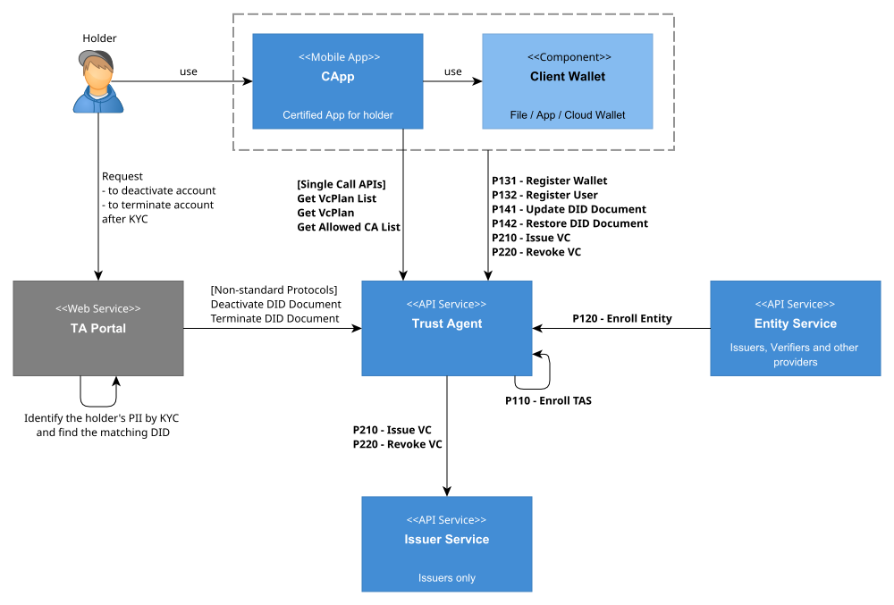

---
puppeteer:
    pdf:
        format: A4
        displayHeaderFooter: true
        landscape: false
        scale: 0.8
        margin:
            top: 1.2cm
            right: 1cm
            bottom: 1cm
            left: 1cm
    image:
        quality: 100
        fullPage: false
---

# TAS API

- Date: 2025-05-30  
- Version: v2.0.0

## Revision History

| Version     | Date       | Changes                                                    |
| ----------- | ---------- | --------------------------------------------------------- |
| 1.0.0       | 2024-09-03 | Initial creation                                          |
| 1.0.1 (dev) | 2024-03-31 | [12.4 Send Email] Optional handling of senderAddress in request data |
| 1.0.1 (dev) | 2024-03-31 | [12.8 Get Vc Schema] Changed request parameter from name -> id |
| 2.0.0       | 2025-05-30 | [12.11 Get Vc Schema List] Request Add, [12.12 Get Credential Schema] Request Add  |

<!-- TOC tocDepth:2..3 chapterDepth:2..6 -->

Table of Contents
---

- [1. Overview](#1-overview)
- [2. Terminology](#2-terminology)
- [3. API List](#3-api-list)
  - [3.1. Sequential APIs](#31-sequential-apis)
  - [3.2. Single Call APIs](#32-single-call-apis)
- [4. P110 - TAS Registration Protocol](#4-p110---tas-registration-protocol)
  - [4.1. Request Enroll TAS](#41-request-enroll-tas)
- [5. P120 - Entity Registration Protocol](#5-p120---entity-registration-protocol)
  - [5.1. Propose Enroll Entity](#51-propose-enroll-entity)
  - [5.2. Request ECDH](#52-request-ecdh)
  - [5.3. Request Enroll Entity](#53-request-enroll-entity)
  - [5.4. Confirm Enroll Entity](#54-confirm-enroll-entity)
- [6. P131 - Wallet Registration Protocol](#6-p131---wallet-registration-protocol)
  - [6.1. Request Register Wallet](#61-request-register-wallet)
- [7. P132 - User Registration Protocol](#7-p132---user-registration-protocol)
  - [7.1. Propose Register User](#71-propose-register-user)
  - [7.2. Request ECDH](#72-request-ecdh)
  - [7.3. Request Create Token](#73-request-create-token)
  - [7.4. Retrieve KYC](#74-retrieve-kyc)
  - [7.5. Request Register User](#75-request-register-user)
  - [7.6. Confirm Register User](#76-confirm-register-user)
- [8. P141 - User DID Document Update Protocol](#8-p141---user-did-document-update-protocol)
  - [8.1. Propose Update DidDoc](#81-propose-update-diddoc)
  - [8.2. Request ECDH](#82-request-ecdh)
  - [8.3. Request Create Token](#83-request-create-token)
  - [8.4. Request Update DidDoc](#84-request-update-diddoc)
  - [8.5. Confirm Update DidDoc](#85-confirm-update-diddoc)
- [9. P142 - User DID Document Recovery Protocol](#9-p142---user-did-document-recovery-protocol)
  - [9.1. Offer Restore DidDoc (Push)](#91-offer-restore-diddoc-push)
  - [9.2. Offer Restore DidDoc (Email)](#92-offer-restore-diddoc-email)
  - [9.3. Propose Restore DidDoc](#93-propose-restore-diddoc)
  - [9.4. Request ECDH](#94-request-ecdh)
  - [9.5. Request Create Token](#95-request-create-token)
  - [9.6. Request Restore DidDoc](#96-request-restore-diddoc)
  - [9.7. Confirm Restore DidDoc](#97-confirm-restore-diddoc)
- [10. P210 - VC Issuance Protocol](#10-p210---vc-issuance-protocol)
  - [10.1 Offer Issue VC (QR)](#101-offer-issue-vc-qr)
  - [10.2 Offer Issue VC (Push)](#102-offer-issue-vc-push)
  - [10.3 Offer Issue VC (Email)](#103-offer-issue-vc-email)
  - [10.4. Propose Issue VC](#104-propose-issue-vc)
  - [10.5. Request ECDH](#105-request-ecdh)
  - [10.6. Request Create Token](#106-request-create-token)
  - [10.7. Request Issue Profile](#107-request-issue-profile)
  - [10.8. Request Issue VC](#108-request-issue-vc)
  - [10.9. Confirm Issue VC](#109-confirm-issue-vc)
- [11. P220 - VC Revocation Protocol](#11-p220---vc-revocation-protocol)
  - [11.1. Propose Revoke VC](#111-propose-revoke-vc)
  - [11.2. Request ECDH](#112-request-ecdh)
  - [11.3. Request Create Token](#113-request-create-token)
  - [11.4. Request Revoke VC](#114-request-revoke-vc)
  - [11.5. Confirm Revoke VC](#115-confirm-revoke-vc)
- [12. Single Call APIs](#12-single-call-apis)
  - [12.1. Get VcPlan List](#121-get-vcplan-list)
  - [12.2. Get VcPlan](#122-get-vcplan)
  - [12.3. Get Allowed CA List](#123-get-allowed-ca-list)
  - [12.4. Send Email](#124-send-email)
  - [12.5. Send push](#125-send-push)
  - [12.6. Update Push Token](#126-update-push-token)
  - [12.7. Get Certificate Vc](#127-get-certificate-vc)
  - [12.8. Get Vc Schema](#128-get-vc-schema)
  - [12.9. Update DidDoc Deactivated](#129-update-diddoc-deactivated)
  - [12.10. Update DidDoc Revoked](#1210-update-diddoc-revoked)
  - [12.11. Get VC Schema List](#1211-get-vc-schema-list)
  - [12.12. Get Credential Schema ](#1212-get-credential-schema)
- [A. Non-standard Object Definitions](#a-non-standard-object-definitions)
  - [A.1. Constant](#a1-constant)
  - [A.2. EmailTemplate Object](#a2-emailtemplate-object)
  - [A.3. FcmNotification Object](#a3-fcmnotification-object)

## 1. Overview

This document defines the APIs provided by Trust Agent (TA or TAS).



- The above diagram shows the protocols and APIs provided by Trust Agent or called by Trust Agent. For readability, only Standard APIs are shown.
- Each term is explained in Chapter 2, and API lists and call examples can be found from Chapter 3 onwards.

<div style="page-break-after: always; margin-top: 50px;"></div>

## 2. Terminology
- Protocol
  - A set of `sequential APIs` that must be called in a defined order to perform specific functions. API call sequence must be strictly followed, and incorrect order may cause unexpected results.
  - Protocols start with P and consist of 3 digits.
    - Example: P110 - TAS Registration Protocol
- Sequential API
  - A series of APIs that are called in a defined order to perform specific functions (protocols). Each API must be called sequentially, and incorrect order may cause malfunction.
  - However, some protocols may have APIs with the same call sequence, in which case one API can be selected and called.
    - Example: In 'P142 - User DID Document Recovery Protocol', you can select and call either `offer-restore-did-push` or `offer-restore-did-email` in call sequence 1.
- Single Call API
  - APIs that can be called independently regardless of order, like general REST APIs.
- Standard API
  - APIs clearly defined in the API documentation that must be provided consistently across all implementations. Standard APIs ensure interoperability between systems and must operate according to predefined specifications.
- Non-Standard API
  - APIs that may be defined differently or customized according to each implementation's needs. Non-standard APIs provided in this document are just examples, and may be implemented differently for each implementation. In such cases, separate documentation for each implementation is required.
  - For example, email sending functionality may be implemented differently depending on the system, and non-standard APIs like `send-email` can be redefined as needed for each implementation.

<div style="page-break-after: always; margin-top: 50px;"></div>

## 3. API List

### 3.1. Sequential APIs

#### 3.1.1. P110 - TAS Registration Protocol
| Seq | API                  | URL                        | Description     | Standard API |
| --- | -------------------- | -------------------------- | --------------- | ------------ |
| 1   | `request-enroll-tas` | /api/v1/request-enroll-tas | TAS Registration | Y            |

<div style="page-break-after: always; margin-top: 40px;"></div>

#### 3.1.2. P120 - Entity Registration Protocol
| Seq | API                     | URL                               | Description                   | Standard API |
| --- | ----------------------- | --------------------------------- | ----------------------------- | ------------ |
| 1   | `propose-enroll-entity` | /api/v1/propose-enroll-entity     | Entity registration request   | Y            |
| 2   | `request-ecdh`          | /api/v1/request-ecdh              | ECDH request                  | Y            |
| 3   | `request-enroll-entity` | /api/v1/request-enroll-entity     | Entity registration request   | Y            |
| 4   | `confirm-enroll-entity` | /api/v1/confirm-enroll-entity     | Entity registration completion| Y            |

<div style="page-break-after: always; margin-top: 40px;"></div>

#### 3.1.3. P131 - Wallet Registration Protocol
| Seq | API                       | URL                                 | Description         | Standard API |
| --- | ------------------------- | ----------------------------------- | ------------------- | ------------ |
| 1   | `request-register-wallet` | /api/v1/request-register-wallet     | Wallet registration | Y            |

<div style="page-break-after: always; margin-top: 40px;"></div>

#### 3.1.4. P132 - User Registration Protocol
| Seq | API                     | URL                               | Description                   | Standard API |
| --- | ----------------------- | --------------------------------- | ----------------------------- | ------------ |
| 1   | `propose-register-user` | /api/v1/propose-register-user     | User registration request     | Y            |
| 2   | `request-ecdh`          | /api/v1/request-ecdh              | ECDH request                  | Y            |
| 3   | `request-create-token`  | /api/v1/request-create-token      | Server token creation request | Y            |
| 4   | `retrieve-kyc`          | /api/v1/retrieve-kyc              | KYC result response request   | N            |
| 5   | `request-register-user` | /api/v1/request-register-user     | User registration request     | Y            |
| 6   | `confirm-register-user` | /api/v1/confirm-register-user     | User registration completion  | Y            |

<div style="page-break-after: always; margin-top: 40px;"></div>

#### 3.1.5. P141 - User DID Document Update Protocol
| Seq | API                     | URL                               | Description                            | Standard API |
| --- | ----------------------- | --------------------------------- | -------------------------------------- | ------------ |
| 1   | `propose-update-diddoc` | /api/v1/propose-update-diddoc     | User DID Document update request       | Y            |
| 2   | `request-ecdh`          | /api/v1/request-ecdh              | ECDH request                           | Y            |
| 3   | `request-create-token`  | /api/v1/request-create-token      | Server token creation request          | Y            |
| 4   | `request-update-diddoc` | /api/v1/request-update-diddoc     | User DID Document update request       | Y            |
| 5   | `confirm-update-diddoc` | /api/v1/confirm-update-diddoc     | User DID Document update completion    | Y            |

<div style="page-break-after: always; margin-top: 40px;"></div>

#### 3.1.6. P142 - User DID Document Recovery Protocol
| Seq | API                       | URL                                 | Description                                | Standard API |
| --- | ------------------------- | ----------------------------------- | ------------------------------------------ | ------------ |
| 1   | `offer-restore-did-push`  | /api/v1/offer-restore-did/push      | User DID Document Offer request (Push)     | N            |
| 1   | `offer-restore-did-email` | /api/v1/offer-restore-did/email     | User DID Document Offer request (Email)    | N            |
| 2   | `propose-restore-user`    | /api/v1/propose-restore-user        | User DID Document recovery request         | Y            |
| 3   | `request-ecdh`            | /api/v1/request-ecdh                | ECDH request                               | Y            |
| 4   | `request-create-token`    | /api/v1/request-create-token        | Server token creation request              | Y            |
| 5   | `request-restore-user`    | /api/v1/request-restore-user        | User DID Document recovery request         | Y            |
| 6   | `confirm-restore-user`    | /api/v1/confirm-restore-user        | User DID Document recovery completion      | Y            |

<div style="page-break-after: always; margin-top: 40px;"></div>

#### 3.1.7. P210 - VC Issuance Protocol
| Seq | API                     | URL                               | Description                    | Standard API |
| --- | ----------------------- | --------------------------------- | ------------------------------ | ------------ |
| 1   | `offer-issue-vc-qr`     | /api/v1/offer-issue-vc/qr         | VC issuance Offer request (QR) | N            |
| 1   | `offer-issue-vc-push`   | /api/v1/offer-issue-vc/push       | VC issuance Offer request (Push)| N           |
| 1   | `offer-issue-vc-email`  | /api/v1/offer-issue-vc/email      | VC issuance Offer request (Email)| N          |
| 2   | `propose-issue-vc`      | /api/v1/propose-issue-vc          | VC issuance request            | Y            |
| 3   | `request-ecdh`          | /api/v1/request-ecdh              | ECDH request                   | Y            |
| 4   | `request-create-token`  | /api/v1/request-create-token      | Server token creation request  | Y            |
| 5   | `request-issue-profile` | /api/v1/request-issue-profile     | Issue Profile request          | Y            |
| 6   | `request-issue-vc`      | /api/v1/request-issue-vc          | VC issuance request            | Y            |
| 7   | `confirm-issue-vc`      | /api/v1/confirm-issue-vc          | VC issuance completion         | Y            |

<div style="page-break-after: always; margin-top: 40px;"></div>

#### 3.1.8. P220 - VC Revocation Protocol

| Seq. | API                    | URL                              | Description                    | Standard API |
| :--: | ---------------------- | -------------------------------- | ------------------------------ | ------------ |
|  1   | `propose-revoke-vc`    | /api/v1/propose-revoke-vc        | VC revocation request          | Y            |
|  2   | `request-ecdh`         | /api/v1/request-ecdh             | ECDH request                   | Y            |
|  3   | `request-create-token` | /api/v1/request-create-token     | Server token creation request  | Y            |
|  4   | `request-revoke-vc`    | /api/v1/request-revoke-vc        | VC revocation request          | Y            |
|  5   | `confirm-revoke-vc`    | /api/v1/confirm-revoke-vc        | VC revocation completion       | Y            |

<div style="page-break-after: always; margin-top: 50px;"></div>

### 3.2. Single Call APIs
| API                         | URL                               | Description                        | Standard API |
| --------------------------- | --------------------------------- | ---------------------------------- | ------------ |
| `send-email`                | /noti/api/v1/send-email           | Email sending                      | N            |
| `send-push`                 | /noti/api/v1/send-push            | Push transmission                  | N            |
| `update-push-token`         | /api/v1/update-push-token         | Push token update                  | N            |
| `get-vcplan-list`           | /list/api/v1/vcplan/list          | Retrieve all VC Plan list          | Y            |
| `get-vcplan`                | /list/api/v1/vcplan/id            | Retrieve VC Plan                   | Y            |
| `get-allowed-ca-list`       | /list/api/v1/allowed-ca/list      | Retrieve CA list allowed for wallet| Y            |
| `get-certificate-vc`        | /api/v1/certificate-vc            | Retrieve enrollment certificate    | N            |
| `get-vcschema`              | /api/v1/vc-schema                 | Retrieve VC schema                 | N            |
| `update-diddoc-deactivated` | /api/v1/update-diddoc-deactivated | DIDDoc deactivation                | N            |
| `update-diddoc-revoked`     | /api/v1/update-diddoc-revoked     | DIDDoc revocation                  | N            |

> **Note**
> 
> - Currently, Trust Agent also performs the roles of Noti provider and List provider. APIs with URLs starting with `noti` and `list` provide these functionalities.
> - To clearly distinguish roles between providers and prevent confusion, it is recommended to configure each provider's APIs with distinct **context paths**.
>   - Trust Agent API: `/tas/api/~`
>   - List API: `/list/api/~`

<div style="page-break-after: always; margin-top: 50px;"></div>

## 4. P110 - TAS Registration Protocol

| Seq. | API                  | Description     | Standard API |
| :--: | -------------------- | --------------- | ------------ |
|  1   | `request-enroll-tas` | TAS registration| Y            |

<div style="page-break-after: always; margin-top: 40px;"></div>

### 4.1. Request Enroll TAS

Issues TAS enrollment certificate VC based on pre-registered information.
Receives and verifies authority using the password assigned during information registration.

| Item          | Description                  | Remarks |
| ------------- | ---------------------------- | ------- |
| Method        | `POST`                       |         |
| Path          | `/api/v1/request-enroll-tas` |         |
| Authorization | -                            |         |

<div style="page-break-after: always; margin-top: 30px;"></div>

#### 4.1.1. Request

**■ Headers**

| Header              | Value                            | Remarks |
| ------------------- | -------------------------------- | ------- |
| + `Content-Type`    | `application/json;charset=utf-8` |         |

**■ Path Parameters**

N/A

**■ Query Parameters**

N/A

**■ Body**

```c#
def object M110_RequestEnrollTas: "Request Enroll TAS request message"
{
    //--- Common Part ---
    + messageId "id": "message id"

    //--- Data Part ---
    + object "request": "request information"
    {
        + string "password": "pre-distributed password"
    }
}
```

- `~/request`
    - `password`: Password composition depends on each implementation.

<div style="page-break-after: always; margin-top: 30px;"></div>

#### 4.1.2. Response

TAS receives this request, issues TAS enrollment certificate, and responds with the publication address.
Data required for TAS registration includes:

- Subject DN: Subject information in Distinguished Name format
- Role: Fixed as "Tas"
- Evidence information
- Enrollment certificate VC publication address

**■ Process**

1. Verify execution authority
    - Check if `~/request/password` matches the pre-specified value
1. Check if currently in registerable state
1. Retrieve data for issuance
    - subject, role, evidence, enrollment certificate VC publication address, etc.
1. Issue enrollment certificate VC
    - Publish enrollment certificate VC

**■ Status 200 - Success**

```c#
def object _M110_RequestEnrollTas: "Request Enroll TAS response message"
{
    //--- Common Part ---
    + uuid "txId": "transaction id"

    //--- Data Part ---
    + url "certVcRef": "TAS enrollment certificate VC URL"
}
```

**■ Status 400 - Client error**

|     Code     | Description               |
| :----------: | ------------------------- |
| SSRVTRA12010 | Password mismatch.        |

**■ Status 500 - Server error**

|     Code     | Description                                              |
| :----------: | -------------------------------------------------------- |
| SSRVTRA13001 | TAS DID Document is not registered.                     |
| SSRVTRA13003 | TAS is already in registered state.                     |
| SSRVTRA18515 | VC creation failed.                                      |
| SSRVTRA15004 | VC metadata publication failed.                         |
| SSRVTRA13006 | 'propose-enroll-tas' API request processing failed.     |

<div style="page-break-after: always; margin-top: 30px;"></div>

#### 4.1.3. Example

**■ Request**

```shell
curl -v -X POST "http://${Host}:${Port}/tas/api/v1/request-enroll-tas" \
-H "Content-Type: application/json;charset=utf-8" \
-d @"data.json"
```

```json
//data.json
{
    "id": "2024123111223312345600000001",
    "request": {
        "password": "VoOyEuOyal"
    }
}
```

**■ Response**

```http
HTTP/1.1 200 OK
Content-Type: application/json;charset=utf-8

{
    "txId": "7a25a59a-3c5a-4d47-9e55-bbc9fa85a92c",
    "certVcRef": "https://opendid.org/cert/tas_v1"
}
```

<div style="page-break-after: always; margin-top: 50px;"></div>

## 5. P120 - Entity Registration Protocol

| Seq. | API                   | Description                   | Standard API |
| :--: | --------------------- | ----------------------------- | ------------ |
|  1   | propose-enroll-entity | Entity registration request   | Y            |
|  2   | request-ecdh          | ECDH request                  | Y            |
|  3   | request-enroll-entity | Entity registration request   | Y            |
|  4   | confirm-enroll-entity | Entity registration completion| Y            |

### 5.1. Propose Enroll Entity

Initiates entity registration transaction for various service providers.

| Item          | Description                     | Remarks |
| ------------- | ------------------------------- | ------- |
| Method        | `POST`                          |         |
| Path          | `/api/v1/propose-enroll-entity` |         |
| Authorization | -                               |         |

<div style="page-break-after: always; margin-top: 30px;"></div>


#### 5.1.1. Request

**■ Headers**

| Header           | Value                            | Remarks |
| ---------------- | -------------------------------- | ------- |
| + `Content-Type` | `application/json;charset=utf-8` |         |

**■ Path Parameters**

N/A

**■ Query Parameters**

N/A

**■ Body**

```c#
def object M120_ProposeEnrollEntity: "Propose Enroll Entity request message"
{
    //--- Common Part ---
    + messageId "id": "message id"
}
```

#### 5.1.2. Response

Generates transaction code and creates nonce for DID Auth.

**■ Process**

1. `txId` = Generate transaction code
1. `authNonce` = Generate 16-byte nonce for DID Auth
1. Save `txId`, `authNonce`

**■ Status 200 - Success**

```c#
def object _M120_ProposeEnrollEntity: "Propose Enroll Entity response message"
{    
    //--- Common Part ---
    + uuid "txId": "transaction id"

    //--- Data Part ---
    + multibase "authNonce": "TAS nonce for DID Auth", byte_length(16)
}
```

**■ Status 400 - Client error**

N/A

**■ Status 500 - Server error**

|     Code     | Description                                           |
| :----------: | ----------------------------------------------------- |
| SSRVTRA14005 | 'propose-enroll-entity' API request processing failed. |

#### 5.1.3. Example

**■ Request**

```shell
curl -v -X POST "http://${Host}:${Port}/tas/api/v1/propose-enroll-entity" \
-H "Content-Type: application/json;charset=utf-8" \
-d @"data.json"
```

```json
//data.json
{
    "id":"20240905105721157000631bff19"
}
```

**■ Response**

```http
HTTP/1.1 200 OK
Content-Type: application/json;charset=utf-8

{
   "txId":"b86855ad-6793-4e15-bd1c-d44c01a87ee8",
   "authNonce":"mxbrrv9EupAFUumfyXD9Vag"
}
```

### 5.2. Request ECDH

Performs key exchange for session encryption.

| Item          | Description            | Remarks |
| ------------- | ---------------------- | ------- |
| Method        | `POST`                 |         |
| Path          | `/api/v1/request-ecdh` |         |
| Authorization | -                      |         |

#### 5.2.1. Request

**■ Headers**

| Header           | Value                            | Remarks |
| ---------------- | -------------------------------- | ------- |
| + `Content-Type` | `application/json;charset=utf-8` |         |

**■ Path Parameters**

N/A

**■ Query Parameters**

N/A

**■ Body**

```c#
def object M120_RequestEcdh: "ECDH request message"
{
    //--- Common Part ---
    + messageId "id"  : "message id"
    + uuid      "txId": "transaction id"

    //--- Data Part ---
    + ReqEcdh "reqEcdh": "ECDH request data"
}
```

- `~/reqEcdh`
    - `client`: Client DID
    - `clientNonce`: Nonce generated by client
    - `curve`: ECC curve type for ECDH (client specifies one)
    - `publicKey`: Public key of temporary key pair generated with above `curve` type
    - `candidate` 
        - `ciphers`: List of cipher algorithms supported by client

#### 5.2.2. Response

**■ Process**

1. Verify transaction code
1. Verify `~/reqEcdh/proof` signature
1. Validate client request values (`~/reqEcdh`) and select cipher algorithm
    - `cipherAlg` = Select cipher algorithm
    - `padding` = Select padding method
1. Generate ECIES session key
    - `clientNonce` = `~/reqEcdh/clientNonce`
    - `severNonce` = Generate 16-byte nonce
    - `mergedNonce` = sha256(serverNonce, clientNonce)
    - `clientPubKey` = `~/reqEcdh/publicKey`
    - `serverPubKey`, `serverPriKey` = Generate server temporary key pair of `~/reqEcdh/curve` type
    - `sesKey` = ecies(serverPriKey, clientPubKey, mergedNonce, cipherAlg)
1. Save ECDH information
    - Client DID, transaction code
    - `sesKey`, `cipherAlg`, `padding`
1. Generate and sign ECDH acceptance data

**■ Status 200 - Success**

```c#
def object _M120_RequestEcdh: "Request ECDH response message"
{    
    //--- Common Part ---
    + uuid "txId": "transaction id"
    
    //--- Data Part ---
    + AccEcdh "accEcdh": "ECDH acceptance data"
}
```

- `~/accEcdh`
    - `server`: Server DID
    - `serverNonce`: Nonce generated by server
    - `publicKey`: Public key of server-generated temporary key pair (`serverPubKey`)
    - `cipher`: Cipher algorithm selected by server from client candidates
    - `padding`: Padding method selected by server

**■ Status 400 - Client error**

|     Code     | Description                                               |
| :----------: | --------------------------------------------------------- |
| SSRVTRA16519 | Client Nonce processing failed: Invalid Nonce.           |
| SSRVTRA16000 | Transaction not found: Transaction does not exist.       |
| SSRVTRA16001 | Transaction processing failed: Transaction is invalid.   |
| SSRVTRA16002 | Transaction processing failed: Transaction has expired.  |
| SSRVTRA16510 | Signature verification failed: Signature is invalid.     |
| SSRVTRA16511 | Signature verification failed.                           |
| SSRVTRA12008 | Unsupported Cipher Type.                                 |

**■ Status 500 - Server error**

|     Code     | Description                                  |
| :----------: | -------------------------------------------- |
| SSRVTRA16504 | Nonce generation failed.                     |
| SSRVTRA16506 | Session key generation failed.               |
| SSRVTRA16521 | 'request-ecdh' API request processing failed.|

#### 5.2.3. Example

**■ Request**

```shell
curl -v -X POST "http://${Host}:${Port}/tas/api/v1/request-ecdh" \
-H "Content-Type: application/json;charset=utf-8" \
-d @"data.json"
```


```json
//data.json
{
   "id":"202409051057215930001a8e8722",
   "txId":"b86855ad-6793-4e15-bd1c-d44c01a87ee8",
   "reqEcdh":{
      "client":"did:omn:issuer",
      "clientNonce":"mazS27bP/XeZl1EDoF4E6sw",
      "curve":"Secp256r1",
      "publicKey":"zp7E4rrt57ELyyDfNWhMpLeeCK9i6T4bq26PmKihkxK66",
      "candidate":{
         "ciphers":[
            "AES-128-CBC",
            "AES-128-ECB",
            "AES-256-CBC",
            "AES-256-ECB"
         ]
      },
      "proof":{
         "type":"Secp256r1Signature2018",
         "created":"2024-09-05T10:57:21.392505Z",
         "verificationMethod":"did:omn:issuer?versionId=1#keyagree",
         "proofPurpose":"keyAgreement",
         "proofValue":"mICxEbCOvZ3rVWtb33O4MREY+I53TZh1LV4mEZKjxYLTYUIzbzzB+zA6DD47saZFWTYuces4ZlEMNp/WyEUz6Kps"
      }
   }
}
```

**■ Response**

```http
HTTP/1.1 200 OK
Content-Type: application/json;charset=utf-8

{
   "id":"202409051057215930001a8e8722",
   "txId":"b86855ad-6793-4e15-bd1c-d44c01a87ee8",
   "reqEcdh":{
      "client":"did:omn:issuer",
      "clientNonce":"mazS27bP/XeZl1EDoF4E6sw",
      "curve":"Secp256r1",
      "publicKey":"zp7E4rrt57ELyyDfNWhMpLeeCK9i6T4bq26PmKihkxK66",
      "candidate":{
         "ciphers":[
            "AES-128-CBC",
            "AES-128-ECB",
            "AES-256-CBC",
            "AES-256-ECB"
         ]
      },
      "proof":{
         "type":"Secp256r1Signature2018",
         "created":"2024-09-05T10:57:21.392505Z",
         "verificationMethod":"did:omn:issuer?versionId=1#keyagree",
         "proofPurpose":"keyAgreement",
         "proofValue":"mICxEbCOvZ3rVWtb33O4MREY+I53TZh1LV4mEZKjxYLTYUIzbzzB+zA6DD47saZFWTYuces4ZlEMNp/WyEUz6Kps"
      }
   }
}
```

<div style="page-break-after: always; margin-top: 40px;"></div>

### 5.3. Request Enroll Entity

After DID Auth signature verification, issues Entity enrollment certificate VC and responds with the VC encrypted with session key.

| Item          | Description                     | Remarks |
| ------------- | ------------------------------- | ------- |
| Method        | `POST`                          |         |
| Path          | `/api/v1/request-enroll-entity` |         |
| Authorization | -                               |         |

#### 5.3.1. Request

**■ Headers**

| Header           | Value                            | Remarks |
| ---------------- | -------------------------------- | ------- |
| + `Content-Type` | `application/json;charset=utf-8` |         |

**■ Path Parameters**

N/A

**■ Query Parameters**

N/A

**■ Body**

```c#
def object M120_RequestEnrollEntity: "Request Enroll Entity request message"
{
    //--- Common Part ---
    + messageId "id"  : "message id"
    + uuid      "txId": "transaction id"

    //--- Data Part ---
    + DidAuth "didAuth": "DID Auth data"
}
```

- `~/didAuth`
    - `did`: DID of entity requesting registration
    - `authNonce`: `_M120_ProposeEnrollEntity:~/authNonce`

#### 5.3.2. Response

Verifies authentication proof including the `authNonce` previously sent by server, then issues enrollment certificate VC.

**■ Process**

1. Verify transaction code
1. Verify DID Auth
    - Check if `authNonce` matches `_M120_ProposeEnrollEntity:~/authNonce`
    - Verify `didAuth/proof` signature
1. Retrieve data for issuance
    - subject, role, evidence
1. `vc` = Issue enrollment certificate VC
1. Encrypt VC with session key
    - `iv` = Generate 16-byte IV
    - `encVc` = multibase(enc(vc, sesKey, iv, padding))

**■ Status 200 - Success**

```c#
def object _M120_RequestEnrollEntity: "Request Enroll Entity response message"
{    
    //--- Common Part ---
    + uuid      "txId": "transaction id"
    + multibase "iv"  : "session key encryption/decryption IV"

    //--- Data Part ---
    + multibase "encVc": "encrypted enrollment certificate VC"
}
```

**■ Status 400 - Client error**

|     Code     | Description                                               |
| :----------: | --------------------------------------------------------- |
| SSRVTRA16000 | Transaction not found: Transaction does not exist.       |
| SSRVTRA16001 | Transaction processing failed: Transaction is invalid.   |
| SSRVTRA16002 | Transaction processing failed: Transaction has expired.  |
| SSRVTRA16510 | Signature verification failed: Signature is invalid.     |
| SSRVTRA16511 | Signature verification failed.                           |
| SSRVTRA16509 | DID Auth verification failed.                           |
| SSRVTRA14006 | Requested DID does not match Entity requesting registration.|
| SSRVTRA16520 | 'authNonce' does not match.                              |

**■ Status 500 - Server error**

|     Code     | Description                                           |
| :----------: | ----------------------------------------------------- |
| SSRVTRA16510 | Signature verification failed: Signature is invalid. |
| SSRVTRA16511 | Signature verification failed.                       |
| SSRVTRA16509 | DID Auth verification failed.                        |
| SSRVTRA18515 | VC creation failed.                                  |
| SSRVTRA15004 | VC metadata publication failed.                      |
| SSRVTRA10004 | Data encryption failed.                              |
| SSRVTRA14007 | 'request-enroll-entity' API request processing failed.|

#### 5.3.3. Example

**■ Request**

```shell
curl -v -X POST "http://${Host}:${Port}/tas/api/v1/request-enroll-entity" \
-H "Content-Type: application/json;charset=utf-8" \
-d @"data.json"
```

```json
//data.json
{
   "id":"202409051057218230006d1055cf",
   "txId":"b86855ad-6793-4e15-bd1c-d44c01a87ee8",
   "didAuth":{
      "did":"did:omn:issuer",
      "authNonce":"mxbrrv9EupAFUumfyXD9Vag",
      "proof":{
         "type":"Secp256r1Signature2018",
         "created":"2024-09-05T10:57:21.813619Z",
         "verificationMethod":"did:omn:issuer?versionId=1#auth",
         "proofPurpose":"authentication",
         "proofValue":"mH9aszl/8gg+HLq0KLp3nHPOwmWNjL+KWOTXdtfAFvCfmPC40cten2OuclmkYKu9+ucRdljU4CVvF+hLMt0CEyYM"
      }
   }
}
```

**■ Response**

```http
HTTP/1.1 200 OK
Content-Type: application/json;charset=utf-8

{
   "txId":"b86855ad-6793-4e15-bd1c-d44c01a87ee8",
   "iv":"mJITQJzWHqXkZLWScaC8xqw",
   "encVc":"mJ2uwCQMr4GFiLW+sgVBflh9NGZ+AZ+7Pua00E9vWIS5sBDQrBnl5Zc9wUAml9fXbCmaQgTmgVFytjr2n5wEJsumqgjYRcv+DjmJEDCxXPogsMPMVrBLwjhy2pTE163oAplLE5YOgEe437H7xXY1ok00NzgkNlVsWCUrz3aBv+yKukuV1Rq9Dhe05JBFvrwBOwNnoaXEQ1SScaQCD+XsGzvYMqBcR1VcoR1Kaadpkr9iQm11wXz+Q8FhTwQ1mFbXWcmZaWcBtUUdGHYIu2z+wuCTwYszwCAIz1etDxqMYmgPYT0c5UPuk9dZ8TDfK4qTBSW1m+o7sfk1ctyNMrnJLK5gkG9A1mi9kLBa8lM0UPo2pLBnTHCplCS49PdziknsBRN284y6DQ9SKYLFMkNJ1u4YBg6sC4gKyrL3e4Q+haDvtdqBAxKSE5W63k9Vx3NsNAGrytE3Z63sv2qMM0F4x2cRgx0Vx3LCErVw+/1//R8ZD049ON+LsywdE/NI+I55jt8tXOBlHuTMBus3QKErsxdi/mX15WnQc7LGpKcEFJ9Fad6bthSzybBw7qUDo5bMUBWeBr3r68/jowgDKD0R4ddcT9vTUuHNBgwTjomFyllJWXzy5eImowmjORlIieLcqlYbGmbViCZ281xTk5pQB7gc993eLEQyx2bSjruhLcFhqDMOg/eHV504yDwhIZ6Wnr1IYJ2Y8evJhTkqaJAAkMVG1lScgmzEPvPUNGcqQHfSMD2XMGKtjHJOBJ5axlEYbtV53r/p89a8aibLSNow1m8Nou4mXKNmJPeQA60rIqAAsF9MzmjWkT3Z056ei6qWX8xRpUX+ww4Z9uPoYtHHRcSJjEzW2QTenqTF+H3WZtxGutI3O+68BkCmXkQrc9a0yriLTWK9DEPgPgw0/oxV/haGJxo5S8boq/8AS8UAKR/+Nn5PWUkvOyiCFASKt4ue1YKhrpftRAIO21huAoVAYhcv0gj3f+gQbZsDLOFA7/2HZOlxcge7aig+vE85Flk0aumqgHuQhj0aRy59YtjWdcNKlui0TKvlXYdpe+itqTuY0inh1DUAdWslBRZJTnOgsLjVICowMLOZXXYshg4qG2uoB4lZjNxXXmwge/i+CdhE0QxyiO1phrO/owkEK2pkXGS8Wb2zDd4XiIoR8nvCo0M5nsYWDGBq9npJvNdtNjE4+kok+JclHAuj3CDDuNUOUcoBKHZ2ok0egZF2aOVpF6Ov3MQDTNHVvgKO0PGfKuzVSCstCl5fAPXInxn9dl2uoXbO2UXQdq/TBo8otMvOfP9ohh1M/1xMvN3//llTsWQFjlhXmcUfRvSEY53a3DXbj1D72QlbrJGgxbDfcDBiYWtGmJfwSzpLozDHp/Tnmgj069wde97nNGOr1yqsbkW/T3r2LBMBs/fkm3xpTOmW/LDJuaw7XRqrvJZxFoyrRWCWBUHaJsJA3GbFzo92x+uADs4k7NhhvEhDw+Gi9oCj/yAloZ9202pzLuRFJrGViGWNdvZkuuhJ2uNRQypSKtmDm7/qZZxE5rl8MsdP3kI/yme8Y02voClyi6UV6duWab2fkbBv5kYSyHB1e1o183uO6uoxtPrNG/kaSCZ98TXF5to8xMOPfvhGVE8EHV0UBiRAzFOljMPHs5JIJQxXe2e+ssSHzge1qFgzihl7xrxp2U4ljI/0V+c7igEzLw+9/FC/+B4oHx+RhuSGyuCHFSdoa/u03/W8hHH7j07473NQXuApfY0CVP2JKeLS68hNUq90IACmbVOlW330IebZ+6ed2hukZl3RXqnF9a9t4thhq95AxvY2i9Mz2E2O+TuYBdP90CjsgfF6IcVR1fHT2AW+m3UIeLDdPMp7/oUyMxVBOEK30Xo723G8Umrr6f5X+vEFk4MlVJl6up5p/YTzzuJfk"
}
```

### 5.4. Confirm Enroll Entity

Terminates Entity registration transaction.

| Item          | Description                     | Remarks |
| ------------- | ------------------------------- | ------- |
| Method        | `POST`                          |         |
| Path          | `/api/v1/confirm-enroll-entity` |         |
| Authorization | -                               |         |

#### 5.4.1. Request

**■ Headers**

| Header           | Value                            | Remarks |
| ---------------- | -------------------------------- | ------- |
| + `Content-Type` | `application/json;charset=utf-8` |         |

**■ Path Parameters**

N/A

**■ Query Parameters**

N/A

**■ Body**

```c#
def object M120_ConfirmEnrollEntity: "Confirm Enroll Entity request message"
{
    //--- Common Part ---
    + messageId "id"  : "message id"
    + uuid      "txId": "transaction id"

    //--- Data Part ---
    + vcId "vcId": "VC id"
}
```

- `~/vcId`: ID of issued enrollment certificate VC

#### 5.4.2. Response

Verifies VC ID match and terminates Entity registration protocol.

**■ Process**

1. Verify transaction code
1. Verify `vcId` match

**■ Status 200 - Success**

```c#
def object _M120_ConfirmEnrollEntity: "Confirm Enroll Entity response message"
{
    //--- Common Part ---
    + uuid "txId": "transaction id"
}
```

**■ Status 400 - Client error**

|     Code     | Description                                               |
| :----------: | --------------------------------------------------------- |
| SSRVTRA16000 | Transaction not found: Transaction does not exist.       |
| SSRVTRA16001 | Transaction processing failed: Transaction is invalid.   |
| SSRVTRA16002 | Transaction processing failed: Transaction has expired.  |
| SSRVTRA18500 | VC ID does not match.                                    |

**■ Status 500 - Server error**

N/A

#### 5.4.3. Example

**■ Request**

```shell
curl -v -X POST "http://${Host}:${Port}/tas/api/v1/confirm-enroll-entity" \
-H "Content-Type: application/json;charset=utf-8" \
-d @"data.json"
```

```json
//data.json
{
   "id":"20240905105724406000f16623c3",
   "txId":"b86855ad-6793-4e15-bd1c-d44c01a87ee8",
   "vcId":"d0a11e31-5068-491e-8de3-24bad1463f08"
}
```

**■ Response**

```http
HTTP/1.1 200 OK
Content-Type: application/json;charset=utf-8

{
    "txId":"b86855ad-6793-4e15-bd1c-d44c01a87ee8"
}
```

## 6. P131 - Wallet Registration Protocol

| Seq. | API                       | Description         | Standard API |
| :--: | ------------------------- | ------------------- | ------------ |
|  1   | `request-register-wallet` | Wallet registration | Y            |

### 6.1. Request Register Wallet

This is the procedure for creating and registering user mobile wallet to TAS.
The processing sequence is as follows:

- Generate wallet DID Document and add proofs for each key
- Wallet provider signs wallet identifier and DID Document
- Register to TAS
    - Verify if registered wallet provider
    - Verify wallet provider signature and signatures within DID Document
    - Register DID Document to trust repository
    - Register wallet to TAS

| Item          | Description                       | Remarks |
| ------------- | --------------------------------- | ------- |
| Method        | `POST`                            |         |
| Path          | `/api/v1/request-register-wallet` |         |
| Authorization | -                                 |         |

#### 6.1.1. Request

**■ Headers**

| Header              | Value                            | Remarks |
| ------------------- | -------------------------------- | ------- |
| + `Content-Type`    | `application/json;charset=utf-8` |         |

**■ Path Parameters**

N/A

**■ Query Parameters**

N/A

**■ Body**

```c#
def object M131_RequestRegisterWallet: "Request Register Wallet request message"
{
    //--- Common Part ---
    + messageId "id": "message id"

    //--- Data Part ---
    + AttestedDidDoc "attestedDidDoc": "provider attested DID Document"
}
```

- `~/attestedDidDoc`
    - `walletId`: Wallet identifier created by wallet
    - `ownerDidDoc`: DID Document with signatures added for each Wallet DID key
    - `provider`: Wallet provider information
        - `did`: Wallet provider DID
        - `certVcRef`: Wallet provider enrollment certificate VC URL
    - `proof`: Wallet provider signature on registration request information

#### 6.1.2. Response

TAS verifies wallet provider's signature, registers DID Document to trust repository, and registers wallet using `walletId` as identifier.

**■ Process**

1. Wallet provider related verification
    - Verify if `~/attestedDidDoc/provider/did` is registered and operational provider
    - (OPTIONAL) Verify `~/attestedDidDoc/provider/certVcRef` enrollment certificate VC
1. Verify Attestation proof
    - Verify if `~/attestedDidDoc/proof/verificationMethod` matches above provider's DID
    - Verify signature (original text is `~/attestedDidDoc`, not entire request message)
1. Check walletId duplication, etc.
1. Verify DID key signatures
    - (OwnerDidDoc) Verify `ownerDidDoc` internal proofs signatures
    - (DidDoc) Extract DID Document original text as `didDoc`
1. Register DID Document to trust repository
    - (InvokedDidDoc) `invokedDidDoc` = Attach TAS signature to `didDoc`
    - Register to trust repository
1. Map and save wallet registration information
    - `walletId`, wallet DID, wallet provider DID

**■ Status 200 - Success**

```c#
def object _M131_RequestRegisterWallet: "Request Register Wallet response message"
{
    //--- Common Part ---
    + uuid "txId": "transaction id"
}
```

**■ Status 400 - Client error**

|     Code     | Description                                           |
| :----------: | ----------------------------------------------------- |
| SSRVTRA17500 | Wallet provider is not registered.                   |
| SSRVTRA14003 | Entity is not in completed registration state.       |
| SSRVTRA18510 | Enrollment certificate VC not found.                 |
| SSRVTRA12007 | Provider DID does not match.                         |
| SSRVTRA18511 | Invalid enrollment certificate VC Issuer.            |
| SSRVTRA16510 | Signature verification failed: Signature is invalid. |
| SSRVTRA16511 | Signature verification failed.                       |
| SSRVTRA17501 | Wallet ID already exists.                            |
| SSRVTRA16516 | DID Document key signature verification failed.      |

**■ Status 500 - Server error**

|     Code     | Description                                             |
| :----------: | ------------------------------------------------------- |
| SSRVTRA18017 | Invoked Document creation failed.                       |
| SSRVTRA18016 | DID Document registration failed.                       |
| SSRVTRA17510 | 'request-register-wallet' API request processing failed.|

#### 6.1.3. Example

**■ Request**

```shell
curl -v -X POST "http://${Host}:${Port}/tas/api/v1/request-register-wallet" \
-H "Content-Type: application/json;charset=utf-8" \
-d @"data.json"
```


```json
//data.json
{
   "id":"6dcdde42-c0d9-4f79-82fb-128a94ce709b",
   "attestedDidDoc":{
      "ownerDidDoc":"ueyJAY29udGV4dCI6WyJodHRwczovL3d3dy53My5vcmcvbnMvZGlkL3YxIl0sImFzc2VydGlvbk1ldGhvZCI6WyJhc3NlcnQiXSwiYXV0aGVudGljYXRpb24iOlsiYXV0aCJdLCJjb250cm9sbGVyIjoiZGlkOm9tbjp0YXMiLCJjcmVhdGVkIjoiMjAyNC0wOS0wNVQwODoxMToxMloiLCJkZWFjdGl2YXRlZCI6ZmFsc2UsImlkIjoiZGlkOm9tbjo0R052ZUxrdmJ1R29naVdKbXRNa3ZocWV0QUQzIiwia2V5QWdyZWVtZW50IjpbImtleWFncmVlIl0sInByb29mcyI6W3siY3JlYXRlZCI6IjIwMjQtMDktMDVUMDg6MTE6MTJaIiwicHJvb2ZQdXJwb3NlIjoiYXNzZXJ0aW9uTWV0aG9kIiwicHJvb2ZWYWx1ZSI6Im1IOTA0MFdUL1Z3SHZFL1dIdXp3U1VsazJwOEwrRDlEeHJrcDEyMEllWEkrK1dpTHV1TCtvVklFeEJvMXdDaU8rZEdjZUY3T01nT1AyU0tFODVIRmpPZjQ9IiwidHlwZSI6IlNlY3AyNTZyMVNpZ25hdHVyZTIwMTgiLCJ2ZXJpZmljYXRpb25NZXRob2QiOiJkaWQ6b21uOjRHTnZlTGt2YnVHb2dpV0ptdE1rdmhxZXRBRDM_dmVyc2lvbklkPTEjYXNzZXJ0In0seyJjcmVhdGVkIjoiMjAyNC0wOS0wNVQwODoxMToxMloiLCJwcm9vZlB1cnBvc2UiOiJhdXRoZW50aWNhdGlvbiIsInByb29mVmFsdWUiOiJtSDBpWnJXaWYrdzBmVlo1eWxHcHFTMGVMZGdKRGtKNVFjRFMycFJUc0g2eGVMa3pWd1JNRlB2cktZZGsvNng4Nm5XNjFER2JValdQV0NDQ2F3b3BTcldZPSIsInR5cGUiOiJTZWNwMjU2cjFTaWduYXR1cmUyMDE4IiwidmVyaWZpY2F0aW9uTWV0aG9kIjoiZGlkOm9tbjo0R052ZUxrdmJ1R29naVdKbXRNa3ZocWV0QUQzP3ZlcnNpb25JZD0xI2F1dGgifV0sInVwZGF0ZWQiOiIyMDI0LTA5LTA1VDA4OjExOjEyWiIsInZlcmlmaWNhdGlvbk1ldGhvZCI6W3siYXV0aFR5cGUiOjEsImNvbnRyb2xsZXIiOiJkaWQ6b21uOnRhcyIsImlkIjoia2V5YWdyZWUiLCJwdWJsaWNLZXlNdWx0aWJhc2UiOiJtQTNlTnViQ2hXTnRGTkhCVDdCREVTRm15Ulc1V0hRK1gyOFZmUGdnTWVDYkQiLCJ0eXBlIjoiU2VjcDI1NnIxVmVyaWZpY2F0aW9uS2V5MjAxOCJ9LHsiYXV0aFR5cGUiOjEsImNvbnRyb2xsZXIiOiJkaWQ6b21uOnRhcyIsImlkIjoiYXV0aCIsInB1YmxpY0tleU11bHRpYmFzZSI6Im1BaTdNQWE3MEwxSGdnd0t4MER1V0NoQWVEOGpodlZkVklKSDBjemJSc0tnbSIsInR5cGUiOiJTZWNwMjU2cjFWZXJpZmljYXRpb25LZXkyMDE4In0seyJhdXRoVHlwZSI6MSwiY29udHJvbGxlciI6ImRpZDpvbW46dGFzIiwiaWQiOiJhc3NlcnQiLCJwdWJsaWNLZXlNdWx0aWJhc2UiOiJtQXFMWitISDl5S0FOSENyYU1sSGU0eFAySCtkTHpnYUpFc1pIWG54dVh4d3AiLCJ0eXBlIjoiU2VjcDI1NnIxVmVyaWZpY2F0aW9uS2V5MjAxOCJ9XSwidmVyc2lvbklkIjoiMSJ9",
      "provider":{
         "did":"did:omn:wallet",
         "certVcRef":"http://192.168.3.130:8095/wallet/api/v1/certificate-vc"
      },
      "nonce":"462cf788a0de320fbc289fa2e6034605",
      "proof":{
         "type":"Secp256r1Signature2018",
         "created":"2024-09-05T17:11:11.612228Z",
         "verificationMethod":"did:omn:wallet?versionId=1#assert",
         "proofPurpose":"assertionMethod",
         "proofValue":"mH21MpWJ4O2CrFa9zQKMnATapF/S2ySIBiqdK9SAKYogqCKlug0XcYPdh0rT/mTOm6u8pteftNzwE7RQmHkt5S8A"
      }
   }
}
```

**■ Response**

```http
HTTP/1.1 200 OK
Content-Type: application/json;charset=utf-8

{
    "txId":"83edab98-b704-4303-b7fa-0d46e55d163b"
}
```

## 7. P132 - User Registration Protocol

| Seq. | API                   | Description                   | Standard API |
| :--: | --------------------- | ----------------------------- | ------------ |
|  1   | propose-register-user | User registration request     | Y            |
|  2   | request-ecdh          | ECDH request                  | Y            |
|  3   | request-create-token  | Server token creation request | Y            |
|  4   | retrieve-kyc          | KYC result response request   | N            |
|  5   | request-register-user | User registration request     | Y            |
|  6   | confirm-register-user | User registration completion  | Y            |

### 7.1. Propose Register User

Initiates user registration transaction.

| Item          | Description                     | Remarks |
| ------------- | ------------------------------- | ------- |
| Method        | `POST`                          |         |
| Path          | `/api/v1/propose-register-user` |         |
| Authorization | -                               |         |

#### 7.1.1. Request

**■ Headers**

| Header           | Value                            | Remarks |
| ---------------- | -------------------------------- | ------- |
| + `Content-Type` | `application/json;charset=utf-8` |         |

**■ Path Parameters**

N/A

**■ Query Parameters**

N/A

**■ Body**

```c#
def object M132_ProposeRegisterUser: "Propose Register User request message"
{
    //--- Common Part ---
    + messageId "id": "message id"
}
```

#### 7.1.2. Response

Generates transaction code and initiates user registration transaction.

**■ Process**

1. `txId` = Generate transaction code
1. Save `txId`

**■ Status 200 - Success**

```c#
def object _M132_ProposeRegisterUser: "Propose Register User response message"
{    
    //--- Common Part ---
    + uuid "txId": "transaction id"
}
```

**■ Status 400 - Client error**

N/A

**■ Status 500 - Server error**

|     Code     | Description                                           |
| :----------: | ----------------------------------------------------- |
| SSRVTRA17008 | 'propose-register-user' API request processing failed.|

#### 7.1.3. Example

**■ Request**

```shell
curl -v -X POST "http://${Host}:${Port}/tas/api/v1/propose-register-user" \
-H "Content-Type: application/json;charset=utf-8" \
-d @"data.json"
```

```json
//data.json
{
    "id":"20240905165727669000CDD0FA74"
}
```

**■ Response**

```http
HTTP/1.1 200 OK
Content-Type: application/json;charset=utf-8

{
    "txId":"61e4164d-939d-4252-b2f4-5026c8225a3b"
}
```

### 7.2. Request ECDH

Performs key exchange for session encryption.

| Item          | Description            | Remarks |
| ------------- | ---------------------- | ------- |
| Method        | `POST`                 |         |
| Path          | `/api/v1/request-ecdh` |         |
| Authorization | -                      |         |

#### 7.2.1. Request

**■ Headers**

| Header           | Value                            | Remarks |
| ---------------- | -------------------------------- | ------- |
| + `Content-Type` | `application/json;charset=utf-8` |         |

**■ Path Parameters**

N/A

**■ Query Parameters**

N/A

**■ Body**

```c#
def object M132_RequestEcdh: "ECDH request message"
{
    //--- Common Part ---
    + messageId "id"  : "message id"
    + uuid      "txId": "transaction id"

    //--- Data Part ---
    + ReqEcdh "reqEcdh": "ECDH request data"
}
```

- `~/reqEcdh`
    - `client`: Client DID
    - `clientNonce`: Random number generated by client
    - `curve`: ECC curve type for ECDH (client specifies one)
    - `publicKey`: Public key of temporary key pair generated with the above `curve` type
    - `candidate` 
        - `ciphers`: List of cipher algorithms supported by client

<div style="page-break-after: always; margin-top: 30px;"></div>

#### 7.2.2. Response

**■ Process**

1. Verify transaction code
1. Verify signature of `~/reqEcdh/proof`
1. Verify client request values (`~/reqEcdh`) integrity and select cipher algorithm
    - `cipherAlg` = Select cipher algorithm
    - `padding` = Select padding method
1. Generate ECIES session key
    - `clientNonce` = `~/reqEcdh/clientNonce`
    - `severNonce` = Generate 16-byte nonce
    - `mergedNonce` = sha256(serverNonce, clientNonce)
    - `clientPubKey` = `~/reqEcdh/publicKey`
    - `serverPubKey`, `serverPriKey` = Generate server temporary key pair of `~/reqEcdh/curve` type
    - `sesKey` = ecies(serverPriKey, clientPubKey, mergedNonce, cipherAlg)
1. Store ECDH information
    - Client DID, transaction code
    - `sesKey`, `cipherAlg`, `padding`
1. Generate and sign ECDH acceptance data

**■ Status 200 - Success**

```c#
def object _M132_RequestEcdh: "Request ECDH response message"
{    
    //--- Common Part ---
    + uuid "txId": "transaction id"
    
    //--- Data Part ---
    + AccEcdh "accEcdh": "ECDH acceptance data"
}
```

- `~/accEcdh`
    - `server`: Server DID
    - `serverNonce`: Random number generated by server
    - `publicKey`: Public key of temporary key pair generated by server (`serverPubKey`)
    - `cipher`: Cipher algorithm selected by server from client candidates
    - `padding`: Padding method selected by server

**■ Status 400 - Client error**

|     Code     | Description                                               |
| :----------: | --------------------------------------------------------- |
| SSRVTRA16519 | Client Nonce processing failed: Invalid Nonce.           |
| SSRVTRA16000 | Transaction not found: Transaction does not exist.       |
| SSRVTRA16001 | Transaction processing failed: Transaction is invalid.   |
| SSRVTRA16002 | Transaction processing failed: Transaction has expired.  |
| SSRVTRA16510 | Signature verification failed: Signature is invalid.     |
| SSRVTRA16511 | Signature verification failed.                           |
| SSRVTRA12008 | Unsupported Cipher Type.                                 |

**■ Status 500 - Server error**

|     Code     | Description                                  |
| :----------: | -------------------------------------------- |
| SSRVTRA16504 | Failed to generate Nonce.                   |
| SSRVTRA16506 | Failed to generate session key.             |
| SSRVTRA16521 | Failed to process 'request-ecdh' API request.|

<div style="page-break-after: always; margin-top: 30px;"></div>

#### 7.2.3. Example

**■ Request**

```shell
curl -v -X POST "http://${Host}:${Port}/tas/api/v1/request-ecdh" \
-H "Content-Type: application/json;charset=utf-8" \
-d @"data.json"
```

```json
//data.json
{
   "id":"202409051657277950001BB998C7",
   "txId":"61e4164d-939d-4252-b2f4-5026c8225a3b",
   "reqEcdh":{
      "client":"did:omn:2kEDLDEjCxNUCPBL4VMJ7hmDAdHc",
      "clientNonce":"zBAW92K2iAdSxNDwAw3H3Xx",
      "curve":"Secp256r1",
      "publicKey":"z2BFUEHLriaZHCWowJ2u5zhdX5xfMXQuBbUzCUYo5btwg7",
      "proof":{
         "type":"Secp256r1Signature2018",
         "created":"2024-09-05T07:57:27Z",
         "verificationMethod":"did:omn:2kEDLDEjCxNUCPBL4VMJ7hmDAdHc?versionId=1#keyagree",
         "proofPurpose":"keyAgreement",
         "proofValue":"z3rUktt9bdVsZ65sbN9oReDNK7YE9jJLHmt5DzCDedYAwrx5Dym47QbpTRnx3UWwnYyQ669W7LqYD6ULq827f2izPa"
      }
   }
}
```

**■ Response**

```http
HTTP/1.1 200 OK
Content-Type: application/json;charset=utf-8

{
   "txId":"61e4164d-939d-4252-b2f4-5026c8225a3b",
   "accEcdh":{
      "server":"did:omn:tas",
      "serverNonce":"mG7HZMlbiFRZ8xRimSMKiDg",
      "publicKey":"mAjCb4gPcBIzLlCXCDaAB+MGCxRh6LouwBI4tTqVkQb/b",
      "cipher":"AES-256-CBC",
      "padding":"PKCS5",
      "proof":{
         "type":"Secp256r1Signature2018",
         "created":"2024-09-05T10:57:21.788620Z",
         "verificationMethod":"did:omn:tas#keyagree",
         "proofPurpose":"keyAgreement",
         "proofValue":"mHwUcQPenuvmgl+4enG0dwBiQ+IZxTIF3X9c0PRCZuXTHBPNL0iC6R7dG5+AUXKd5nbWb6ZsCtPccVL+me7wU+34"
      }
   }
}
```

<div style="page-break-after: always; margin-top: 40px;"></div>

### 7.3. Request Create Token

CA app requests TAS to create server token.

| Item          | Description                    | Remarks |
| ------------- | ------------------------------ | ------- |
| Method        | `POST`                         |         |
| Path          | `/api/v1/request-create-token` |         |
| Authorization | -                              |         |

#### 7.3.1. Request

To create server token, the following token seed must be provided:

- `(ServerTokenSeed)seed`
    - `purpose`: "CreateDid" or "CreateDidAndIssueVc"
    - `walletInfo`: Signed wallet information (obtained by calling wallet SDK)
    - `caAppInfo`: Signed CA app information (obtained by calling CA app provider API)

For detailed information, refer to [DATA-SPEC].

**■ Headers**

| Header           | Value                            | Remarks |
| ---------------- | -------------------------------- | ------- |
| + `Content-Type` | `application/json;charset=utf-8` |         |

**■ Path Parameters**

N/A

**■ Query Parameters**

N/A

**■ Body**

```c#
def object M132_RequestCreateToken: "Request Create Token request message"
{
    //--- Common Part ---
    + messageId "id"  : "message id"
    + uuid      "txId": "transaction id"

    //--- Data Part ---
    + ServerTokenSeed "seed": "server token seed"
}
```

- `~/seed`
    - `purpose`: Token usage purpose
    - `walletInfo`: Signed wallet information
    - `caAppInfo`: Signed CA app information

#### 7.3.2. Response

Verifies signatures within client-provided seed, generates server token data, and responds.
Response data is encrypted with session key.

**■ Process**

1. Verify transaction code
1. Validate purpose
1. Verify proof signatures within `~/seed`
    - Verify `walletInfo.proof` wallet signature
    - Verify `caAppInfo.proof` wallet provider signature
1. Prepare data
    - Set token validity period
    - Generate other random values etc.
1. Sign above data to generate `(ServerTokenData)std`
1. Generate and save server token
    - `serverToken` = sha256(std)
1. Prepare response data
    - `encStd` = multibase(enc(std, sesKey, iv, padding))

**■ Status 200 - Success**

```c#
def object _M132_RequestCreateToken: "Request Create Token response message"
{    
    //--- Common Part ---
    + uuid      "txId": "transaction id"
    + multibase "iv"  : "session key encryption/decryption IV"
    
    //--- Data Part ---
    + multibase "encStd": "multibase(enc((ServerTokenData)std))"
}
```

- `~/encStd`: Encrypted server token data

**■ Status 400 - Client error**

|     Code     | Description                                               |
| :----------: | --------------------------------------------------------- |
| SSRVTRA16000 | Transaction not found: Transaction does not exist.       |
| SSRVTRA16001 | Transaction processing failed: Transaction is invalid.   |
| SSRVTRA16002 | Transaction processing failed: Transaction has expired.  |
| SSRVTRA12005 | Unsupported 'token purpose'.                             |
| SSRVTRA17502 | Wallet not found: Wallet is not registered.              |
| SSRVTRA16510 | Signature verification failed: Signature is invalid.     |
| SSRVTRA16511 | Signature verification failed.                           |
| SSRVTRA18510 | Enrollment certificate VC not found.                     |
| SSRVTRA12007 | Provider DID does not match.                             |
| SSRVTRA18511 | Invalid enrollment certificate VC Issuer.                |
| SSRVTRA18519 | VC verification failed.                                   |

**■ Status 500 - Server error**

|     Code     | Description                                          |
| :----------: | ---------------------------------------------------- |
| SSRVTRA19000 | Server token creation failed.                        |
| SSRVTRA19001 | Server token data encryption failed.                 |
| SSRVTRA19005 | 'request-create-token' API request processing failed.|

#### 7.3.3. Example

**■ Request**

```shell
curl -v -X POST "http://${Host}:${Port}/tas/api/v1/request-create-token" \
-H "Content-Type: application/json;charset=utf-8" \
-d @"data.json"
```

```json
//data.json
{
   "id":"202409051713135030009A02C148",
   "txId":"cad7a1e8-0e27-47f3-b9dd-b6590a349852",
   "seed":{
      "purpose":6,
      "walletInfo":{
         "wallet":{
            "id":"WID202409HFaOFhPdgvY",
            "did":"did:omn:3yybwkGEF46BXaqhXSJDhWE7ptN8"
         },
         "nonce":"z12N48Lbt8cBWtRWSBe41Z4",
         "proof":{
            "type":"Secp256r1Signature2018",
            "created":"2024-09-05T08:13:13Z",
            "verificationMethod":"did:omn:3yybwkGEF46BXaqhXSJDhWE7ptN8?versionId=1#assert",
            "proofPurpose":"assertionMethod",
            "proofValue":"z3oUFPoVwmjZ221gToC6BxFkwYpBQ4qb1AQhJwZBTUvKH4qvim9KfZ9ARGvxRJNGx7UH2j7Vx16uyXg35R4oeBCPT5"
         }
      },
      "caAppInfo":{
         "appId":"202409Btz6cMklY2a",
         "provider":{
            "did":"did:omn:cas",
            "certVcRef":"http://192.168.3.130:8094/cas/api/v1/certificate-vc"
         },
         "nonce":"mba89KNRDoJKr7eH6kv60mg",
         "proof":{
            "type":"Secp256r1Signature2018",
            "created":"2024-09-05T17:13:13.067488Z",
            "verificationMethod":"did:omn:cas?versionId=1#assert",
            "proofPurpose":"assertionMethod",
            "proofValue":"mIAX852dupvgF3P6JsvDNuWwjM1KrRySGBbnVrOzbXIcBE4T42/thIvHNXRZiocTFhCAt21QgUtJRCVCu1xse+lE"
         }
      }
   }
}
```

**■ Response**

```http
HTTP/1.1 200 OK
Content-Type: application/json;charset=utf-8
{
   "txId":"cad7a1e8-0e27-47f3-b9dd-b6590a349852",
   "iv":"z75M7MfQsC4p2rTxeKxYh2M",
   "encStd":"zHri4iJ8q2mcv4GKmrb3GgnsyY6hT93rbvQir1eAmnqvMrfRcRUTfs16NQvrReuV9hx76X5qSpQ19NVm78ca4jnRuDoqbDwAqmtGPLwUvVaLUFMh6oEXZzfQQ5ds6JHMDvcYpeKCHtmyfUb2W7DbhZNEg9D4Au5TqQomey9A2vWG9FrN91PUg9nfyt9NCfqX6s38JHvedKCjqixBiv4Gs5hk2HNN3aCuS5Y53ACGeADA3cKFHwpJZNYBubHN7QAraBFu5zjWRv4RgK46MnTmfyxXzPLucjeRg9qAUabCJWmb6RwWT1SoUFzk8CMoQtppfn8GDHfcUrhGHEFcU2PYu3kKr97NLGbrpdftha2wVprd4ZKD4YS78pLSeXKGGEsnWU5CatFN7ayZqTU5ZspwZ567SUohWfJZn3XXp9y938rDr5WW1RtWD6UsxFxSY14h7C694DUkNsZKJejcnBxLqdqxbeqRn8AMvx"
}
```

### 7.4. Retrieve KYC

Registers user's PII (Personally Identifiable Information).

Trust Agent must register user's personally identifiable information (PII). For this, Trust Agent should perform KYC (Know Your Customer) procedures to obtain PII from users, but the KYC process is not a function supported by the Open DID system. Therefore, Trust Agent assumes that users have already completed KYC and must receive the kycTxId generated as a result of KYC before calling the retrieve-kyc API.

Trust Agent must obtain user's personally identifiable information (PII) from a pre-integrated KYC server using kycTxId. In this process, CAS acts as the KYC server proxy to provide user's PII.

| Item          | Description                | Remarks |
| ------------- | -------------------------- | ------- |
| Method        | `POST`                     |         |
| Path          | `/tas/api/v1/retrieve-kyc` |         |
| Authorization | -                          |         |

#### 7.4.1. Request

**■ HTTP Headers**

| Header           | Value                            | Remarks |
| ---------------- | -------------------------------- | ------- |
| + `Content-Type` | `application/json;charset=utf-8` |         |     

**■ Path Parameters**

N/A

**■ Query Parameters**

N/A

**■ HTTP Body**

```c#
def object RetrieveKyc: "Retrieve KYC request message"
{    
    //--- Common Part ---
    + messageId     "id"    : "message id"
    + uuid          "txId"  : "transaction id"

    //--- Data Part ---
    + multibase "serverToken"       : "multibase(serverToken)"
    + string    "kycTxId"           : "KYC identifier"
}
```

#### 7.4.2. Response

**■ Process**
1. Verify transaction code
1. Verify server token match 
1. Check PII with KYC server
1. Map and save pii
    - pii, txId

**■ Status 200 - Success**

```c#
def object _RetrieveKyc: "Retrieve KYC response message"
{    
    + uuid  "txId": "transaction id"
}
```

**■ Status 400 - Client error**

| Code         | Description                                               |
| ------------ | --------------------------------------------------------- |
| SSRVTRA16000 | Transaction not found: Transaction does not exist.       |
| SSRVTRA16001 | Transaction processing failed: Transaction is invalid.   |
| SSRVTRA16002 | Transaction processing failed: Transaction has expired.  |
| SSRVTRA19004 | Token not found: Token is not registered.                |
| SSRVTRA19002 | Token processing failed: Token has expired.              |
| SSRVTRA19003 | Authentication failed: Provided token is invalid.        |

**■ Status 500 - Server error**

| Code         | Description                                           |
| ------------ | ----------------------------------------------------- |
| SSRVTRA17018 | 'retrieve-kyc' API request processing failed.        |

#### 7.4.3. Example

**■ Request**

```shell
curl -v -X POST "http://${Host}:${Port}/tas/api/v1/retrieve-kyc" \
-H "Content-Type: application/json;charset=utf-8" \
-d @"data.json"
```

```json
//data.json
{
   "id":"61e4164d-939d-4252-b2f4-5026c8225a3b",
   "txId":"b28a35a0",
   "serverToken":"mCpmk2VhUL6Q8aBerIxm1CaGv86eWoH7toZQKhz8Te6g",
   "kycTxId":"b28a35a0"
}
```

**■ Response**

```http
HTTP/1.1 200 OK
Content-Type: application/json;charset=utf-8

{
    "txId":"61e4164d-939d-4252-b2f4-5026c8225a3b"
}
```

### 7.5. Request Register User

- Transmission: Wallet → TAS

Wallet generates signed registration request data for user DID Document registration and directly requests registration to TAS.

| Item          | Description                     | Remarks |
| ------------- | ------------------------------- | ------- |
| Method        | `POST`                          |         |
| Path          | `/api/v1/request-register-user` |         |
| Authorization | -                               |         |

#### 7.5.1. Request

**■ Headers**

| Header           | Value                            | Remarks |
| ---------------- | -------------------------------- | ------- |
| + `Content-Type` | `application/json;charset=utf-8` |         |

**■ Path Parameters**

N/A

**■ Query Parameters**

N/A

**■ Body**

```c#
def object M132_RequestRegisterUser: "Request Register User request message"
{
    //--- Common Part ---
    + messageId "id"  : "message id"
    + uuid      "txId": "transaction id"

    //--- Data Part ---
    + multibase    "serverToken" : "multibase(serverToken)"
    + SignedDidDoc "signedDidDoc": "wallet signed DID Document"
}
```

- `~/serverToken`: Previously generated server token
- `~/signedDidDoc`: Wallet-signed user DID Document generated by wallet

#### 7.5.2. Response

**■ Process**

1. Verify transaction code
1. Verify server token match
1. Verify wallet signature
    - Verify `~/signedDidDoc/proof`
1. Verify signatures for each DID key
    - Verify `~/signedDidDoc/ownerDidDoc/proofs`
1. `didDoc` = Extract DidDoc original text
1. Register DidDoc to trust repository
    - (InvokedDidDoc)idd = Generate trust repository registration request data with TAS signature
1. Save user mapping information
    - pii (personal identifier)
    - holderDid (Holder DID)
    - walletId (wallet identifier)
    - appId (CA app identifier)

**■ Status 200 - Success**

```c#
def object _M132_RequestRegisterUser: "Request Register User response message"
{    
    //--- Common Part ---
    + uuid "txId": "transaction id"
}
```

**■ Status 400 - Client error**

|     Code     | Description                                                   |
| :----------: | ------------------------------------------------------------- |
| SSRVTRA16000 | Transaction not found: Transaction does not exist.           |
| SSRVTRA16001 | Transaction processing failed: Transaction is invalid.       |
| SSRVTRA16002 | Transaction processing failed: Transaction has expired.      |
| SSRVTRA19004 | Token not found: Token is not registered.                    |
| SSRVTRA19002 | Token processing failed: Token has expired.                  |
| SSRVTRA19003 | Authentication failed: Provided token is invalid.            |
| SSRVTRA17502 | Wallet not found: Wallet is not registered.                  |
| SSRVTRA16510 | Signature verification failed: Signature is invalid.         |
| SSRVTRA16511 | Signature verification failed.                               |
| SSRVTRA12006 | DID Document parsing failed.                                 |
| SSRVTRA17000 | User DID registration failed: User DID already exists.       |
| SSRVTRA16516 | DID Document key signature verification failed.              |

**■ Status 500 - Server error**

|     Code     | Description                                                |
| :----------: | ---------------------------------------------------------- |
| SSRVTRA18017 | Invoked Document creation failed.                          |
| SSRVTRA18016 | DID Document registration failed.                          |
| SSRVTRA17009 | 'request-register-user' API request processing failed.     |

#### 7.5.3. Example

**■ Request**

```shell
curl -v -X POST "http://${Host}:${Port}/tas/api/v1/request-register-user" \
-H "Content-Type: application/json;charset=utf-8" \
-d @"data.json"
```


```json
//data.json
{
   "id":"20240905165736842000502ABE65",
   "txId":"61e4164d-939d-4252-b2f4-5026c8225a3b",
   "serverToken":"mCpmk2VhUL6Q8aBerIxm1CaGv86eWoH7toZQKhz8Te6g",
   "signedDidDoc":{
      "ownerDidDoc":"z5HwRWXrRb8sLAdWBxZtQcN9JR588dnpvojhXG2BCRYC9CX9Xpq6RokkvXzGQYYCqAKC2EkFPgaA3TzWCsCvVUZnk6Cz33Xbyie2wsytg3mUQ5hvQnvRpqVucbrSCanHbc9JYVsT9knFqFqdSc9MsUitAHCo5H1uQGzEnSGUuGiatJeMzTEZmJAkfBSMSnAsZ3h5cYkW4S3XfqkpLPdX41r5ZG1UmkXE9TLNsnwCL9XP5D7K1ND6VTHi2Xqg82mFeynC64dje559VqQkUHMqNCviFa9NzkieS5jstDyCkiK5vafB4pgwWp7AJitQF7iHUw2o395UfRSwaqVYnYzis3oUiT79WxYQ1AbaYPS1fQNFjfQWpGgemXRTzjpnPcCaeC1n6aj3hgSoYsLuuuTDuz3knxw6nxW2nUVhnL8fTN68y88V373u1vnZ3edS6L8risucq8fTxPjaZ1zkJjbmNc4Wi99WVG7aYpYCdnpe6P1xaubkH7LNF7iYgTAcmHPLGLZnV8PU76Vzmbz4W9JtC3PBqCJnt8BrwrpW3CKVFBC17KYWA5PHvRKgwFkm4TE82gCsGdbZrN3GK8wS7Ugb3DiLvYydcuzm68JLZhqmkdH27DFCBFqyCHrAwNvM6gLNH9mKC9RnmqVAUYToD7TU3J6BabsD836tEEqQEobYTaTwbGwLCURRxYJELQ3ifcDbTXGTdfV9yBTe1sTrZPiAjbgzAz8vmiFLkUyqDPsDdyXznhBjZqXWK3cyvMCrRXg3JPoxFmHHM9exwz8LKWmVLCx9DYpirtrPPFPFy96qYHDFK3pANwfGLcjhLEXXPrbQrfubGpHQcXk3RNtU9WYErng8qNgnPFjbxNFSMwgwdbZVQKMaZz2aQMyqkZjK9JCcaxEJUBh5kTh12X1BAv9FtddFivF9xDjejRSmkqwSsTUPn2pG74ujmVn2vjLaaDou2ohWnDJKCi6eSZn91Lnvi8rBqEMvfwrKn6fYhCtPqUgArZHxaL9gXZPXKWPAbtjewa5JTbBqZZCW6v5jKeYc4Ans6CoiPRkHdHXKXqxSQ4yZU57zsBC7XyQwKyfkHyN6oW755qwdnwC5bW56H2RheTkgYXppMJQtBMZT95N5rpZRunc4zsJcDaQJ9yjPzThfSfHdZvB6Fq7wE7KM3UpgJiPKx165ipYyuSQq5C1HrZUY58PWFPd67Njp5LKJfg8EzaF4QZ3VGFd69p9nsEPsiggN6u17jZj5SokDYfkREWzQRReWQvYTjycubQwsmHZ1HmN58tAh9b8U6wYHmWEH6MVSVYaEcSQq2Uu3HXBtFXgb8ZtgqGUukByyPf3n3Evztd7i",
      "wallet":{
         "id":"WID202409fZzUMQO359p",
         "did":"did:omn:2kEDLDEjCxNUCPBL4VMJ7hmDAdHc"
      },
      "nonce":"zwnCp7CDerpkza7bPDNsx8",
      "proof":{
         "type":"Secp256r1Signature2018",
         "created":"2024-09-05T07:57:36Z",
         "verificationMethod":"did:omn:2kEDLDEjCxNUCPBL4VMJ7hmDAdHc?versionId=1#assert",
         "proofPurpose":"assertionMethod",
         "proofValue":"z3tCpV6S5SjZhdzsgfAHmSEq3wRp3xmPcaaq31Hz86Vq8hHpqJ1wEmWtV9cQsiN7aUaWhpbJjkLigPLqPUKUUtbn1s"
      }
   }
}
```

**■ Response**

```http
HTTP/1.1 200 OK
Content-Type: application/json;charset=utf-8

{
    "txId":"61e4164d-939d-4252-b2f4-5026c8225a3b"
}
```

### 7.6. Confirm Register User

Terminates user registration transaction.

| Item          | Description                     | Remarks |
| ------------- | ------------------------------- | ------- |
| Method        | `POST`                          |         |
| Path          | `/api/v1/confirm-register-user` |         |
| Authorization | -                               |         |

#### 7.6.1. Request

After wallet completes user DID Document registration through TAS, it returns the `txId` from TAS response.
CA app requests user registration completion with `txId` along with server token in transaction code.

**■ Headers**

| Header           | Value                            | Remarks |
| ---------------- | -------------------------------- | ------- |
| + `Content-Type` | `application/json;charset=utf-8` |         |

**■ Path Parameters**

N/A

**■ Query Parameters**

N/A

**■ Body**

```c#
def object M132_ConfirmRegisterUser: "Confirm Register User request message"
{
    //--- Common Part ---
    + messageId "id"  : "message id"
    + uuid      "txId": "transaction id"

    //--- Data Part ---
    + multibase "serverToken": "multibase(serverToken)"
}
```

- `~/txId`: `_M132_RequestRegisterUser.txId` (received from wallet)
- `~/serverToken`: Previously generated server token

#### 7.6.2. Response

Verifies server token and transaction code match, then terminates user registration protocol.

**■ Process**

1. Verify transaction code
1. Verify server token match

**■ Status 200 - Success**

```c#
def object _M132_ConfirmRegisterUser: "Confirm Register User response message"
{
    //--- Common Part ---
    + uuid "txId": "transaction id"
}
```

**■ Status 400 - Client error**

|     Code     | Description                                               |
| :----------: | --------------------------------------------------------- |
| SSRVTRA16000 | Transaction not found: Transaction does not exist.       |
| SSRVTRA16001 | Transaction processing failed: Transaction is invalid.   |
| SSRVTRA16002 | Transaction processing failed: Transaction has expired.  |
| SSRVTRA19004 | Token not found: Token is not registered.                |
| SSRVTRA19002 | Token processing failed: Token has expired.              |
| SSRVTRA19003 | Authentication failed: Provided token is invalid.        |
| SSRVTRA17502 | Wallet not found: Wallet is not registered.              |
| SSRVTRA16510 | Signature verification failed: Signature is invalid.     |
| SSRVTRA16511 | Signature verification failed.                           |

**■ Status 500 - Server error**

|     Code     | Description                                          |
| :----------: | ---------------------------------------------------- |
| SSRVTRA17010 | 'request-confirm-user' API request processing failed.|

#### 7.6.3. Example

**■ Request**

```shell
curl -v -X POST "http://${Host}:${Port}/tas/api/v1/confirm-register-user" \
-H "Content-Type: application/json;charset=utf-8" \
-d @"data.json"
```

```json
//data.json
{
   "id":"202409051657391450005463C74A",
   "txId":"61e4164d-939d-4252-b2f4-5026c8225a3b",
   "serverToken":"mCpmk2VhUL6Q8aBerIxm1CaGv86eWoH7toZQKhz8Te6g"
}
```

**■ Response**

```http
HTTP/1.1 200 OK
Content-Type: application/json;charset=utf-8

{
    "txId":"61e4164d-939d-4252-b2f4-5026c8225a3b"
}
```

## 8. P141 - User DID Document Update Protocol

| Seq. | API                   | Description                            | Standard API |
| :--: | --------------------- | -------------------------------------- | ------------ |
|  1   | propose-update-diddoc | User DID Document update request       | Y            |
|  2   | request-ecdh          | ECDH request                           | Y            |
|  3   | request-create-token  | Server token creation request          | Y            |
|  4   | request-update-diddoc | User DID Document update request       | Y            |
|  5   | confirm-update-diddoc | User DID Document update completion    | Y            |

### 8.1. Propose Update DidDoc

Initiates user DID Document update transaction.

| Item          | Description                     | Remarks |
| ------------- | ------------------------------- | ------- |
| Method        | `POST`                          |         |
| Path          | `/api/v1/propose-update-diddoc` |         |
| Authorization | -                               |         |

#### 8.1.1. Request

**■ Headers**

| Header           | Value                            | Remarks |
| ---------------- | -------------------------------- | ------- |
| + `Content-Type` | `application/json;charset=utf-8` |         |

**■ Path Parameters**

N/A

**■ Query Parameters**

N/A

**■ Body**

```c#
def object M141_ProposeUpdateDidDoc: "Propose Update DidDoc request message"
{
    //--- Common Part ---
    + messageId "id": "message id"

    //--- Data Part ---
    + did "did": "User DID to update"
}
```

#### 8.1.2. Response

Generates transaction code and initiates user DID Document update transaction.

**■ Process**

1. `txId` = Generate transaction code
1. Check if `did` is in updatable state
1. `authNonce` = Generate 16-byte nonce for DID Auth
1. Save `authNonce`
1. Save `txId`, `did`

**■ Status 200 - Success**

```c#
def object _M141_ProposeUpdateDidDoc: "Propose Update DidDoc response message"
{    
    //--- Common Part ---
    + uuid "txId": "transaction id"

    //--- Data Part ---
    + multibase "authNonce": "TAS nonce for DID Auth", byte_length(16)
}
```

**■ Status 400 - Client error**

|     Code     | Description                                                     |
| :----------: | --------------------------------------------------------------- |
| SSRVTRA17003 | Request processing failed: User state is not 'Activated'.      |

**■ Status 500 - Server error**

|     Code     | Description                                           |
| :----------: | ----------------------------------------------------- |
| SSRVTRA17011 | 'propose-update-diddoc' API request processing failed.|

#### 8.1.3. Example

**■ Request**

```shell
curl -v -X POST "http://${Host}:${Port}/tas/api/v1/propose-update-diddoc" \
-H "Content-Type: application/json;charset=utf-8" \
-d @"data.json"
```

```json
//data.json
{
   "id":"202409061024373320008E32CA36",
   "did":"did:omn:gagws6YDE6qAGac2MsjPkAQah3t"
}
```

**■ Response**

```http
HTTP/1.1 200 OK
Content-Type: application/json;charset=utf-8

{
   "txId":"cad7a1e8-0e27-47f3-b9dd-b6590a349852",
   "authNonce":"mXx4ZICWZNczC1jpFHXyxDA"
}
```

### 8.2. Request ECDH

Performs key exchange for session encryption.

| Item          | Description            | Remarks |
| ------------- | ---------------------- | ------- |
| Method        | `POST`                 |         |
| Path          | `/api/v1/request-ecdh` |         |
| Authorization | -                      |         |

#### 8.2.1. Request

**■ Headers**

| Header           | Value                            | Remarks |
| ---------------- | -------------------------------- | ------- |
| + `Content-Type` | `application/json;charset=utf-8` |         |

**■ Path Parameters**

N/A

**■ Query Parameters**

N/A

**■ Body**

```c#
def object M141_RequestEcdh: "ECDH request message"
{
    //--- Common Part ---
    + messageId "id"  : "message id"
    + uuid      "txId": "transaction id"

    //--- Data Part ---
    + ReqEcdh "reqEcdh": "ECDH request data"
}
```

- `~/reqEcdh`
    - `client`: Client DID
    - `clientNonce`: Random number generated by client
    - `curve`: ECC curve type for ECDH (client specifies one)
    - `publicKey`: Public key of temporary key pair generated with the above `curve` type
    - `candidate` 
        - `ciphers`: List of cipher algorithms supported by client

<div style="page-break-after: always; margin-top: 30px;"></div>

#### 8.2.2. Response

**■ Process**

1. Verify transaction code
1. Verify signature of `~/reqEcdh/proof`
1. Validate client request values (`~/reqEcdh`) and select cipher algorithm
    - `client` = `M141_ProposeUpdateDidDoc:~/did`
    - `cipherAlg` = Select cipher algorithm
    - `padding` = Select padding method
1. Generate ECIES session key
    - `clientNonce` = `~/reqEcdh/clientNonce`
    - `severNonce` = Generate 16-byte nonce
    - `mergedNonce` = sha256(serverNonce, clientNonce)
    - `clientPubKey` = `~/reqEcdh/publicKey`
    - `serverPubKey`, `serverPriKey` = Generate server temporary key pair of `~/reqEcdh/curve` type
    - `sesKey` = ecies(serverPriKey, clientPubKey, mergedNonce, cipherAlg)
1. Store ECDH information
    - Client DID, transaction code
    - `sesKey`, `cipherAlg`, `padding`
1. Generate and sign ECDH acceptance data

**■ Status 200 - Success**

```c#
def object _M141_RequestEcdh: "Request ECDH response message"
{    
    //--- Common Part ---
    + uuid "txId": "transaction id"
    
    //--- Data Part ---
    + AccEcdh "accEcdh": "ECDH acceptance data"
}
```

- `~/accEcdh`
    - `server`: Server DID
    - `serverNonce`: Random number generated by server
    - `publicKey`: Public key of temporary key pair generated by server (`serverPubKey`)
    - `cipher`: Cipher algorithm selected by server from client candidates
    - `padding`: Padding method selected by server

**■ Status 400 - Client error**

|     Code     | Description                                               |
| :----------: | --------------------------------------------------------- |
| SSRVTRA16519 | Client Nonce processing failed: Invalid Nonce.           |
| SSRVTRA16000 | Transaction not found: Transaction does not exist.       |
| SSRVTRA16001 | Transaction processing failed: Transaction is invalid.   |
| SSRVTRA16002 | Transaction processing failed: Transaction has expired.  |
| SSRVTRA16510 | Signature verification failed: Signature is invalid.     |
| SSRVTRA16511 | Signature verification failed.                            |
| SSRVTRA12008 | Unsupported Cipher Type.                                  |

**■ Status 500 - Server error**

|     Code     | Description                                  |
| :----------: | -------------------------------------------- |
| SSRVTRA16504 | Failed to generate Nonce.                   |
| SSRVTRA16506 | Failed to generate session key.             |
| SSRVTRA16521 | Failed to process 'request-ecdh' API request. |

<div style="page-break-after: always; margin-top: 30px;"></div>

#### 8.2.3. Example

**■ Request**

```shell
curl -v -X POST "http://${Host}:${Port}/tas/api/v1/request-ecdh" \
-H "Content-Type: application/json;charset=utf-8" \
-d @"data.json"
```

```json
//data.json
{
   "id":"20240906102437450000382635A9",
   "txId":"cad7a1e8-0e27-47f3-b9dd-b6590a349852",
   "reqEcdh":{
      "client":"did:omn:3yybwkGEF46BXaqhXSJDhWE7ptN8",
      "clientNonce":"zW9wYU7dzYfwzYq2HsKTXrH",
      "curve":"Secp256r1",
      "publicKey":"zh7epe6WHeSYjQybGL3ctmaYRDtXR8uMyBoHWaMSEjqZT",
      "proof":{
         "type":"Secp256r1Signature2018",
         "created":"2024-09-06T01:24:37Z",
         "verificationMethod":"did:omn:3yybwkGEF46BXaqhXSJDhWE7ptN8?versionId=1#keyagree",
         "proofPurpose":"keyAgreement",
         "proofValue":"z3m3xwu53VLbznUa8CyAS4MvC54ueCw8zJq4UgWpeqYjfqzKa9evCbQEKqkXH5MBv6uaWWY1Ah8Ftbo6tRGwRoVvnA"
      }
   }
}
```

**■ Response**

```http
HTTP/1.1 200 OK
Content-Type: application/json;charset=utf-8

{
   "txId":"cad7a1e8-0e27-47f3-b9dd-b6590a349852",
   "accEcdh":{
      "server":"did:omn:tas",
      "serverNonce":"mG7HZMlbiFRZ8xRimSMKiDg",
      "publicKey":"mAjCb4gPcBIzLlCXCDaAB+MGCxRh6LouwBI4tTqVkQb/b",
      "cipher":"AES-256-CBC",
      "padding":"PKCS5",
      "proof":{
         "type":"Secp256r1Signature2018",
         "created":"2024-09-05T10:57:21.788620Z",
         "verificationMethod":"did:omn:tas#keyagree",
         "proofPurpose":"keyAgreement",
         "proofValue":"mHwUcQPenuvmgl+4enG0dwBiQ+IZxTIF3X9c0PRCZuXTHBPNL0iC6R7dG5+AUXKd5nbWb6ZsCtPccVL+me7wU+34"
      }
   }
}
```

<div style="page-break-after: always; margin-top: 40px;"></div>

### 8.3. Request Create Token

The authorization app requests TAS to create a server token.

| Item          | Description                    | Remarks |
| ------------- | ------------------------------ | ------- |
| Method        | `POST`                         |         |
| Path          | `/api/v1/request-create-token` |         |
| Authorization | -                              |         |

#### 8.3.1. Request

To create a server token, the following token seed must be provided.

- `(ServerTokenSeed)seed`
    - `purpose`: "UpdateDid"
    - `walletInfo`: Signed wallet information (obtained by calling wallet SDK)
    - `caAppInfo`: Signed authorization app information (obtained by calling authorization app provider API)

For detailed information, refer to [DATA-SPEC].

**■ Headers**

| Header           | Value                            | Remarks |
| ---------------- | -------------------------------- | ------- |
| + `Content-Type` | `application/json;charset=utf-8` |         |

**■ Path Parameters**

N/A

**■ Query Parameters**

N/A

**■ Body**

```c#
def object M141_RequestCreateToken: "Request Create Token request message"
{
    //--- Common Part ---
    + messageId "id"  : "message id"
    + uuid      "txId": "transaction id"

    //--- Data Part ---
    + ServerTokenSeed "seed": "server token seed"
}
```

- `~/seed`
    - `purpose`: Token usage purpose
    - `walletInfo`: Signed wallet information
    - `caAppInfo`: Signed authorization app information

<div style="page-break-after: always; margin-top: 30px;"></div>

#### 8.3.2. Response

After verifying signatures within the seed provided by the client, generates server token data and responds.
Response data is encrypted with session key.

**■ Process**

1. Verify transaction code
1. Validate purpose validity
1. Verify proof signatures within `~/seed`
    - Verify `walletInfo.proof` wallet signature
    - Verify `caAppInfo.proof` wallet provider signature
1. Prepare data
    - Set token expiration date/time
    - Generate other random numbers, etc.
1. Sign the above data to create `(ServerTokenData)std`
1. Create and store server token
    - `serverToken` = sha256(std)
1. Prepare response data
    - `encStd` = multibase(enc(std, sesKey, iv, padding))

**■ Status 200 - Success**

```c#
def object _M141_RequestCreateToken: "Request Create Token response message"
{    
    //--- Common Part ---
    + uuid      "txId": "transaction id"
    + multibase "iv"  : "Session key encryption/decryption IV"
    
    //--- Data Part ---
    + multibase "encStd": "multibase(enc((ServerTokenData)std))"
}
```

- `~/encStd`: Encrypted server token data

**■ Status 400 - Client error**

|     Code     | Description                                               |
| :----------: | --------------------------------------------------------- |
| SSRVTRA16000 | Transaction not found: Transaction does not exist.       |
| SSRVTRA16001 | Transaction processing failed: Transaction is invalid.   |
| SSRVTRA16002 | Transaction processing failed: Transaction has expired.  |
| SSRVTRA12005 | Unsupported 'token purpose'.                             |
| SSRVTRA17502 | Cannot find Wallet: Wallet is not registered.           |
| SSRVTRA16510 | Signature verification failed: Signature is invalid.     |
| SSRVTRA16511 | Signature verification failed.                            |
| SSRVTRA18510 | Cannot find registration certificate VC.                 |
| SSRVTRA12007 | Provider DID does not match.                             |
| SSRVTRA18511 | Invalid registration certificate VC Issuer.              |
| SSRVTRA18519 | VC verification failed.                                   |

**■ Status 500 - Server error**

|     Code     | Description                                          |
| :----------: | ---------------------------------------------------- |
| SSRVTRA19000 | Failed to create server token.                      |
| SSRVTRA19001 | Failed to encrypt server token data.                |
| SSRVTRA19005 | Failed to process 'request-create-token' API request. |

<div style="page-break-after: always; margin-top: 30px;"></div>

#### 8.3.3. Example

**■ Request**

```shell
curl -v -X POST "http://${Host}:${Port}/tas/api/v1/request-create-token" \
-H "Content-Type: application/json;charset=utf-8" \
-d @"data.json"
```

```json
//data.json
{
   "id":"202409051713135030009A02C148",
   "txId":"cad7a1e8-0e27-47f3-b9dd-b6590a349852",
   "seed":{
      "purpose":6,
      "walletInfo":{
         "wallet":{
            "id":"WID202409HFaOFhPdgvY",
            "did":"did:omn:3yybwkGEF46BXaqhXSJDhWE7ptN8"
         },
         "nonce":"z12N48Lbt8cBWtRWSBe41Z4",
         "proof":{
            "type":"Secp256r1Signature2018",
            "created":"2024-09-05T08:13:13Z",
            "verificationMethod":"did:omn:3yybwkGEF46BXaqhXSJDhWE7ptN8?versionId=1#assert",
            "proofPurpose":"assertionMethod",
            "proofValue":"z3oUFPoVwmjZ221gToC6BxFkwYpBQ4qb1AQhJwZBTUvKH4qvim9KfZ9ARGvxRJNGx7UH2j7Vx16uyXg35R4oeBCPT5"
         }
      },
      "caAppInfo":{
         "appId":"202409Btz6cMklY2a",
         "provider":{
            "did":"did:omn:cas",
            "certVcRef":"http://192.168.3.130:8094/cas/api/v1/certificate-vc"
         },
         "nonce":"mba89KNRDoJKr7eH6kv60mg",
         "proof":{
            "type":"Secp256r1Signature2018",
            "created":"2024-09-05T17:13:13.067488Z",
            "verificationMethod":"did:omn:cas?versionId=1#assert",
            "proofPurpose":"assertionMethod",
            "proofValue":"mIAX852dupvgF3P6JsvDNuWwjM1KrRySGBbnVrOzbXIcBE4T42/thIvHNXRZiocTFhCAt21QgUtJRCVCu1xse+lE"
         }
      }
   }
}
```

**■ Response**

```http
HTTP/1.1 200 OK
Content-Type: application/json;charset=utf-8

{
   "txId":"cad7a1e8-0e27-47f3-b9dd-b6590a349852",
   "iv":"z75M7MfQsC4p2rTxeKxYh2M",
   "encStd":"zHri4iJ8q2mcv4GKmrb3GgnsyY6hT93rbvQir1eAmnqvMrfRcRUTfs16NQvrReuV9hx76X5qSpQ19NVm78ca4jnRuDoqbDwAqmtGPLwUvVaLUFMh6oEXZzfQQ5ds6JHMDvcYpeKCHtmyfUb2W7DbhZNEg9D4Au5TqQomey9A2vWG9FrN91PUg9nfyt9NCfqX6s38JHvedKCjqixBiv4Gs5hk2HNN3aCuS5Y53ACGeADA3cKFHwpJZNYBubHN7QAraBFu5zjWRv4RgK46MnTmfyxXzPLucjeRg9qAUabCJWmb6RwWT1SoUFzk8CMoQtppfn8GDHfcUrhGHEFcU2PYu3kKr97NLGbrpdftha2wVprd4ZKD4YS78pLSeXKGGEsnWU5CatFN7ayZqTU5ZspwZ567SUohWfJZn3XXp9y938rDr5WW1RtWD6UsxFxSY14h7C694DUkNsZKJejcnBxLqdqxbeqRn8AMvx"
}
```

<div style="page-break-after: always; margin-top: 40px;"></div>

### 8.4. Request Update DidDoc

- Transmission: Wallet → TAS

Wallet generates signed registration request data for user DID Document update and directly requests to TAS.

DID Document update is only possible when lifecycle state is `ACTIVATED`.
Items that can be changed by user request are:

- DID keys
- Service endpoints (add/modify/delete etc.)

Also, the following items must be changed to latest values unconditionally, and TAS must verify value validity by comparing with previous DID Document.

- `~/updated`: Final modification time
    - Must be later than the value in pre-change document (currently registered in trust repository)
    - Should preferably verify no significant difference from current time
- `~/versionId`: Version
    - Must be 1 greater than pre-change document

The following items must be same as previous document:

- `~/@context`
- `~/id`
- `~/controller`
- `~/created`
- `~/deactivated`

DID Auth is performed to confirm user approval of DID Document changes.

| Item          | Description                     | Remarks |
| ------------- | ------------------------------- | ------- |
| Method        | `POST`                          |         |
| Path          | `/api/v1/request-update-diddoc` |         |
| Authorization | -                               |         |

#### 8.4.1. Request

**■ Headers**

| Header           | Value                            | Remarks |
| ---------------- | -------------------------------- | ------- |
| + `Content-Type` | `application/json;charset=utf-8` |         |

**■ Path Parameters**

N/A

**■ Query Parameters**

N/A

**■ Body**

```c#
def object M141_RequestUpdateDidDoc: "Request Update DidDoc request message"
{
    //--- Common Part ---
    + messageId "id"  : "message id"
    + uuid      "txId": "transaction id"

    //--- Data Part ---
    + multibase    "serverToken" : "multibase(serverToken)"
    + DidAuth      "didAuth"     : "DID Auth data"
    + SignedDidDoc "signedDidDoc": "wallet signed DID Document"
}
```

- `~/serverToken`: Previously generated server token
- `~/didAuth`: User authentication information
- `~/signedDidDoc`: Wallet-signed user DID Document generated by wallet

#### 8.4.2. Response

**■ Process**

1. Verify transaction code
1. Verify server token match
1. Verify DID Auth
1. Verify wallet signature
    - Verify `~/signedDidDoc/proof`
1. Verify signatures for each DID key
    - Verify `~/signedDidDoc/ownerDidDoc/proofs`
1. `didDoc` = Extract DidDoc original text
    - Verify if `didDoc:~/id` matches `M141_ProposeUpdateDidDoc:~/did`
    - Verify if `didDoc:~/id` matches `~/didAuth.did`
1. Check user mapping information stored in DB
    - holderDid (Holder DID)
    - walletId (wallet identifier)
    - appId (CA app identifier)
1. Register DidDoc to trust repository
    - (InvokedDidDoc)idd = Generate trust repository registration request data with TAS signature
    - Request registration to trust repository

**■ Status 200 - Success**

```c#
def object _M141_RequestUpdateDidDoc: "Request Update DidDoc response message"
{    
    //--- Common Part ---
    + uuid "txId": "transaction id"
}
```

**■ Status 400 - Client error**

|     Code     | Description                                                                |
| :----------: | -------------------------------------------------------------------------- |
| SSRVTRA16000 | Transaction not found: Transaction does not exist.                        |
| SSRVTRA16001 | Transaction processing failed: Transaction is invalid.                    |
| SSRVTRA16002 | Transaction processing failed: Transaction has expired.                   |
| SSRVTRA19004 | Token not found: Token is not registered.                                 |
| SSRVTRA19002 | Token processing failed: Token has expired.                               |
| SSRVTRA19003 | Authentication failed: Provided token is invalid.                         |
| SSRVTRA17502 | Wallet not found: Wallet is not registered.                               |
| SSRVTRA16510 | Signature verification failed: Signature is invalid.                      |
| SSRVTRA16511 | Signature verification failed.                                            |
| SSRVTRA12006 | DID Document parsing failed.                                              |
| SSRVTRA12009 | Invalid DID Document version.                                             |
| SSRVTRA18006 | DID Document processing failed: Invalid updated.                          |
| SSRVTRA18007 | DID Document processing failed: Invalid context.                          |
| SSRVTRA18008 | DID Document processing failed: Invalid id.                               |
| SSRVTRA18009 | DID Document processing failed: Invalid controller.                       |
| SSRVTRA18014 | DID Document processing failed: Invalid creation.                         |
| SSRVTRA18015 | DID Document processing failed: Invalid deactivated.                      |
| SSRVTRA17002 | User not found: User is not registered.                                   |
| SSRVTRA16520 | 'authNonce' does not match.                                               |
| SSRVTRA16516 | DID Document key signature verification failed.                           |
| SSRVTRA18018 | Request processing failed: DID Document ID does not match previously requested DID. |
| SSRVTRA17005 | App authentication failed: app ID does not match.                         |
| SSRVTRA17508 | Wallet authentication failed: Wallet ID does not match.                   |

**■ Status 500 - Server error**

|     Code     | Description                                             |
| :----------: | ------------------------------------------------------- |
| SSRVTRA18017 | Invoked Document creation failed.                       |
| SSRVTRA18016 | DID Document registration failed.                       |
| SSRVTRA17012 | 'request-update-diddoc' API request processing failed.  |

#### 8.4.3. Example

**■ Request**

```shell
curl -v -X POST "http://${Host}:${Port}/tas/api/v1/request-update-diddoc" \
-H "Content-Type: application/json;charset=utf-8" \
-d @"data.json"
```

```json
//data.json
{
   "id":"20240905165736842000502ABE65",
   "txId":"cad7a1e8-0e27-47f3-b9dd-b6590a349852",
   "serverToken":"mCpmk2VhUL6Q8aBerIxm1CaGv86eWoH7toZQKhz8Te6g",
   "signedDidDoc":{
      "ownerDidDoc":"z5HwRWXrRb8sLAdWBxZtQcN9JR588dnpvojhXG2BCRYC9CX9Xpq6RokkvXzGQYYCqAKC2EkFPgaA3TzWCsCvVUZnk6Cz33Xbyie2wsytg3mUQ5hvQnvRpqVucbrSCanHbc9JYVsT9knFqFqdSc9MsUitAHCo5H1uQGzEnSGUuGiatJeMzTEZmJAkfBSMSnAsZ3h5cYkW4S3XfqkpLPdX41r5ZG1UmkXE9TLNsnwCL9XP5D7K1ND6VTHi2Xqg82mFeynC64dje559VqQkUHMqNCviFa9NzkieS5jstDyCkiK5vafB4pgwWp7AJitQF7iHUw2o395UfRSwaqVYnYzis3oUiT79WxYQ1AbaYPS1fQNFjfQWpGgemXRTzjpnPcCaeC1n6aj3hgSoYsLuuuTDuz3knxw6nxW2nUVhnL8fTN68y88V373u1vnZ3edS6L8risucq8fTxPjaZ1zkJjbmNc4Wi99WVG7aYpYCdnpe6P1xaubkH7LNF7iYgTAcmHPLGLZnV8PU76Vzmbz4W9JtC3PBqCJnt8BrwrpW3CKVFBC17KYWA5PHvRKgwFkm4TE82gCsGdbZrN3GK8wS7Ugb3DiLvYydcuzm68JLZhqmkdH27DFCBFqyCHrAwNvM6gLNH9mKC9RnmqVAUYToD7TU3J6BabsD836tEEqQEobYTaTwbGwLCURRxYJELQ3ifcDbTXGTdfV9yBTe1sTrZPiAjbgzAz8vmiFLkUyqDPsDdyXznhBjZqXWK3cyvMCrRXg3JPoxFmHHM9exwz8LKWmVLCx9DYpirtrPPFPFy96qYHDFK3pANwfGLcjhLEXXPrbQrfubGpHQcXk3RNtU9WYErng8qNgnPFjbxNFSMwgwdbZVQKMaZz2aQMyqkZjK9JCcaxEJUBh5kTh12X1BAv9FtddFivF9xDjejRSmkqwSsTUPn2pG74ujmVn2vjLaaDou2ohWnDJKCi6eSZn91Lnvi8rBqEMvfwrKn6fYhCtPqUgArZHxaL9gXZPXKWPAbtjewa5JTbBqZZCW6v5jKeYc4Ans6CoiPRkHdHXKXqxSQ4yZU57zsBC7XyQwKyfkHyN6oW755qwdnwC5bW56H2RheTkgYXppMJQtBMZT95N5rpZRunc4zsJcDaQJ9yjPzThfSfHdZvB6Fq7wE7KM3UpgJiPKx165ipYyuSQq5C1HrZUY58PWFPd67Njp5LKJfg8EzaF4QZ3VGFd69p9nsEPsiggN6u17jZj5SokDYfkREWzQRReWQvYTjycubQwsmHZ1HmN58tAh9b8U6wYHmWEH6MVSVYaEcSQq2Uu3HXBtFXgb8ZtgqGUukByyPf3n3Evztd7i",
      "wallet":{
         "id":"WID202409fZzUMQO359p",
         "did":"did:omn:2kEDLDEjCxNUCPBL4VMJ7hmDAdHc"
      },
      "nonce":"mXx4ZICWZNczC1jpFHXyxDA",
      "proof":{
         "type":"Secp256r1Signature2018",
         "created":"2024-09-05T07:57:36Z",
         "verificationMethod":"did:omn:2kEDLDEjCxNUCPBL4VMJ7hmDAdHc?versionId=1#assert",
         "proofPurpose":"assertionMethod",
         "proofValue":"z3tCpV6S5SjZhdzsgfAHmSEq3wRp3xmPcaaq31Hz86Vq8hHpqJ1wEmWtV9cQsiN7aUaWhpbJjkLigPLqPUKUUtbn1s"
      }
   }
}
```

**■ Response**

```http
HTTP/1.1 200 OK
Content-Type: application/json;charset=utf-8

{
    "txId":"cad7a1e8-0e27-47f3-b9dd-b6590a349852"
}
```

### 8.5. Confirm Update DidDoc

Terminates user DID Document update transaction.

| Item          | Description                     | Remarks |
| ------------- | ------------------------------- | ------- |
| Method        | `POST`                          |         |
| Path          | `/api/v1/confirm-update-diddoc` |         |
| Authorization | -                               |         |

#### 8.5.1. Request

After wallet completes user DID Document registration through TAS, it returns the `txId` from TAS response.

**■ Headers**

| Header           | Value                            | Remarks |
| ---------------- | -------------------------------- | ------- |
| + `Content-Type` | `application/json;charset=utf-8` |         |

**■ Path Parameters**

N/A

**■ Query Parameters**

N/A

**■ Body**

```c#
def object M141_ConfirmUpdateDidDoc: "Confirm Update DidDoc request message"
{
    //--- Common Part ---
    + messageId "id"  : "message id"
    + uuid      "txId": "transaction id"

    //--- Data Part ---
    + multibase "serverToken": "multibase(serverToken)"
}
```

- `~/txId`: `_M141_RequestUpdateDidDoc.txId` (received from wallet)
- `~/serverToken`: Previously generated server token

#### 8.5.2. Response

Verifies server token and transaction code match, then terminates user DID Document update protocol.

**■ Process**

1. Verify transaction code
1. Verify server token match

**■ Status 200 - Success**

```c#
def object _M141_ConfirmUpdateDidDoc: "Confirm Update DidDoc response message"
{
    //--- Common Part ---
    + uuid "txId": "transaction id"
}
```

**■ Status 400 - Client error**

|     Code     | Description                                               |
| :----------: | --------------------------------------------------------- |
| SSRVTRA16000 | Transaction not found: Transaction does not exist.       |
| SSRVTRA16001 | Transaction processing failed: Transaction is invalid.   |
| SSRVTRA16002 | Transaction processing failed: Transaction has expired.  |
| SSRVTRA19004 | Token not found: Token is not registered.                |
| SSRVTRA19002 | Token processing failed: Token has expired.              |
| SSRVTRA19003 | Authentication failed: Provided token is invalid.        |
| SSRVTRA17502 | Wallet not found: Wallet is not registered.              |

**■ Status 500 - Server error**

|     Code     | Description                                           |
| :----------: | ----------------------------------------------------- |
| SSRVTRA17013 | 'confirm-update-diddoc' API request processing failed.|

#### 8.5.3. Example

**■ Request**

```shell
curl -v -X POST "http://${Host}:${Port}/tas/api/v1/confirm-update-diddoc" \
-H "Content-Type: application/json;charset=utf-8" \
-d @"data.json"
```

```json
//data.json
{
   "id":"202409051657391450005463C74A",
   "txId":"cad7a1e8-0e27-47f3-b9dd-b6590a349852",
   "serverToken":"mCpmk2VhUL6Q8aBerIxm1CaGv86eWoH7toZQKhz8Te6g"
}
```

**■ Response**

```http
HTTP/1.1 200 OK
Content-Type: application/json;charset=utf-8

{
    "txId":"cad7a1e8-0e27-47f3-b9dd-b6590a349852"
}
```

## 9. P142 - User DID Document Recovery Protocol

| Seq. | API                     | Description                                | Standard API |
| :--: | ----------------------- | ------------------------------------------ | ------------ |
|  1   | offer-restore-did-push  | User DID Document Offer request (Push)     | N            |
|  1   | offer-restore-did-email | User DID Document Offer request (Email)    | N            |
|  2   | propose-restore-diddoc  | User DID Document recovery request         | Y            |
|  3   | request-ecdh            | ECDH request                               | Y            |
|  4   | request-create-token    | Server token creation request              | Y            |
|  5   | request-restore-diddoc  | User DID Document recovery request         | Y            |
|  6   | confirm-restore-diddoc  | User DID Document recovery completion      | Y            |

### 9.1. Offer Restore DidDoc (Push)

Requests DID Document recovery session information.

Trust Agent can proceed with user authentication through Portal site etc. and conduct DID Document recovery process.
The recovery session information at this time is called DID Restore Offer.

There are 3 types of Offers, each with different methods of delivering recovery session information:
1. **offer-restore-vc-push**: Deliver recovery session information through Push notifications.
2. **offer-restore-vc-email**: Deliver recovery session information through email.

This API sends DID Restore Offer Payload through Push messages.

| Item          | Description                          | Remarks |
| ------------- | ------------------------------------ | ------- |
| Method        | `POST`                               |         |
| Path          | `/api/v1/offer-restore-did/push`     |         |
| Authorization | -                                    |         |

#### 9.1.1. Request

**■ HTTP Headers**

| Header           | Value                            | Remarks |
| ---------------- | -------------------------------- | ------- |
| + `Content-Type` | `application/json;charset=utf-8` |         |     

**■ Path Parameters**

N/A

**■ Query Parameters**

N/A

**■ HTTP Body**

```c#
def object OfferRestoreDidPush: "Offer Restore DID Push request message"
{    
    //--- Common Part ---
    + messageId "id"        : "message id"

    //--- Data Part ---
    + string    "did"       : "user DID"
}
```

#### 9.1.2. Response

**■ Process**
1. Retrieve user information by DID
1. Check if user DID Document is in 'revoked' state 
1. Retrieve user's Push Token
1. Send Push message
1. Save Offer information to DB

**■ Status 200 - Success**

```c#
def object _OfferRestoreDidPush: "Offer Restore DID Push response message"
{    
    + uuid    "offerId"           : "recovery offer id"
}
```

**■ Status 400 - Client error**

| Code         | Description                                                       |
| ------------ | ----------------------------------------------------------------- |
| SSRVTRA17002 | User not found: User is not registered.                          |
| SSRVTRA17014 | Request processing failed: User state is not 'Deactivated'.      |
| SSRVTRA17004 | App not found: App is not registered.                            |
| SSRVTRA17007 | Push token cannot be retrieved.                                   |

**■ Status 500 - Server error**

| Code         | Description                                            |
| ------------ | ------------------------------------------------------ |
| SSRVTRA12003 | Push data creation failed.                             |
| SSRVTRA13501 | FCM message transmission failed.                       |
| SSRVTRA17019 | 'offer-restore-did-push' API request processing failed.|

#### 9.1.3. Example

**■ Request**

```shell
curl -v -X POST "http://${Host}:${Port}/tas/api/v1/offer-restore-did/push" \
-H "Content-Type: application/json;charset=utf-8" \
-d @"data.json"
```

```json
//data.json
{
   "id":"202409061024378200004A6EE7C2",
   "did":"did:omn:gagws6YDE6qAGac2MsjPkAQah3t"
}
```

**■ Response**

```http
HTTP/1.1 200 OK
Content-Type: application/json;charset=utf-8

{
    "offerId":"aae54cdf-0412-4878-bd32-b9745dd60482"
}
```

### 9.2. Offer Restore DidDoc (Email)

Requests DID Document recovery session information.

TA can proceed with user authentication through Portal site etc. and conduct DID Document recovery process.
The recovery session information at this time is called DID Restore Offer.

There are 3 types of Offers, each with different methods of delivering recovery session information:
1. **offer-restore-vc-push**: Deliver recovery session information through Push notifications.
2. **offer-restore-vc-email**: Deliver recovery session information through email.

| Item          | Description                           | Remarks |
| ------------- | ------------------------------------- | ------- |
| Method        | `POST`                                |         |
| Path          | `/api/v1/offer-restore-did/email`     |         |
| Authorization | -                                     |         |

#### 9.2.1. Request

**■ HTTP Headers**

| Header           | Value                            | Remarks |
| ---------------- | -------------------------------- | ------- |
| + `Content-Type` | `application/json;charset=utf-8` |         |     

**■ Path Parameters**

N/A

**■ Query Parameters**

N/A

**■ HTTP Body**

```c#
def object OfferRestoreDidEmail: "Offer Restore DID Email request message"
{    
    //--- Common Part ---
    + messageId     "id"    : "message id"

    //--- Data Part ---
    + string    "did"       : "user DID"
    + string    "email"     : "user email address"
}
```

#### 9.2.2. Response

**■ Process**
1. Retrieve user information by DID
1. Check if user DID Document is in 'revoked' state 
1. Send email
1. Save Offer information to DB

**■ Status 200 - Success**

```c#
def object _OfferRestoreDidEmail: "Offer Restore DID Email response message"
{    
    + uuid    "offerId"           : "recovery offer id"
}
```

**■ Status 400 - Client error**

| Code         | Description                                                       |
| ------------ | ----------------------------------------------------------------- |
| SSRVTRA17002 | User not found: User is not registered.                          |
| SSRVTRA17014 | Request processing failed: User state is not 'Deactivated'.      |
| SSRVTRA13500 | Email template retrieval failed.                                  |
| SSRVTRA15504 | Email transmission failed.                                        |

**■ Status 500 - Server error**

| Code         | Description                                             |
| ------------ | ------------------------------------------------------- |
| SSRVTRA20020 | 'offer-restore-did-email' API request processing failed.|

#### 9.2.3. Example

**■ Request**

```shell
curl -v -X POST "http://${Host}:${Port}/tas/api/v1/offer-restore-did/email" \
-H "Content-Type: application/json;charset=utf-8" \
-d @"data.json"
```

```json
//data.json
{
   "id":"202409061024378200004A6EE7C2",
   "did":"did:omn:gagws6YDE6qAGac2MsjPkAQah3t",
   "email":"test@example.com"
}
```
**■ Response**

```http
HTTP/1.1 200 OK
Content-Type: application/json;charset=utf-8

{
   "offerId":"aae54cdf-0412-4878-bd32-b9745dd60482"
}
```

### 9.3. Propose Restore DidDoc

Initiates user DID Document recovery transaction.

| Item          | Description                      | Remarks |
| ------------- | -------------------------------- | ------- |
| Method        | `POST`                           |         |
| Path          | `/api/v1/propose-restore-diddoc` |         |
| Authorization | -                                |         |

#### 9.3.1. Request

**■ Headers**

| Header           | Value                            | Remarks |
| ---------------- | -------------------------------- | ------- |
| + `Content-Type` | `application/json;charset=utf-8` |         |

**■ Path Parameters**

N/A

**■ Query Parameters**

N/A

**■ Body**

```c#
def object M142_ProposeRestoreDidDoc: "Propose Restore DidDoc request message"
{
    //--- Common Part ---
    + messageId "id": "message id"

    //--- Data Part ---
    + uuid "offerId": "restore offer id"
    + did  "did"    : "User DID to restore"
}
```

#### 9.3.2. Response

Generates transaction code and initiates user DID Document recovery transaction.

**■ Process**

1. `txId` = Generate transaction code
1. Check if `RestoreDidOfferPayload` `offerId` and `did` sent by TAS match
1. Check if `did` state is recoverable
    - Error if lifecycle state is not `DEACTIVATED`
1. `authNonce` = Generate 16-byte nonce for DID Auth
1. Save `authNonce`
1. Save `txId`, `offerId`, `did`

**■ Status 200 - Success**

```c#
def object _M142_ProposeRestoreDidDoc: "Propose Restore DidDoc response message"
{    
    //--- Common Part ---
    + uuid "txId": "transaction id"

    //--- Data Part ---
    + multibase "authNonce": "TAS nonce for DID Auth", byte_length(16)
}
```

**■ Status 400 - Client error**

|     Code     | Description                                                       |
| :----------: | ----------------------------------------------------------------- |
| SSRVTRA11001 | DID Offer information not found.                                 |
| SSRVTRA12011 | Requested DID does not match Offer's DID.                        |
| SSRVTRA17002 | User not found: User is not registered.                          |
| SSRVTRA17014 | Request processing failed: User state is not 'Deactivated'.      |

**■ Status 500 - Server error**

|     Code     | Description                                                 |
| :----------: | ----------------------------------------------------------- |
| SSRVTRA17015 | 'propose-restore-diddoc' API request processing failed.    |

#### 9.3.3. Example

**■ Request**

```shell
curl -v -X POST "http://${Host}:${Port}/tas/api/v1/propose-restore-diddoc" \
-H "Content-Type: application/json;charset=utf-8" \
-d @"data.json"
```

```json
//data.json
{
   "id":"202409061024373320008E32CA36",
   "offerId":"aae54cdf-0412-4878-bd32-b9745dd60482",
   "did":"did:omn:gagws6YDE6qAGac2MsjPkAQah3t"
}
```

**■ Response**

```http
HTTP/1.1 200 OK
Content-Type: application/json;charset=utf-8

{
   "txId":"cad7a1e8-0e27-47f3-b9dd-b6590a349852",
   "authNonce":"mXx4ZICWZNczC1jpFHXyxDA"
}
```

### 9.4. Request ECDH

Performs key exchange for session encryption.

| Item          | Description            | Remarks |
| ------------- | ---------------------- | ------- |
| Method        | `POST`                 |         |
| Path          | `/api/v1/request-ecdh` |         |
| Authorization | -                      |         |


#### 9.4.1. Request

**■ Headers**

| Header           | Value                            | Remarks |
| ---------------- | -------------------------------- | ------- |
| + `Content-Type` | `application/json;charset=utf-8` |         |

**■ Path Parameters**

N/A

**■ Query Parameters**

N/A

**■ Body**

```c#
def object M142_RequestEcdh: "ECDH request message"
{
    //--- Common Part ---
    + messageId "id"  : "message id"
    + uuid      "txId": "transaction id"

    //--- Data Part ---
    + ReqEcdh "reqEcdh": "ECDH request data"
}
```

- `~/reqEcdh`
    - `client`: Client DID
    - `clientNonce`: Random number generated by client
    - `curve`: ECC curve type for ECDH (client specifies one)
    - `publicKey`: Public key of temporary key pair generated with the above `curve` type
    - `candidate` 
        - `ciphers`: List of cipher algorithms supported by client

<div style="page-break-after: always; margin-top: 30px;"></div>

#### 9.4.2. Response

**■ Process**

1. Verify transaction code
1. Verify signature of `~/reqEcdh/proof`
1. Verify client request values (`~/reqEcdh`) integrity and select cipher algorithm
    - `client` = `M142_ProposeRestoreDidDoc:~/did`
    - `cipherAlg` = Select cipher algorithm
    - `padding` = Select padding method
1. Generate ECIES session key
    - `clientNonce` = `~/reqEcdh/clientNonce`
    - `severNonce` = Generate 16-byte nonce
    - `mergedNonce` = sha256(serverNonce, clientNonce)
    - `clientPubKey` = `~/reqEcdh/publicKey`
    - `serverPubKey`, `serverPriKey` = Generate server temporary key pair of `~/reqEcdh/curve` type
    - `sesKey` = ecies(serverPriKey, clientPubKey, mergedNonce, cipherAlg)
1. Store ECDH information
    - Client DID, transaction code
    - `sesKey`, `cipherAlg`, `padding`
1. Generate and sign ECDH acceptance data

**■ Status 200 - Success**

```c#
def object _M142_RequestEcdh: "Request ECDH response message"
{    
    //--- Common Part ---
    + uuid "txId": "transaction id"
    
    //--- Data Part ---
    + AccEcdh "accEcdh": "ECDH acceptance data"
}
```

- `~/accEcdh`
    - `server`: Server DID
    - `serverNonce`: Random number generated by server
    - `publicKey`: Public key of temporary key pair generated by server (`serverPubKey`)
    - `cipher`: Cipher algorithm selected by server from client candidates
    - `padding`: Padding method selected by server

**■ Status 400 - Client error**

|     Code     | Description                                               |
| :----------: | --------------------------------------------------------- |
| SSRVTRA16519 | Client Nonce processing failed: Invalid Nonce.           |
| SSRVTRA16000 | Transaction not found: Transaction does not exist.       |
| SSRVTRA16001 | Transaction processing failed: Transaction is invalid.   |
| SSRVTRA16002 | Transaction processing failed: Transaction has expired.  |
| SSRVTRA16510 | Signature verification failed: Signature is invalid.     |
| SSRVTRA16511 | Signature verification failed.                           |
| SSRVTRA12008 | Unsupported Cipher Type.                                 |

**■ Status 500 - Server error**

|     Code     | Description                                  |
| :----------: | -------------------------------------------- |
| SSRVTRA16504 | Failed to generate Nonce.                   |
| SSRVTRA16506 | Failed to generate session key.             |
| SSRVTRA16521 | Failed to process 'request-ecdh' API request.|

<div style="page-break-after: always; margin-top: 30px;"></div>

#### 9.4.3. Example

**■ Request**

```shell
curl -v -X POST "http://${Host}:${Port}/tas/api/v1/request-ecdh" \
-H "Content-Type: application/json;charset=utf-8" \
-d @"data.json"
```

```json
//data.json
{
   "id":"20240906102437450000382635A9",
   "txId":"cad7a1e8-0e27-47f3-b9dd-b6590a349852",
   "reqEcdh":{
      "client":"did:omn:3yybwkGEF46BXaqhXSJDhWE7ptN8",
      "clientNonce":"zW9wYU7dzYfwzYq2HsKTXrH",
      "curve":"Secp256r1",
      "publicKey":"zh7epe6WHeSYjQybGL3ctmaYRDtXR8uMyBoHWaMSEjqZT",
      "proof":{
         "type":"Secp256r1Signature2018",
         "created":"2024-09-06T01:24:37Z",
         "verificationMethod":"did:omn:3yybwkGEF46BXaqhXSJDhWE7ptN8?versionId=1#keyagree",
         "proofPurpose":"keyAgreement",
         "proofValue":"z3m3xwu53VLbznUa8CyAS4MvC54ueCw8zJq4UgWpeqYjfqzKa9evCbQEKqkXH5MBv6uaWWY1Ah8Ftbo6tRGwRoVvnA"
      }
   }
}
```

**■ Response**

```http
HTTP/1.1 200 OK
Content-Type: application/json;charset=utf-8

{
   "txId":"cad7a1e8-0e27-47f3-b9dd-b6590a349852",
   "accEcdh":{
      "server":"did:omn:tas",
      "serverNonce":"mG7HZMlbiFRZ8xRimSMKiDg",
      "publicKey":"mAjCb4gPcBIzLlCXCDaAB+MGCxRh6LouwBI4tTqVkQb/b",
      "cipher":"AES-256-CBC",
      "padding":"PKCS5",
      "proof":{
         "type":"Secp256r1Signature2018",
         "created":"2024-09-05T10:57:21.788620Z",
         "verificationMethod":"did:omn:tas#keyagree",
         "proofPurpose":"keyAgreement",
         "proofValue":"mHwUcQPenuvmgl+4enG0dwBiQ+IZxTIF3X9c0PRCZuXTHBPNL0iC6R7dG5+AUXKd5nbWb6ZsCtPccVL+me7wU+34"
      }
   }
}
```

<div style="page-break-after: always; margin-top: 40px;"></div>

### 9.5. Request Create Token

CA app requests TAS to create server token.

| Item          | Description                    | Remarks |
| ------------- | ------------------------------ | ------- |
| Method        | `POST`                         |         |
| Path          | `/api/v1/request-create-token` |         |
| Authorization | -                              |         |


### 9.6. Request Restore DidDoc

- Transmission: Wallet → TAS

Wallet directly requests user DID Document recovery to TAS.

DID Document recovery is only possible when lifecycle state is `DEACTIVATED`.
For recovery, only `DidDoc:~/deactivated` is changed to false and no other values including `DidDoc:~/versionId` are changed.

DID Auth is performed to confirm user approval of DID Document recovery.

| Item          | Description                      | Remarks |
| ------------- | -------------------------------- | ------- |
| Method        | `POST`                           |         |
| Path          | `/api/v1/request-restore-diddoc` |         |
| Authorization | -                                |         |

#### 9.6.1. Request

**■ Headers**

| Header           | Value                            | Remarks |
| ---------------- | -------------------------------- | ------- |
| + `Content-Type` | `application/json;charset=utf-8` |         |

**■ Path Parameters**

N/A

**■ Query Parameters**

N/A

**■ Body**

```c#
def object M142_RequestRestoreDidDoc: "Request Restore DidDoc request message"
{
    //--- Common Part ---
    + messageId "id"  : "message id"
    + uuid      "txId": "transaction id"

    //--- Data Part ---
    + multibase "serverToken": "multibase(serverToken)"
    + DidAuth   "didAuth"    : "DID Auth data"
}
```

- `~/serverToken`: Previously generated server token
- `~/didAuth`: User authentication information

#### 9.6.2. Response

**■ Process**

1. Verify transaction code
1. Verify server token match
1. Verify DID Auth
1. Generate recovered DidDoc
    - `didDoc` = Retrieve DidDoc from trust repository
    - Change `deactivated` to false
1. Check user mapping information stored in DB
    - holderDid (Holder DID)
    - walletId (wallet identifier)
    - appId (CA app identifier)
1. Update DidDoc in trust repository
    - (InvokedDidDoc)idd = Generate trust repository update request data with TAS signature
    - Request DidDoc update and change to active state

**■ Status 200 - Success**

```c#
def object _M142_RequestRestoreDidDoc: "Request Restore DidDoc response message"
{    
    //--- Common Part ---
    + uuid "txId": "transaction id"
}
```

**■ Status 400 - Client error**

|     Code     | Description                                               |
| :----------: | --------------------------------------------------------- |
| SSRVTRA16000 | Transaction not found: Transaction does not exist.       |
| SSRVTRA16001 | Transaction processing failed: Transaction is invalid.   |
| SSRVTRA16002 | Transaction processing failed: Transaction has expired.  |
| SSRVTRA19004 | Token not found: Token is not registered.                |
| SSRVTRA19002 | Token processing failed: Token has expired.              |
| SSRVTRA19003 | Authentication failed: Provided token is invalid.        |
| SSRVTRA16510 | Signature verification failed: Signature is invalid.     |
| SSRVTRA16511 | Signature verification failed.                           |
| SSRVTRA16520 | 'authNonce' does not match.                              |
| SSRVTRA12011 | Requested DID does not match Offer's DID.                |
| SSRVTRA17005 | App authentication failed: app ID does not match.        |
| SSRVTRA17508 | Wallet authentication failed: Wallet ID does not match.  |
| SSRVTRA15003 | DID Document update in blockchain failed.                |

**■ Status 500 - Server error**

|     Code     | Description                                                 |
| :----------: | ----------------------------------------------------------- |
| SSRVTRA17016 | 'request-restore-diddoc' API request processing failed.    |

#### 9.6.3. Example

**■ Request**

```shell
curl -v -X POST "http://${Host}:${Port}/tas/api/v1/request-restore-diddoc" \
-H "Content-Type: application/json;charset=utf-8" \
-d @"data.json"
```

```json
//data.json
{
   "id":"2024090610244042600051401B88",
   "txId":"cad7a1e8-0e27-47f3-b9dd-b6590a349852",
   "serverToken":"muIA3jnftOaSIZt499pH0Zr3CWNDhZ6bXMOCB6i74HgY",
   "didAuth":{
      "did":"did:omn:gagws6YDE6qAGac2MsjPkAQah3t",
      "authNonce":"mXx4ZICWZNczC1jpFHXyxDA",
      "proof":{
         "type":"Secp256r1Signature2018",
         "created":"2024-09-06T01:24:40Z",
         "verificationMethod":"did:omn:gagws6YDE6qAGac2MsjPkAQah3t?versionId=1#pin",
         "proofPurpose":"authentication",
         "proofValue":"z3ndb7oW3ZpCLKgewocEPFxx6iWgdqAwBMFT6p4Wf4a89HS9jDdAa67Cyo1SYyNYPQpgUk3E3DfKMVU61TzdftAn1Q"
      }
   }
}
```

**■ Response**

```http
HTTP/1.1 200 OK
Content-Type: application/json;charset=utf-8

{
    "txId":"cad7a1e8-0e27-47f3-b9dd-b6590a349852"
}
```

### 9.7. Confirm Restore DidDoc

Terminates user DID Document recovery transaction.

| Item          | Description                      | Remarks |
| ------------- | -------------------------------- | ------- |
| Method        | `POST`                           |         |
| Path          | `/api/v1/confirm-restore-diddoc` |         |
| Authorization | -                                |         |

#### 9.7.1. Request

After wallet completes user DID Document registration through TAS, it returns the `txId` from TAS response.

**■ Headers**

| Header           | Value                            | Remarks |
| ---------------- | -------------------------------- | ------- |
| + `Content-Type` | `application/json;charset=utf-8` |         |

**■ Path Parameters**

N/A

**■ Query Parameters**

N/A

**■ Body**

```c#
def object M142_ConfirmRestoreDidDoc: "Confirm Restore DidDoc request message"
{
    //--- Common Part ---
    + messageId "id"  : "message id"
    + uuid      "txId": "transaction id"

    //--- Data Part ---
    + multibase "serverToken": "multibase(serverToken)"
}
```

- `~/txId`: `_M142_RequestRestoreDidDoc.txId` (received from wallet)
- `~/serverToken`: Previously generated server token

#### 9.7.2. Response

Verifies server token and transaction code match, then terminates user DID Document recovery protocol.

**■ Process**

1. Verify transaction code
1. Verify server token match

**■ Status 200 - Success**

```c#
def object _M142_ConfirmRestoreDidDoc: "Confirm Restore DidDoc response message"
{
    //--- Common Part ---
    + uuid "txId": "transaction id"
}
```

**■ Status 400 - Client error**

|     Code     | Description                                               |
| :----------: | --------------------------------------------------------- |
| SSRVTRA16000 | Transaction not found: Transaction does not exist.       |
| SSRVTRA16001 | Transaction processing failed: Transaction is invalid.   |
| SSRVTRA16002 | Transaction processing failed: Transaction has expired.  |
| SSRVTRA19004 | Token not found: Token is not registered.                |
| SSRVTRA19002 | Token processing failed: Token has expired.              |
| SSRVTRA19003 | Authentication failed: Provided token is invalid.        |

**■ Status 500 - Server error**

|     Code     | Description                                                 |
| :----------: | ----------------------------------------------------------- |
| SSRVTRA17017 | 'confirm-restore-diddoc' API request processing failed.    |

#### 9.7.3. Example

**■ Request**

```shell
curl -v -X POST "http://${Host}:${Port}/tas/api/v1/confirm-restore-diddoc" \
-H "Content-Type: application/json;charset=utf-8" \
-d @"data.json"
```

```json
//data.json
{
   "id":"20240906102442670000A4A355AF",
   "txId":"cad7a1e8-0e27-47f3-b9dd-b6590a349852",
   "serverToken":"muIA3jnftOaSIZt499pH0Zr3CWNDhZ6bXMOCB6i74HgY"
}
```

**■ Response**

```http
HTTP/1.1 200 OK
Content-Type: application/json;charset=utf-8

{
    "txId":"cad7a1e8-0e27-47f3-b9dd-b6590a349852"
}
```

## 10. P210 - VC Issuance Protocol

| Seq. | API                   | Description                    | Standard API |
| :--: | --------------------- | ------------------------------ | ------------ |
|  1   | offer-issue-vc-qr     | VC issuance Offer request (QR) | N            |
|  1   | offer-issue-vc-push   | VC issuance Offer request (Push)| N           |
|  1   | offer-issue-vc-email  | VC issuance Offer request (Email)| N          |
|  2   | propose-issue-vc      | VC issuance request            | Y            |
|  3   | request-ecdh          | ECDH request                   | Y            |
|  4   | request-create-token  | Server token creation request  | Y            |
|  5   | request-issue-profile | Issue Profile request          | Y            |
|  6   | request-issue-vc      | VC issuance request            | Y            |
|  7   | confirm-issue-vc      | VC issuance completion         | Y            |

### 10.1 Offer Issue VC (QR)

This is the process of requesting issuance session information for VC issuance. The Issuer knows the user's information related to the VC to be issued in advance, so they can provide issuance session information to the CA app. This issuance session information is called Issue Offer, and users can start the issuance procedure through this information.

For example, in the case of civil servant ID that can only be issued to employees of specific institutions, the employee's information is already registered, and the issuer can create an issuance session based on this and provide an issuance link through QR code. Users can start the VC issuance procedure by scanning the QR code.

There are 3 types of Offers, each with different methods of delivering issuance session information:
1. **offer-issue-vc-qr**: Deliver issuance session information through QR code.
2. **offer-issue-vc-push**: Deliver issuance session information through Push notifications.
3. **offer-issue-vc-email**: Deliver issuance session information through email.

| Item          | Description                     | Remarks |
| ------------- | ------------------------------- | ------- |
| Method        | `POST`                          |         |
| Path          | `/tas/api/v1/offer-issue-vc/qr` |         |
| Authorization | -                               |         |

#### 10.1.1. Request

**■ HTTP Headers**

| Header           | Value                            | Remarks |
| ---------------- | -------------------------------- | ------- |
| + `Content-Type` | `application/json;charset=utf-8` |         |     

**■ Path Parameters**

N/A

**■ Query Parameters**

N/A

**■ HTTP Body**

```c#
def object OfferIssueVcQr: "Offer Issue VC QR request message"
{    
    //--- Common Part ---
    + messageId     "id"            : "message id"

    //--- Data Part ---
    + vcPlanId      "vcPlanId"      : "VC Plan ID"
    + did           "issuer"        : "Issuer DID"
}
```

#### 10.1.2. Response

**■ Process**
1. Retrieve Entity information by issuer
1. Send OfferIssueVc message to issuer server

**■ Status 200 - Success**

```c#
def object _OfferIssueVcQr: "Offer Issue VC QR response message"
{    
    + uuid                  "offerId"           : "VC issuance offer id"
    + utcDatetime           "validUntil"        : "issuance availability end time"
    + IssueOfferPayload     "issueOfferPayload" : "VC Plan ID" // Refer to data specification
}
```

**■ Status 400 - Client error**

| Code         | Description                                             |
| ------------ | ------------------------------------------------------- |
| SSRVISSXXXXX | Please refer to Issuer_API documentation.              |
| SSRVTRA14001 | Issuer not found: Issuer is not registered.            |
| SSRVTRA14002 | Issuer registration is not completed.                   |

**■ Status 500 - Server error**

|     Code     | Description                                                   |
| :----------: | ------------------------------------------------------------- |
| SSRVTRA15502 | Communication with Issuer failed: Unknown error occurred.    |
| SSRVTRA18527 | 'offer-issue-vc-qr' API request processing failed.          |

#### 10.1.3. Example

**■ Request**

```shell
curl -v -X POST "http://${Host}:${Port}/tas/api/v1/offer-issue-vc/qr" \
-H "Content-Type: application/json;charset=utf-8" \
-d @"data.json"
```

```json
//data.json
{
   "id":"2024090517094582900020C99687",
   "vcPlanId":"vcplanid000000000001",
   "issuer":"did:omn:issuer"
}
```

**■ Response**

```http
HTTP/1.1 200 OK
Content-Type: application/json;charset=utf-8

{
   "offerId":"91931795-346c-41ad-bf03-5a1ac6420dc8",
   "validUntil":"2024-09-05T08:12:45.509427Z",
   "issueOfferPayload":{
      "offerId":"91931795-346c-41ad-bf03-5a1ac6420dc8",
      "type":"IssueOffer",
      "vcPlanId":"vcplanid000000000001",
      "issuer":"did:omn:issuer",
      "validUntil":"2024-09-05T08:12:45.509427Z"
   }
}
```

## 10.2 Offer Issue VC (Push)

This process requests issuance session information for VC issuance. The Issuer already knows the user information related to the VC to be issued and can provide issuance session information to the authorization app. This issuance session information is called an Issue Offer, and users can initiate the issuance process using this information.

For example, in the case of a government employee ID that can only be issued to employees of a specific institution, the employee's information is already registered, and the issuer can create an issuance session based on this information and provide an issuance link through Push notifications. Users can receive the Push notification and start the VC issuance process.

There are 3 types of Offers, each with different methods of delivering issuance session information:
1. **offer-issue-vc-qr**: Delivers issuance session information through QR code.
2. **offer-issue-vc-push**: Delivers issuance session information through Push notifications.
3. **offer-issue-vc-email**: Delivers issuance session information through email.

| Item          | Description                     | Remarks |
| ------------- | ------------------------------- | ------- |
| Method        | `POST`                          |         |
| Path          | `/tas/api/v1/offer-issue-vc/push` |         |
| Authorization | -                               |         |

#### 10.2.1. Request

**■ HTTP Headers**
| Header           | Value                            | Remarks |
| ---------------- | -------------------------------- | ------- |
| + `Content-Type` | `application/json;charset=utf-8` |         |     

**■ Path Parameters**
N/A

**■ Query Parameters**
N/A

**■ HTTP Body**
```c#
def object OfferIssueVcPush: "Offer Issue VC Push request"
{    
    //--- Common Part ---
    + messageId     "id"            : "message id"
    //--- Data Part ---
    + vcPlanId      "vcPlanId"      : "VC Plan ID"
    + did           "issuer"        : "Issuer DID"
    + did           "holder"        : "User DID"
}
```

<div style="page-break-after: always; margin-top: 30px;"></div>

#### 10.2.2. Response

**■ Process**
1. Retrieve Entity information by issuer
1. Send OfferIssueVc message to issuer server
1. Retrieve user Push Token by holder
1. Generate and send push message

**■ Status 200 - Success**
```c#
def object _OfferIssueVcPush: "Offer Issue VC Push response"
{    
    + uuid                  "offerId"           : "VC issuance offer id"
    + utcDatetime           "validUntil"        : "Issuance available end date/time"
}
```

**■ Status 400 - Client error**
| Code         | Description                                             |
| ------------ | ------------------------------------------------------- |
| SSRVISSXXXXX | Please refer to the Issuer_API documentation.          |
| SSRVTRA14001 | Issuer not found: Issuer is not registered.            |
| SSRVTRA14002 | Issuer registration is not completed.                  |

**■ Status 500 - Server error**
| Code         | Description                                                   |
| ------------ | ------------------------------------------------------------- |
| SSRVTRA15502 | Failed to communicate with Issuer: An unknown error occurred. |
| SSRVTRA12003 | Failed to generate Push data.                                |
| SSRVTRA13501 | Failed to send FCM message.                                  |
| SSRVTRA18528 | Failed to process 'offer-issue-vc-push' API request.         |

<div style="page-break-after: always; margin-top: 30px;"></div>

#### 10.2.3. Example

**■ Request**

```shell
curl -v -X POST "http://${Host}:${Port}/tas/api/v1/offer-issue-vc/push" \
-H "Content-Type: application/json;charset=utf-8" \
-d @"data.json"
```

```json
//data.json
{
   "id":"2024090517094582900020C99687",
   "vcPlanId":"vcplanid000000000001",
   "issuer":"did:omn:issuer",
   "holder":"did:omn:gagws6YDE6qAGac2MsjPkAQah3t"
}```

**■ Response**

```http
HTTP/1.1 200 OK
Content-Type: application/json;charset=utf-8

{
   "offerId":"91931795-346c-41ad-bf03-5a1ac6420dc8",
   "validUntil":"2024-09-05T08:12:45.509427Z"
}
```

### 10.3 Offer Issue VC (Email)

This is the process of requesting issuance session information for VC issuance. The Issuer knows the user's information related to the VC to be issued in advance, so they can provide issuance session information to the CA app. This issuance session information is called Issue Offer, and users can start the issuance procedure through this information.

For example, in the case of civil servant ID that can only be issued to employees of specific institutions, the employee's information is already registered, and the issuer can create an issuance session based on this and provide an issuance link through email. Users can start the VC issuance procedure through email.

There are 3 types of Offers, each with different methods of delivering issuance session information:
1. **offer-issue-vc-qr**: Deliver issuance session information through QR code.
2. **offer-issue-vc-push**: Deliver issuance session information through Push notifications.
3. **offer-issue-vc-email**: Deliver issuance session information through email.

| Item          | Description                        | Remarks |
| ------------- | ---------------------------------- | ------- |
| Method        | `POST`                             |         |
| Path          | `/tas/api/v1/offer-issue-vc/email` |         |
| Authorization | -                                  |         |

#### 10.3.1. Request

**■ HTTP Headers**

| Header           | Value                            | Remarks |
| ---------------- | -------------------------------- | ------- |
| + `Content-Type` | `application/json;charset=utf-8` |         |     

**■ Path Parameters**

N/A

**■ Query Parameters**

N/A

**■ HTTP Body**

```c#
def object OfferIssueVcEmail: "Offer Issue VC Email request message"
{    
    //--- Common Part ---
    + messageId     "id"            : "message id"

    //--- Data Part ---
    + vcPlanId      "vcPlanId"      : "VC Plan ID"
    + did           "issuer"        : "Issuer DID"
    + string        "email"         : "user Email address"
}
```

#### 10.3.2. Response

**■ Process**
1. Retrieve Entity information by issuer
1. Send OfferIssueVc message to issuer server
1. Generate and send email message

**■ Status 200 - Success**

```c#
def object _OfferIssueVcPush: "Offer Issue VC Push response message"
{    
    + uuid                  "offerId"           : "VC issuance offer id"
    + utcDatetime           "validUntil"        : "issuance availability end time"
}
```

**■ Status 400 - Client error**

| Code         | Description                                             |
| ------------ | ------------------------------------------------------- |
| SSRVISSXXXXX | Please refer to Issuer_API documentation.              |
| SSRVTRA14001 | Issuer not found: Issuer is not registered.            |
| SSRVTRA14002 | Issuer registration is not completed.                   |
| SSRVTRA13500 | Email template retrieval failed.                        |
| SSRVTRA15504 | Email transmission failed.                              |

**■ Status 500 - Server error**

| Code         | Description                                                   |
| ------------ | ------------------------------------------------------------- |
| SSRVTRA15502 | Communication with Issuer failed: Unknown error occurred.    |
| SSRVTRA18529 | 'offer-issue-vc-email' API request processing failed.        |

#### 10.3.3. Example

**■ Request**

```shell
curl -v -X POST "http://${Host}:${Port}/tas/api/v1/offer-issue-vc/email" \
-H "Content-Type: application/json;charset=utf-8" \
-d @"data.json"
```

```json
//data.json
{
   "id":"2024090517094582900020C99687",
   "vcPlanId":"vcplanid000000000001",
   "issuer":"did:omn:issuer",
   "email":"test@example.com"
}
```

**■ Response**

```http
HTTP/1.1 200 OK
Content-Type: application/json;charset=utf-8

{
   "offerId":"91931795-346c-41ad-bf03-5a1ac6420dc8",
   "validUntil":"2024-09-05T08:12:45.509427Z"
}
```

### 10.4. Propose Issue VC

Initiates VC issuance transaction.

| Item          | Description                | Remarks |
| ------------- | -------------------------- | ------- |
| Method        | `POST`                     |         |
| Path          | `/api/v1/propose-issue-vc` |         |
| Authorization | -                          |         |

#### 10.4.1. Request

**■ Headers**

| Header           | Value                            | Remarks |
| ---------------- | -------------------------------- | ------- |
| + `Content-Type` | `application/json;charset=utf-8` |         |

**■ Path Parameters**

N/A

**■ Query Parameters**

N/A

**■ Body**

```c#
def object M210_ProposeIssueVc: "Propose Issue VC request message"
{
    //--- Common Part ---
    + messageId "id": "message id"

    //--- Data Part ---
    + vcPlanId "vcPlanId": "VC plan id"
    - did      "issuer"  : "issuer DID"
    - uuid     "offerId" : "VC offer id"
}
```

#### 10.4.2. Response

Checks the VC Plan specified in `vcPlanId` and verifies if VC issuance is possible.

**■ Process**

1. Verify VC plan validity
    - Search VC plan by `vcPlanId`
    - If `issuer` is specified, check registration of issuable issuer (including delegator) for that VC plan
    - Issuance issuer = Retrieve which issuer will proceed with issuance (retrieve information stored in TAS DB etc.)
1. Check issuance availability with issuance issuer (pass `vcPlanId`, `issuer`, `offerId`)
    - `refId` = Generate reference number
1. `txId` = Generate transaction code
1. Save `txId`, `refId`

**■ Status 200 - Success**

```c#
def object _M210_ProposeIssueVc: "Propose Issue VC response message"
{    
    //--- Common Part ---
    + uuid "txId": "transaction id"

    //--- Data Part ---
    + refId "refId": "reference number"
}
```

**■ Status 400 - Client error**

|     Code     | Description                                             |
| :----------: | ------------------------------------------------------- |
| SSRVISSXXXXX | Please refer to Issuer_API documentation.              |
| SSRVTRA14001 | Issuer not found: Issuer is not registered.            |
| SSRVTRA14002 | Issuer registration is not completed.                   |

**■ Status 500 - Server error**

|     Code     | Description                                                   |
| :----------: | ------------------------------------------------------------- |
| SSRVTRA15502 | Communication with Issuer failed: Unknown error occurred.    |
| SSRVTRA18520 | 'propose-issue-vc' API request processing failed.            |

#### 10.4.3. Example

**■ Request**

```shell
curl -v -X POST "http://${Host}:${Port}/tas/api/v1/propose-issue-vc" \
-H "Content-Type: application/json;charset=utf-8" \
-d @"data.json"
```

```json
//data.json
{
   "id":"2024090517094742400079C99687",
   "vcPlanId":"vcplanid000000000001",
   "issuer":"did:omn:issuer",
   "offerId":"91931795-346c-41ad-bf03-5a1ac6420dc8"
}
```

**■ Response**

```http
HTTP/1.1 200 OK
Content-Type: application/json;charset=utf-8

{
   "txId":"33d0ac8d-3392-4fcc-88bc-1652fe5fed76",
   "refId":"1234567890ABCDEFGHIJ"
}
```

### 10.5. Request ECDH

Performs key exchange for session encryption.

| Item          | Description            | Remarks |
| ------------- | ---------------------- | ------- |
| Method        | `POST`                 |         |
| Path          | `/api/v1/request-ecdh` |         |
| Authorization | -                      |         |


#### 10.5.1. Request

**■ Headers**

| Header           | Value                            | Remarks |
| ---------------- | -------------------------------- | ------- |
| + `Content-Type` | `application/json;charset=utf-8` |         |

**■ Path Parameters**

N/A

**■ Query Parameters**

N/A

**■ Body**

```c#
def object M210_RequestEcdh: "ECDH request message"
{
    //--- Common Part ---
    + messageId "id"  : "message id"
    + uuid      "txId": "transaction id"

    //--- Data Part ---
    + ReqEcdh "reqEcdh": "ECDH request data"
}
```

- `~/reqEcdh`
    - `client`: Client DID
    - `clientNonce`: Random number generated by client
    - `curve`: ECC curve type for ECDH (client specifies one)
    - `publicKey`: Public key of temporary key pair generated with the above `curve` type
    - `candidate` 
        - `ciphers`: List of cipher algorithms supported by client

<div style="page-break-after: always; margin-top: 30px;"></div>

#### 10.5.2. Response

**■ Process**

1. Verify transaction code
1. Verify signature of `~/reqEcdh/proof`
1. Verify client request values (`~/reqEcdh`) integrity and select cipher algorithm
    - `cipherAlg` = Select cipher algorithm
    - `padding` = Select padding method
1. Generate ECIES session key
    - `clientNonce` = `~/reqEcdh/clientNonce`
    - `severNonce` = Generate 16-byte nonce
    - `mergedNonce` = sha256(serverNonce, clientNonce)
    - `clientPubKey` = `~/reqEcdh/publicKey`
    - `serverPubKey`, `serverPriKey` = Generate server temporary key pair of `~/reqEcdh/curve` type
    - `sesKey` = ecies(serverPriKey, clientPubKey, mergedNonce, cipherAlg)
1. Store ECDH information
    - Client DID, transaction code
    - `sesKey`, `cipherAlg`, `padding`
1. Generate and sign ECDH acceptance data

**■ Status 200 - Success**

```c#
def object _M210_RequestEcdh: "Request ECDH response message"
{    
    //--- Common Part ---
    + uuid "txId": "transaction id"
    
    //--- Data Part ---
    + AccEcdh "accEcdh": "ECDH acceptance data"
}
```

- `~/accEcdh`
    - `server`: Server DID
    - `serverNonce`: Random number generated by server
    - `publicKey`: Public key of temporary key pair generated by server (`serverPubKey`)
    - `cipher`: Cipher algorithm selected by server from client candidates
    - `padding`: Padding method selected by server


**■ Status 400 - Client error**

|     Code     | Description                                               |
| :----------: | --------------------------------------------------------- |
| SSRVTRA16519 | Client Nonce processing failed: Invalid Nonce.           |
| SSRVTRA16000 | Transaction not found: Transaction does not exist.       |
| SSRVTRA16001 | Transaction processing failed: Transaction is invalid.   |
| SSRVTRA16002 | Transaction processing failed: Transaction has expired.  |
| SSRVTRA16510 | Signature verification failed: Signature is invalid.     |
| SSRVTRA16511 | Signature verification failed.                           |
| SSRVTRA12008 | Unsupported Cipher Type.                                 |

**■ Status 500 - Server error**

|     Code     | Description                                  |
| :----------: | -------------------------------------------- |
| SSRVTRA16504 | Failed to generate Nonce.                   |
| SSRVTRA16506 | Failed to generate session key.             |
| SSRVTRA16521 | Failed to process 'request-ecdh' API request.|

<div style="page-break-after: always; margin-top: 30px;"></div>

#### 10.5.3. Example

**■ Request**

```shell
curl -v -X POST "http://${Host}:${Port}/tas/api/v1/request-ecdh" \
-H "Content-Type: application/json;charset=utf-8" \
-d @"data.json"
```

```json
//data.json
{
   "id":"202409051657277950001BB998C7",
   "txId":"33d0ac8d-3392-4fcc-88bc-1652fe5fed76",
   "reqEcdh":{
      "client":"did:omn:2kEDLDEjCxNUCPBL4VMJ7hmDAdHc",
      "clientNonce":"zBAW92K2iAdSxNDwAw3H3Xx",
      "curve":"Secp256r1",
      "publicKey":"z2BFUEHLriaZHCWowJ2u5zhdX5xfMXQuBbUzCUYo5btwg7",
      "proof":{
         "type":"Secp256r1Signature2018",
         "created":"2024-09-05T07:57:27Z",
         "verificationMethod":"did:omn:2kEDLDEjCxNUCPBL4VMJ7hmDAdHc?versionId=1#keyagree",
         "proofPurpose":"keyAgreement",
         "proofValue":"z3rUktt9bdVsZ65sbN9oReDNK7YE9jJLHmt5DzCDedYAwrx5Dym47QbpTRnx3UWwnYyQ669W7LqYD6ULq827f2izPa"
      }
   }
}
```

**■ Response**

```http
HTTP/1.1 200 OK
Content-Type: application/json;charset=utf-8

{
   "txId":"33d0ac8d-3392-4fcc-88bc-1652fe5fed76",
   "accEcdh":{
      "server":"did:omn:tas",
      "serverNonce":"mG7HZMlbiFRZ8xRimSMKiDg",
      "publicKey":"mAjCb4gPcBIzLlCXCDaAB+MGCxRh6LouwBI4tTqVkQb/b",
      "cipher":"AES-256-CBC",
      "padding":"PKCS5",
      "proof":{
         "type":"Secp256r1Signature2018",
         "created":"2024-09-05T10:57:21.788620Z",
         "verificationMethod":"did:omn:tas#keyagree",
         "proofPurpose":"keyAgreement",
         "proofValue":"mHwUcQPenuvmgl+4enG0dwBiQ+IZxTIF3X9c0PRCZuXTHBPNL0iC6R7dG5+AUXKd5nbWb6ZsCtPccVL+me7wU+34"
      }
   }
}
```

<div style="page-break-after: always; margin-top: 40px;"></div>

### 10.6. Request Create Token

The authorized app requests TAS to generate a server token.

| Item          | Description                    | Remarks |
| ------------- | ------------------------------ | ------- |
| Method        | `POST`                         |         |
| Path          | `/api/v1/request-create-token` |         |
| Authorization | -                              |         |

#### 10.6.1. Request

To generate a server token, the following token seed must be provided:

- `(ServerTokenSeed)seed`
    - `purpose`: "IssueVc"
    - `walletInfo`: Signed wallet information (obtained by calling wallet SDK)
    - `caAppInfo`: Signed authorized app information (obtained by calling authorized app provider API)

For detailed information, refer to [DATA-SPEC].

**■ Headers**

| Header           | Value                            | Remarks |
| ---------------- | -------------------------------- | ------- |
| + `Content-Type` | `application/json;charset=utf-8` |         |

**■ Path Parameters**

N/A

**■ Query Parameters**

N/A

**■ Body**

```c#
def object M210_RequestCreateToken: "Request Create Token message"
{
    //--- Common Part ---
    + messageId "id"  : "message id"
    + uuid      "txId": "transaction id"

    //--- Data Part ---
    + ServerTokenSeed "seed": "server token seed"
}
```

- `~/seed`
    - `purpose`: Token usage purpose
    - `walletInfo`: Signed wallet information
    - `caAppInfo`: Signed authorized app information

<div style="page-break-after: always; margin-top: 30px;"></div>

#### 10.6.2. Response

After verifying the signatures in the seed provided by the client, generates server token data and responds.
The response data is encrypted with the session key.

**■ Process**

1. Verify transaction code
1. Verify purpose validity
1. Verify proof signatures in `~/seed`
    - Verify `walletInfo.proof` wallet signature
    - Verify `caAppInfo.proof` wallet provider signature
1. Prepare data
    - Set token expiration time
    - Generate other random numbers, etc.
1. Sign the above data to generate `(ServerTokenData)std`
1. Generate and store server token
    - `serverToken` = sha256(std)
1. Prepare response data
    - `tmp` = enc(std, sesKey, iv, padding)
    - `encStd` = multibase(tmp)

**■ Status 200 - Success**

```c#
def object _M210_RequestCreateToken: "Request Create Token response message"
{    
    //--- Common Part ---
    + uuid      "txId": "transaction id"
    + multibase "iv"  : "session key encryption/decryption IV"
    
    //--- Data Part ---
    + multibase "encStd": "multibase(enc((ServerTokenData)std))"
}
```

- `~/encStd`: Encrypted server token data


**■ Status 400 - Client error**

|     Code     | Description                                               |
| :----------: | --------------------------------------------------------- |
| SSRVTRA16000 | Transaction not found: Transaction does not exist.       |
| SSRVTRA16001 | Transaction processing failed: Transaction is invalid.   |
| SSRVTRA16002 | Transaction processing failed: Transaction has expired.  |
| SSRVTRA12005 | Unsupported 'token purpose'.                             |
| SSRVTRA17502 | Wallet not found: Wallet is not registered.              |
| SSRVTRA16510 | Signature verification failed: Signature is invalid.     |
| SSRVTRA16511 | Signature verification failed.                           |
| SSRVTRA18510 | Registration certificate VC not found.                   |
| SSRVTRA12007 | Provider DID does not match.                             |
| SSRVTRA18511 | Invalid registration certificate VC Issuer.              |
| SSRVTRA18519 | VC verification failed.                                   |

**■ Status 500 - Server error**

|     Code     | Description                                          |
| :----------: | ---------------------------------------------------- |
| SSRVTRA19000 | Failed to generate server token.                    |
| SSRVTRA19001 | Failed to encrypt server token data.                |
| SSRVTRA19005 | Failed to process 'request-create-token' API request.|

<div style="page-break-after: always; margin-top: 30px;"></div>

#### 10.6.3. Example

**■ Request**

```shell
curl -v -X POST "http://${Host}:${Port}/tas/api/v1/request-create-token" \
-H "Content-Type: application/json;charset=utf-8" \
-d @"data.json"
```

```json
//data.json
{
   "id":"20240905170947993000861DAFA8",
   "txId":"33d0ac8d-3392-4fcc-88bc-1652fe5fed76",
   "seed":{
      "purpose":8,
      "walletInfo":{
         "wallet":{
            "id":"WID202409HFaOFhPdgvY",
            "did":"did:omn:3yybwkGEF46BXaqhXSJDhWE7ptN8"
         },
         "nonce":"zH89qcQKR7aWHtBEgBP5yGw",
         "proof":{
            "type":"Secp256r1Signature2018",
            "created":"2024-09-05T08:09:47Z",
            "verificationMethod":"did:omn:3yybwkGEF46BXaqhXSJDhWE7ptN8?versionId=1#assert",
            "proofPurpose":"assertionMethod",
            "proofValue":"z3rVubHq8Qf6xCV91t3YHir4jmiu1q6YqrY5bFZLMdfGD6jBSsRA35s5cv3gYomiPNmkr1S5tq4jLnWTRjHoUbuzY9"
         }
      },
      "caAppInfo":{
         "appId":"202409Btz6cMklY2a",
         "provider":{
            "did":"did:omn:cas",
            "certVcRef":"http://192.168.3.130:8094/cas/api/v1/certificate-vc"
         },
         "nonce":"mo89FVpdpHTebEmxWTowoJg",
         "proof":{
            "type":"Secp256r1Signature2018",
            "created":"2024-09-05T17:09:47.641218Z",
            "verificationMethod":"did:omn:cas?versionId=1#assert",
            "proofPurpose":"assertionMethod",
            "proofValue":"mH3t/sR8N4MSR6X1xbf/M9UsN9vZJJ9e9rkofDASJKJBfF/YiEXi1fXZxm0d8nnnEfZiOHfQapIZXahg6sj79Wbk"
         }
      }
   }
}
```

**■ Response**

```http
HTTP/1.1 200 OK
Content-Type: application/json;charset=utf-8

{
   "txId":"33d0ac8d-3392-4fcc-88bc-1652fe5fed76",
   "iv":"z75M7MfQsC4p2rTxeKxYh2M",
   "encStd":"zHri4iJ8q2mcv4GKmrb3GgnsyY6hT93rbvQir1eAmnqvMrfRcRUTfs16NQvrReuV9hx76X5qSpQ19NVm78ca4jnRuDoqbDwAqmtGPLwUvVaLUFMh6oEXZzfQQ5ds6JHMDvcYpeKCHtmyfUb2W7DbhZNEg9D4Au5TqQomey9A2vWG9FrN91PUg9nfyt9NCfqX6s38JHvedKCjqixBiv4Gs5hk2HNN3aCuS5Y53ACGeADA3cKFHwpJZNYBubHN7QAraBFu5zjWRv4RgK46MnTmfyxXzPLucjeRg9qAUabCJWmb6RwWT1SoUFzk8CMoQtppfn8GDHfcUrhGHEFcU2PYu3kKr97NLGbrpdftha2wVprd4ZKD4YS78pLSeXKGGEsnWU5CatFN7ayZqTU5ZspwZ567SUohWfJZn3XXp9y938rDr5WW1RtWD6UsxFxSY14h7C694DUkNsZKJejcnBxLqdqxbeqRn8AMvx"
}
```

<div style="page-break-after: always; margin-top: 40px;"></div>

### 10.7. Request Issue Profile

Requests IssueProfile for VC issuance.
TAS requests IssueProfile creation from identified issuer provider and delivers to CA app.

| Item          | Description                     | Remarks |
| ------------- | ------------------------------- | ------- |
| Method        | `POST`                          |         |
| Path          | `/api/v1/request-issue-profile` |         |
| Authorization | -                               |         |

#### 10.7.1. Request

**■ Headers**

| Header           | Value                            | Remarks |
| ---------------- | -------------------------------- | ------- |
| + `Content-Type` | `application/json;charset=utf-8` |         |

**■ Path Parameters**

N/A

**■ Query Parameters**

N/A

**■ Body**

```c#
def object M210_RequestIssueProfile: "Request Issue Profile request message"
{
    //--- Common Part ---
    + messageId "id"  : "message id"
    + uuid      "txId": "transaction id"

    //--- Data Part ---
    + multibase "serverToken": "server token"
}
```

#### 10.7.2. Response

**■ Process**

1. Verify transaction code
1. Verify server token validity
1. Request IssueProfile from issuer
1. `authNonce` = Generate 16-byte nonce for DID Auth
1. Save `authNonce`

**■ Status 200 - Success**

```c#
def object _M210_RequestIssueProfile: "Request Issue Profile response message"
{    
    //--- Common Part ---
    + uuid "txId": "transaction id"

    //--- Data Part ---
    + multibase    "authNonce": "TAS nonce for DID Auth", byte_length(16)
    + IssueProfile "profile"  : "issue profile"
}
```

**■ Status 400 - Client error**

|     Code     | Description                                               |
| :----------: | --------------------------------------------------------- |
| SSRVISSXXXXX | Please refer to Issuer_API documentation.                |
| SSRVTRA16000 | Transaction not found: Transaction does not exist.       |
| SSRVTRA16001 | Transaction processing failed: Transaction is invalid.   |
| SSRVTRA16002 | Transaction processing failed: Transaction has expired.  |
| SSRVTRA14001 | Issuer not found: Issuer is not registered.              |
| SSRVTRA14002 | Issuer registration is not completed.                    |
| SSRVTRA19004 | Token not found: Token is not registered.                |
| SSRVTRA19002 | Token processing failed: Token has expired.              |
| SSRVTRA19003 | Authentication failed: Provided token is invalid.        |
| SSRVTRA17502 | Wallet not found: Wallet is not registered.              |

**■ Status 500 - Server error**

|     Code     | Description                                                   |
| :----------: | ------------------------------------------------------------- |
| SSRVTRA15502 | Communication with Issuer failed: Unknown error occurred.    |
| SSRVTRA18521 | 'request-issue-profile' API request processing failed.       |

#### 10.7.3. Example

**■ Request**

```shell
curl -v -X POST "http://${Host}:${Port}/tas/api/v1/request-issue-profile" \
-H "Content-Type: application/json;charset=utf-8" \
-d @"data.json"
```

```json
//data.json
{
   "id":"2024090517094848900077CC2981",
   "txId":"33d0ac8d-3392-4fcc-88bc-1652fe5fed76",
   "serverToken":"mr9B+5H6PbgSCNilyvvdbwJA05P/LyvC7ijTVkid7qGU"
}
```

**■ Response**

```http
HTTP/1.1 200 OK
Content-Type: application/json;charset=utf-8

{
   "txId":"33d0ac8d-3392-4fcc-88bc-1652fe5fed76",
   "authNonce":"mrF7S5K8vnr+TPL0h4dwbxA",
   "profile":{
      "id":"8f7fc1ee-7aec-4dd3-94ca-57e7162485ce",
      "type":"IssueProfile",
      "title":"Mobile Driver License",
      "description":"Mobile Driver License",
      "encoding":"UTF-8",
      "language":"ko",
      "profile":{
         "issuer":{
            "did":"did:omn:issuer",
            "certVcRef":"http://192.168.3.130:8091/issuer/api/v1/certificate-vc",
            "name":"issuer"
         },
         "credentialSchema":{
            "id":"http://192.168.3.130:8091/issuer/api/v1/vc/vcschema?name=mdl",
            "type":"OsdSchemaCredential"
         },
         "process":{
            "endpoints":[
               "http://192.168.3.130:8091/issuer"
            ],
            "reqE2e":{
               "nonce":"mgM7zQA4IgIYefiLMqkdPcQ",
               "curve":"Secp256r1",
               "publicKey":"mAnkp5UjBqUnBCkW0pe9jA2jh4bU8v8NhRfN2hhqmPN+w",
               "cipher":"AES-256-CBC",
               "padding":"PKCS5"
            },
            "issuerNonce":"mgM7zQA4IgIYefiLMqkdPcQ"
         }
      },
      "proof":{
         "type":"Secp256r1Signature2018",
         "created":"2024-09-05T17:09:48.542686Z",
         "verificationMethod":"did:omn:issuer#assert",
         "proofPurpose":"assertionMethod",
         "proofValue":"mH5W1Ix7hcGBneQUFy854p/yBDHAy3+sj1zTu7gqMdLrQcNudaA31U5Pr9YS+o9OA93jlAy7JziutugxwgPqGMZA"
      }
   }
}
```

### 10.8. Request Issue VC

- Transmission: Wallet → TAS

Wallet generates the following information for VC issuance and requests to TAS.

- DID Auth information: Verified by TAS
- Encrypted issuance request information: Verified by issuer
- E2E acceptance information

TAS verifies DID Auth and then delivers remaining information to issuer to request issuance.

| Item          | Description                | Remarks |
| ------------- | -------------------------- | ------- |
| Method        | `POST`                     |         |
| Path          | `/api/v1/request-issue-vc` |         |
| Authorization | -                          |         |

#### 10.8.1. Request

**■ Headers**

| Header           | Value                            | Remarks |
| ---------------- | -------------------------------- | ------- |
| + `Content-Type` | `application/json;charset=utf-8` |         |

**■ Path Parameters**

N/A

**■ Query Parameters**

N/A

**■ Body**

```c#
def object M210_RequestIssueVc: "Request Issue VC request message"
{
    //--- Common Part ---
    + messageId "id"  : "message id"
    + uuid      "txId": "transaction id"

    //--- Data Part ---
    + mulitbase "serverToken": "server token"
    + DidAuth   "didAuth"    : "DID Auth data"
    + AccE2e    "accE2e"     : "E2E acceptance information"
    + multibase "encReqVc"   : "multibase(enc((ReqVc)reqVc))"
}
```

- `~/didAuth`: User authentication information
- `~/accE2e`: E2E acceptance information corresponding to `IssueProfile:~/profile/process/reqE2e`
- `~/encReqVc`: VC issuance request information encrypted with E2E key
    - `refId`: `_M210_ProposeIssueVc:~/refId`
    - `profile`
        - `id`: `IssueProfile:~/id` 
        - `issuerNonce`: `IssueProfile:~/profile/process/issuerNonce` 

#### 10.8.2. Response

**■ Process**

1. Verify transaction code
1. Verify DID Auth
1. Request issuance from issuer
    - Call Issue VC {accE2e, encReqVc} API
    - Receive {encVc, iv}

**■ Status 200 - Success**

```c#
def object _M210_RequestIssueVc: "Request Issue VC response message"
{    
    //--- Common Part ---
    + uuid "txId": "transaction id"

    //--- Data Part ---
    + object "e2e": "E2E encryption information"
    {
        + multibase "iv"   : "E2E encryption/decryption IV", byte_length(16)
        + multibase "encVc": "multibase(enc(vc))"
    }
}
```

**■ Status 400 - Client error**

|     Code     | Description                                               |
| :----------: | --------------------------------------------------------- |
| SSRVISSXXXXX | Please refer to Issuer_API documentation.                |
| SSRVTRA16000 | Transaction not found: Transaction does not exist.       |
| SSRVTRA16001 | Transaction processing failed: Transaction is invalid.   |
| SSRVTRA16002 | Transaction processing failed: Transaction has expired.  |
| SSRVTRA14001 | Issuer not found: Issuer is not registered.              |
| SSRVTRA14002 | Issuer registration is not completed.                    |
| SSRVTRA19004 | Token not found: Token is not registered.                |
| SSRVTRA19002 | Token processing failed: Token has expired.              |
| SSRVTRA19003 | Authentication failed: Provided token is invalid.        |
| SSRVTRA17502 | Wallet not found: Wallet is not registered.              |
| SSRVTRA16520 | 'authNonce' does not match.                              |

**■ Status 500 - Server error**

|     Code     | Description                                                   |
| :----------: | ------------------------------------------------------------- |
| SSRVTRA15502 | Communication with Issuer failed: Unknown error occurred.    |
| SSRVTRA18522 | 'request-issue-vc' API request processing failed.            |

#### 10.8.3. Example

**■ Request**

```shell
curl -v -X POST "http://${Host}:${Port}/tas/api/v1/request-issue-vc" \
-H "Content-Type: application/json;charset=utf-8" \
-d @"data.json"
```

```json
//data.json
{
   "id":"2024090517095134400058236747",
   "txId":"33d0ac8d-3392-4fcc-88bc-1652fe5fed76",
   "serverToken":"mr9B+5H6PbgSCNilyvvdbwJA05P/LyvC7ijTVkid7qGU",
   "didAuth":{
      "did":"did:omn:gagws6YDE6qAGac2MsjPkAQah3t",
      "authNonce":"mrF7S5K8vnr+TPL0h4dwbxA",
      "proof":{
         "type":"Secp256r1Signature2018",
         "created":"2024-09-05T08:09:51Z",
         "verificationMethod":"did:omn:gagws6YDE6qAGac2MsjPkAQah3t?versionId=1#pin",
         "proofPurpose":"authentication",
         "proofValue":"z3jgUargprtpToWL5yGhwU4tNQGET6QUAwMYMDHCM9YGViqExdr7pF3WuHu5CtbuUwsn84uoc3DWHnr86Mjgn679FZ"
      }
   },
   "accE2e":{
      "publicKey":"z23VZ8fxjN2nQLEEdSfG1wy9ZTRhvbSKQXHgntw8K85oKe",
      "iv":"zH75TaC7Gm5iyR16vURZzQV",
      "proof":{
         "type":"Secp256r1Signature2018",
         "created":"2024-09-05T08:09:51Z",
         "verificationMethod":"did:omn:gagws6YDE6qAGac2MsjPkAQah3t?versionId=1#keyagree",
         "proofPurpose":"keyAgreement",
         "proofValue":"z3rAMDs9cQbnjBoZyuofzRpiBeD4V8kKs8o3Qqa5M43AQvHz1mrRe1PqhMhVq9ZUrnmwr1cErvVcEEhes8BP9RRUYY"
      }
   },
   "encReqVc":"zKrq4BRRZACyGjzbJoHUbbTdfw6mitYQmoiyMiB9V4KTV8YDFQQhLvq5aAFKekBfDceX4YJY9b4ADC3L7kBi1jdiR5A79zrcJtScDAf27xFi7ZTvTeqQ2moS1FbprfaFuUr3zBgVsb8MNEP9inpE6Ko8ix2LfYEuAmkLdBmAeotSc8JA"
}
```

**■ Response**

```http
HTTP/1.1 200 OK
Content-Type: application/json;charset=utf-8

{
   "txId":"33d0ac8d-3392-4fcc-88bc-1652fe5fed76",
   "e2e":{
      "iv":"z75M7MfQsC4p2rTxeKxYh2M",
      "encVc":"z9Nkz77f4EwqLHZR34aDWrzyY8ik8VbpAmXrABTvoJgCJ6ixBc215ohPcANg7iShMK6HTn3VQ2ivPu5vHtGUYJEQPdHKpbFaiXod8fk4N6BdQwTkSPqGnWn8GekuCXf9Vd44Sdp63bWhpLKFPpvsLXmU3W1kLEiukXyf42L22gSCj1HNEcBskGeYWpGMpcm7L8opPwLjuMKMD8qnvvtKHpHCzLi2tSv3GE4RpnuyamdSKtM2SWoGec1EuHLFh9QBb5ntPxfFEpTae2ysmsee1p9pKpkd3BApE6jFfSXaerXqSiF6EKHZPPFp9fbpLxnqd9MAQ3CbGEttVoYUvYtsRQBge5zFfhPCXGdFuiik3iFQ2RxvRgqP3krwKgNYUjKkcJDGuP27oyipHNWxgUh2oEkQdJizBwLe2aj1aScsNt19341kJa2dTHGqenbg3GpvNDQqRKnkUFkhk7KzhFgaDJqAuo22MCcm8MgvP3nmbR23NQF9UaXRP3CN7c9N1KDAsNJYGtRVbNArj9xdgxurB55BcmvifJgJAQmYciyaYVmSZmgNghh3xjfZ9i2DmqV6DYVaFvWUrzDg1bj3RVadNguiwGf5sUMtAoMWeg1ixpbU5GQrkYBnZ5XxAWaAA6CToqDyaJ6nJZFb9kipF2YkHLBmf96GUSvBoJbNxDcXLA9YfABwCCiujbYRekd5AbVm48YcNzonzo981zGFpLMCxZ9a6mHkD29p1yMDEFwBANsTaAnPYxphmPMBcrDZN5NxHRyBjPSUz1GWay3JPxYsC41URXp3fJf43vP29LEr9pcRrxnGdznfkfKC6MihRF6658e11ZBU8g2a2nF3wVoxiQTWzHgusHosbj7rDB8wA9id5QZDsJBEeJAR834rXUbb2QnbNSpLfRiiAxHvwzXyZ7w3WWssY6mdixVkfLojDJpB1Szcfu2xVZRZkq42VUGgWkYCV2YNQc3VURtQ3HQg6w3GikjJZjtmysq2e9aB2Z6QTWDNzkKhZPLRW6aaqeUACmwfJusFNeHDCkbnPpBS8duwZ293dqW2xbP87VQmqS9cx9BNhKTzfWFc6yMbej2gaWnY7VGDZwXYoDcc2aktDSHTxm6BVhhX1cWh1oXim1TVC75Q4YsPrGxjL5jzkMVBnihqjDYfP4Hm8mJBzjM1zRiBn6ndUwrKF1DbjVLstgLqshUv2kxunRUVmFCkBpcsFHiMYgnkG1B1b7zsCFxQ47f117RWdLy3UVCDT1YHiFVNztpPZ8DvFJ6mfAQkXzNp5SYNnB4wCtqAjMjHqfY2EKVdv4mwNSah7tZ2VLVFha3pxAqvt5N1QS2vrNPirnJZupycHs5mhCfsq5TjuVaooaMxiZNsHneKSUen4THoGd7WdRXeuQtGoevWvAH8G5jnv9dBJKeDiKPsunLeU7pZGA1MaL4QPHhXCiDAuhrzYyhFN56eLEr2FQuuA7yjhWV4inqZt21Jn5iDBQ1B5G66mDGqBzUxF9eJiZiSJGVknv7e81RVRCabdu5j8p7R5xZ4UAu6UGAxXMno8rX9BVshqoSNamk9ryWqWHwYCGSUNxvvEz6qCR2Efp5km8Fo2hb4yJJmEjBSRZghgTUsfMExQq4SZxmHnzE3zqMjScys4rehp9RLMBtfoDE8HfF2qebzTv3EFfehGDrxy44AT9Qm9w8XFUSd84aaCicXu6JrV1xHmAxUF2z23k17S3L2Xfi3RusunjUuA6DpGETaNH84fWKYt2YGGnJpxGpoNsDFmvFeQdQqRjPydjPy21HmzCQyAHexEePvdrASxn8qk52TUtXasXsUPRs2YaJdtd9QALEqwmYK6XaJ6uKstrpKY4MtGb2Uz5RwyPPrtiYL3w34T5DV5WoZBE9rQhTSvBWnPQybwpLXM56s4k1154Q91m3MoeLu2G5xsLfx7LDVFg8Mw2kN74Q1egGUrsVLcEYVNRtgphX6vomQ1y8kuiVLXhhtCsrbvJo3nujV7pZpBW9P6N6xkBzgSuLSAPsLWz1jv2rai9NMcustDKQDEAH2KFyfLBx3xYuL3WuJocVJ3ipGaN2DcYeeVaz9WfHAEpfpXQssHfLqc9TzfPZBAP8x1zpm5rbmaSx3igEnv8CMAmjMSEypoCVcV999qnru8fbtRBECUsv7sBmKTwLEvWv63Jw1zsQ57cML1YaNeRiT8SGWFh1tDWndtu1j1SnmuS23yYohtDS7tVk2bGSh95Jf18i4PZo7b4qS8uRMnyWn6jpknxc51WAAz9UH31VbaFsvHPUzFB5ssNfRJkPtxPMueAy5Fr27dyAZdMnXTx1a7u9nXdyHZhdTTvV2meFa2JmccCfzVPd7XTqjZkHUHZHCKsuScKVF84JR47utAqGFX1tdMKa6Ht1gNAidM7XjrjiazWg6mbb6dNhiuZTePSzmWpnVrGpSHgdqxFcxHZMKWwWACSanv8Uzyskt3FkD3dH1vBhd22LmctnvAcixR8E7sm4SKeSZirgyHgictrz74XRPFApAAu2cBAP86Q49FDcuREGbXD9fdh4GezC9G7gT5j9AMF9Smoq27CpHkxazJJUjkmHERW9kv8QCYPgqjGH8MoLakU7fbaVJ6gswignkPjmEsws4a5SijrKQNQpHnhEBkEWzAvjaBwzcrEpc1oShvnxsciEP4UTc2LWeFWqZY9Vy9zqrNdkwg5YCNBWVCKPWPPAhqKxDW5zxZRytQWfTCT6L5QyQebS25CCiiwsFuRuifPkgLRLHma7qp4zpdn6xtk8BqVXct6AZ5zoeUM4hS4M4KwMMhkj3x4CU7uSogiNUi2EqYQ2b6JsxsiYYFxwFazj26RY3b5hozYJMBA5Zdf7TW9y986BPRfN4QDKfqUV6nLm2cYmm72TVsznHDm3xXGMMbhufdyobRGir3CxZcE6J8dYsZyLXWmqLpQmYf9Nkz1kTdmko6pYUrPA4EY9XfRGuzhGZh5BEs1UGQZ7Rbnwti8UNKCnRmAvaBz8FLxCmY4CgXAAQvu99VvcqYyB6mdqE9997CpJekR8SW2e3Qvp9hnv2z2HQpgTnGSkxNgnUawe1W1mHXirmEGdCUEFvRC5TS1DeqbfwkfB4Q4oijA5Vv7oaTMVnDw8aBtU2MNqc6TMeieAb7XSc4V12Vd7PbD32gegYAQMo7Kozbskj7Gg98FjFF9SVH96zVMmEgNCHqTcqgHg1Q9wxxWssyugU3o6Q7vz6PFvQ59BH4Huotg7NMZcF6TwyKsMEmBPkbDHBCHeKTiuN48SpS7UQx56jmnoBDQe4mAxwkVNbryVv4qgqRNR5UmG7rt7g35d4Mi8y4AD4yCHJyKsHpGmmjAWRgpS8jeqNSRazF3RxnstcBjrhU8A39mddpcjXu4veU8B8yfx7DyYzw1KtEmHU2MBMuku4CGEWuZ3RTwkQ1i73wFCGGhWYrn3L5bvZHvp6SpGLCEFERnTYfraC6MxjCEUtJq9YB87gGXnvdwysgjp2xj6eYDQWXxCar652bYD37GBnPkCxXJp1YNckPbD9Vg3EvnqpYfpDadxtaZveYfn3Lu7wMTF53BLCJgevHtGHaTCYsq2zJGdFibYWbAPuNAmnsnXspAYwAzpTZvNXJND6NTi9EDRqF1MQbhwufuYy4fDaFLq9FHyZc6MF1YPZpVfkLQm4UQ57P34gw4hSHxkTiGMVWBUzJLw3iVzvf6KZxXPSQuq9SowCqSbj9tfzhNKQPVg1rfoP8hJm52awUxtE9rX8dF6Gbsg95Lp5zFdqh1ZrpakoqUGMe3KNjNo3Sj9GKUthKQkAPukSZWt6bCXpguM9xANbgnXL2h7yQ1NoKKJWPJoMk6wr42FC34LRHZpTWx1CYYGPULrVj5miLPwTLBk9FahPoFZ5WAcoWEYpe4XzSKzTA7putR75Z4vMzqT2pYCnQK7AGj3CmmrERsgLdkXByXQFWKF5E3Cv9bVuaGVGar7tiuYqWzebGZgpMbjHmT4BH8xt9bbDzES6zjEYNSbYx99NgndsQLSsx9zx6XnnEe15ptrMmwa67pURVCSDMhSY7LYQuPjVH5vy8oioJHA8gGhdMLXu3nBWXc1yVPni4paJWCRdHLutjQRKC4LwJDjZLaEmrrGqB4oXGugrpkM969o4dvVuu3tNFHBdxhXh3JY1mMKj3nweUQPFHvgqnBY3vg2xGaiSLX5egh211mcTBtEa6RWRGUFA9sAgAvQ9u6gHA6v8UpmdEpzwZ8u1bzpDhJXsGwkojKCEPaSGdWypHWQ8dU1rJauLuz4p4jWVxcMX9DQegce3nCGDqqbGU2FqcjQny151TCtJkidtsyFg9tfdWmM6g4RBZ7avnyxiQDbECFkv5SijSHtDcFoPWxAgFEwC8JaqwUK42iHcnKcH1QdEJenLhjVrhTb3RETdK8hf24HFZnxYRBdKcAyPNdBuaUYAjKdMeRULqSHgbwEm4DWdx7srNFqwhnm6HEnPEyqUgT1sGM6n8PRRvPj9ZzT7CrRo9qmXFLY2RmTY2t5u5xkic7GPuCLUbpSeKQDqBToFZRDZNzhcgYJsKRv4qNkJ4fUyubUfuScyftHJ91AHRq5iTDAgZHcquTUHLBSAFRMihFxN1c1DzwHvvwhkwofk5F8ZUnPMeGVTXMkwVoqRKBWJw7TnNpvCKRUk1CBno9dxSf5h4aANWAPoxv5QmvZDjm2xf9hd7hpDSFcnUsMuBjdPHv8sUaxZS1ARoPbwZH8MHATCiQxktGyDSnqirfxTzdzZmu7GiWZKRS5qpmMd52dSYCUQvybh9GZmfELW7Y8ZsoWepHfNvKnK9C2KM5FtkBP6b3aDe4RJ41DgKE688bKviVEyMKEfzij5TfnBFdPmVwAuAycRM3nxJtFzL5JuH6z7D58P8T7h7qM4dirBbk5ETTUCHU51vZqF3pMFyaujawRsMondCKbKf6RvCdKn5UXHDMpeFGMp2VkzGjgmEgi3bpVeGqAfTd3NYHAiaJS81wsQBp6ff6EnbGVGw8DkcttFJPFc4t9hpQxpQ8txazDyPt4qx4SDefC1u2NYAGYGDf8cGWee5kPnarWTZqMXJwiLJtxjjuuymhS3rNSmTvV93jBVoQxrkbFqR2iY8xLxdqPKz8eP8LsycNgCnxUAr2pPenVbHwSsXEJoFTtQ15tJqB7WQciGkUXtTU1xRmiT35xXvfAuWoNih49ZAwcsfnNxrVPZWqCGJ51RmDJaWN42YtCw5s7PNQf3yFRZhHq7CyCHt3sjCbFnSLhzWq58D6srvePjMbimqEfjuMWvYZw19eB6qLrRzUn85DS8ZWeAjVdsHy7cMTdBy7WSqRqakfacoY1v4Y1sTsr9235NX9HTci79Bdaumgv3Cg4zQwBoxU8xV3pTFgc1RwgskF6r61SDprcsrPb3h3G7nz9aodtWCaawni6enabV96YvkYFE5wMMXcE5zkhk8RCktBxqGemB3xcuvj77secB6Lr16LCRcK8UUUn9e6m5EUQasPZBcEerTEWYRNMd6kB1NKP3TQfdo4Ue2MPwcMFkqKb9jv947pP2TZHBKEf3VC3cHf5QDPduvhfi5j1RHwjzwT8m1XoZrYMfMt7KppBJx6imAmoNcHe2YhDjLbut6dH2NYSLsbKZfo7uMBwaegAdFND82wpCN6Lg9HW3ZaB4VuJZc3YvUWQ7Z7t1wR6qbGX9hQTunmaeqxbFLU5ZUkrLCGr5cQgiasxaCVAE2RrjfnG22PjeqkugUKHhcvkvAUHQVo3JXkVutMGCNpQGrw5Lr7u4bzCzk7oeRxRAMgGem7t6fmsvHNgrWyNwXAqUV2iodsDU7s97FGh6eXGrsN8to8pNTAZxiih5XDxTxsLqXUaat2gXQjyRp5StZR8YhhLMmwFKTaWTe6nuk4JVDw1sfeXQQCYFdUn85KR18PgQmjdVkc8bK5yWasdkhncakNj5XN9k2Pg7Ffvd7yohktsX1mgbA7qVEnMmcqskTMadfTeUC8y8LEKHpMb98F1ZJpLjBVrn6SzS2vgbNrtgnV1TcYazc7JMaCY12BQvcwrf5S236eTCgVFbX2JeH1bUVPU6bETSd1FzhjJQzoWhGj5PsMaCRgCLne6qVHLTxbnKjqcNDPnmx7LiUb9BgUnhYepLGfeahXWxwijc8ryKkj96kn9UHqJnsJzJUE9GVT5rnLsasKTVQ3tctHm1ZBvKrnA"
   }
}
```

<div style="page-break-after: always; margin-top: 40px;"></div>

### 10.9. Confirm Issue VC

Terminates VC issuance transaction.

| Item          | Description                | Remarks |
| ------------- | -------------------------- | ------- |
| Method        | `POST`                     |         |
| Path          | `/api/v1/confirm-issue-vc` |         |
| Authorization | -                          |         |

#### 10.9.1. Request

After wallet receives and stores issued VC, it returns `vcId`.
CA app delivers server token and `vcId` to request VC issuance completion.

**■ Headers**

| Header           | Value                            | Remarks |
| ---------------- | -------------------------------- | ------- |
| + `Content-Type` | `application/json;charset=utf-8` |         |

**■ Path Parameters**

N/A

**■ Query Parameters**

N/A

**■ Body**

```c#
def object M210_ConfirmIssueVc: "Confirm Issue VC request message"
{
    //--- Common Part ---
    + messageId "id"  : "message id"
    + uuid      "txId": "transaction id"

    //--- Data Part ---
    + multibase "serverToken": "multibase(serverToken)"
    + uuid      "vcId"       : "VC id"
}
```

- `~/serverToken`: Previously generated server token

#### 10.9.2. Response

Verifies server token and transaction code match, then terminates VC issuance protocol.

**■ Process**

1. Verify transaction code and server token match
1. Request issuance completion to issuer
    - Call Complete VC {vcId} API
1. Discard transaction code and server token

**■ Status 200 - Success**

```c#
def object _M210_ConfirmIssueVc: "Confirm Issue VC response message"
{
    //--- Common Part ---
    + uuid "txId": "transaction id"
}
```

**■ Status 400 - Client error**

|     Code     | Description                                               |
| :----------: | --------------------------------------------------------- |
| SSRVISSXXXXX | Please refer to Issuer_API documentation.                |
| SSRVTRA16000 | Transaction not found: Transaction does not exist.       |
| SSRVTRA16001 | Transaction processing failed: Transaction is invalid.   |
| SSRVTRA16002 | Transaction processing failed: Transaction has expired.  |
| SSRVTRA14001 | Issuer not found: Issuer is not registered.              |
| SSRVTRA14002 | Issuer registration is not completed.                    |
| SSRVTRA19004 | Token not found: Token is not registered.                |
| SSRVTRA19002 | Token processing failed: Token has expired.              |
| SSRVTRA19003 | Authentication failed: Provided token is invalid.        |

**■ Status 500 - Server error**

|     Code     | Description                                                   |
| :----------: | ------------------------------------------------------------- |
| SSRVTRA15502 | Communication with Issuer failed: Unknown error occurred.    |
| SSRVTRA18523 | 'confirm-issue-vc' API request processing failed.            |

#### 10.9.3. Example

**■ Request**

```shell
curl -v -X POST "http://${Host}:${Port}/tas/api/v1/confirm-issue-vc" \
-H "Content-Type: application/json;charset=utf-8" \
-d @"data.json"
```

```json
//data.json
{
   "id":"20240905170954522000C2C48F3E",
   "txId":"33d0ac8d-3392-4fcc-88bc-1652fe5fed76",
   "serverToken":"mr9B+5H6PbgSCNilyvvdbwJA05P/LyvC7ijTVkid7qGU",
   "vcId":"3f0d51d9-57d3-45d0-98a4-a66ae875ced3"
}
```

**■ Response**

```http
HTTP/1.1 200 OK
Content-Type: application/json;charset=utf-8

{
    "txId":"33d0ac8d-3392-4fcc-88bc-1652fe5fed76"
}
```

## 11. P220 - VC Revocation Protocol

| Seq. | API                  | Description                    | Standard API |
| :--: | -------------------- | ------------------------------ | ------------ |
|  1   | propose-revoke-vc    | VC revocation request          | Y            |
|  2   | request-ecdh         | ECDH request                   | Y            |
|  3   | request-create-token | Server token creation request  | Y            |
|  4   | request-revoke-vc    | VC revocation request          | Y            |
|  5   | confirm-revoke-vc    | VC revocation completion       | Y            |

### 11.1. Propose Revoke VC

Initiates VC revocation transaction.

| Item          | Description                 | Remarks |
| ------------- | --------------------------- | ------- |
| Method        | `POST`                      |         |
| Path          | `/api/v1/propose-revoke-vc` |         |
| Authorization | -                           |         |

#### 11.1.1. Request

**■ Headers**

| Header           | Value                            | Remarks |
| ---------------- | -------------------------------- | ------- |
| + `Content-Type` | `application/json;charset=utf-8` |         |

**■ Path Parameters**

N/A

**■ Query Parameters**

N/A

**■ Body**

```c#
def object M220_ProposeRevokeVc: "Propose Revoke VC request message"
{
    //--- Common Part ---
    + messageId "id": "message id"

    //--- Data Part ---
    + vcId "vcId": "VC id"
}
```

#### 11.1.2. Response

Identifies Issuer by `vcId` and delivers revocation request to that Issuer.

**■ Process**

1. `txId` = Generate transaction code
1. Identify Issuer that issued the VC
    - Retrieve `VcMeta` by `vcId` to check Issuer's DID
    - `issuer` = Issuer DID or Issuer identifier
1. Call Issuer API "Inspect Propose Revoke"
1. Return Issuer's response values (`issuerNonce`, `authType`)
    - However, `txId` returned to client is generated by TAS
1. Save `txId`, `issuer`

**■ Status 200 - Success**

```c#
def object _M220_ProposeRevokeVc: "Propose Revoke VC response message"
{    
    //--- Common Part ---
    + uuid "txId": "transaction id"

    //--- Data Part ---
    + multibase        "issuerNonce": "issuer nonce", byte_length(16)
    + VERIFY_AUTH_TYPE "authType"   : "authentication method"
}
```

**■ Status 400 - Client error**

|     Code     | Description                                           |
| :----------: | ----------------------------------------------------- |
| SSRVISSXXXXX | Please refer to Issuer_API documentation.            |
| SSRVTRA15005 | Failed to retrieve VC metadata from blockchain.      |
| SSRVTRA18518 | VC revocation failed: VC is already revoked.         |

**■ Status 500 - Server error**

|     Code     | Description                                                   |
| :----------: | ------------------------------------------------------------- |
| SSRVTRA15502 | Communication with Issuer failed: Unknown error occurred.    |
| SSRVTRA18524 | 'propose-revoke-vc' API request processing failed.           |

#### 11.1.3. Example

**■ Request**

```shell
curl -v -X POST "http://${Host}:${Port}/tas/api/v1/propose-revoke-vc" \
-H "Content-Type: application/json;charset=utf-8" \
-d @"data.json"
```

```json
//data.json
{
   "id":"20240905171312628000DF5BF781",
   "vcId":"5dbebdf0-6b36-4bdf-9ceb-436262986ac9"
}
```

**■ Response**

```http
HTTP/1.1 200 OK
Content-Type: application/json;charset=utf-8

{
   "txId":"4bc7e7b9-e666-4a90-9eef-783a33326fd9",
   "issuerNonce":"mgvugfUjgDu8wrwb3aeqIFw",
   "authType":6
}
```

Here’s the full **English translation** of the provided API documentation section:

---

### 11.2. Request ECDH

Performs key exchange for session encryption.

| Item          | Description            | Remarks |
| ------------- | ---------------------- | ------- |
| Method        | `POST`                 |         |
| Path          | `/api/v1/request-ecdh` |         |
| Authorization | -                      |         |

#### 11.2.1. Request

**■ Headers**

| Header           | Value                            | Remarks |
| ---------------- | -------------------------------- | ------- |
| + `Content-Type` | `application/json;charset=utf-8` |         |

**■ Path Parameters**

N/A

**■ Query Parameters**

N/A

**■ Body**

```c#
def object M220_RequestEcdh: "ECDH Request"
{
    //--- Common Part ---
    + messageId "id"  : "message id"
    + uuid      "txId": "transaction id"

    //--- Data Part ---
    + ReqEcdh "reqEcdh": "ECDH request data"
}
```

* `~/reqEcdh`

  * `client`: Client DID
  * `clientNonce`: Random number generated by the client
  * `curve`: ECC curve type for ECDH (client selects one)
  * `publicKey`: Public key from a temporary key pair generated using the specified `curve`
  * `candidate`

    * `ciphers`: List of cipher algorithms supported by the client

<div style="page-break-after: always; margin-top: 30px;"></div>

#### 11.2.2. Response

**■ Process**

1. Verify transaction code
2. Verify signature on `~/reqEcdh/proof`
3. Check the integrity of client request values (`~/reqEcdh`) and select cipher algorithm

   * `cipherAlg` = selected cipher algorithm
   * `padding` = selected padding method
4. Generate ECIES session key

   * `clientNonce` = `~/reqEcdh/clientNonce`
   * `serverNonce` = generate 16-byte nonce
   * `mergedNonce` = sha256(serverNonce, clientNonce)
   * `clientPubKey` = `~/reqEcdh/publicKey`
   * `serverPubKey`, `serverPriKey` = server temporary key pair generated using `~/reqEcdh/curve`
   * `sesKey` = ecies(serverPriKey, clientPubKey, mergedNonce, cipherAlg)
5. Store ECDH information

   * Client DID, transaction code
   * `sesKey`, `cipherAlg`, `padding`
6. Generate and sign ECDH acceptance data

**■ Status 200 - Success**

```c#
def object _M220_RequestEcdh: "Request ECDH Response"
{    
    //--- Common Part ---
    + uuid "txId": "transaction id"
    
    //--- Data Part ---
    + AccEcdh "accEcdh": "ECDH acceptance data"
}
```

* `~/accEcdh`

  * `server`: Server DID
  * `serverNonce`: Random number generated by the server
  * `publicKey`: Server-generated public key (`serverPubKey`)
  * `cipher`: Cipher algorithm selected by the server (from the client’s candidates)
  * `padding`: Padding method selected by the server

**■ Status 400 - Client error**

|     Code     | Description                                             |
| :----------: | ------------------------------------------------------- |
| SSRVTRA16519 | Failed client nonce processing: Invalid nonce.          |
| SSRVTRA16000 | Transaction not found: Transaction does not exist.      |
| SSRVTRA16001 | Transaction processing failed: Transaction is invalid.  |
| SSRVTRA16002 | Transaction processing failed: Transaction has expired. |
| SSRVTRA16510 | Signature verification failed: Signature is invalid.    |
| SSRVTRA16511 | Signature verification failed.                          |
| SSRVTRA12008 | Unsupported cipher type.                                |

**■ Status 500 - Server error**

|     Code     | Description                                       |
| :----------: | ------------------------------------------------- |
| SSRVTRA16504 | Failed to generate nonce.                         |
| SSRVTRA16506 | Failed to generate session key.                   |
| SSRVTRA16521 | Failed to process the 'request-ecdh' API request. |

<div style="page-break-after: always; margin-top: 30px;"></div>

#### 11.2.3. Example

**■ Request**

```shell
curl -v -X POST "http://${Host}:${Port}/tas/api/v1/request-ecdh" \
-H "Content-Type: application/json;charset=utf-8" \
-d @"data.json"
```

```json
//data.json
{
   "id":"202409051713129440007B9BB6B2",
   "txId":"4bc7e7b9-e666-4a90-9eef-783a33326fd9",
   "reqEcdh":{
      "client":"did:omn:gagws6YDE6qAGac2MsjPkAQah3t",
      "clientNonce":"zSegsxXNQqEAQxkMszDTnGe",
      "curve":"Secp256r1",
      "publicKey":"z29oq32fXbVvD88aDkhMLGibis7Q4wQVusuuebmvdQ3N8G",
      "proof":{
         "type":"Secp256r1Signature2018",
         "created":"2024-09-05T08:13:12Z",
         "verificationMethod":"did:omn:gagws6YDE6qAGac2MsjPkAQah3t?versionId=1#keyagree",
         "proofPurpose":"keyAgreement",
         "proofValue":"z3m2ApFRTgdrBa22TcSekBSwGgsGrqqQM62tYdbQUwivf9chd5YG3QQzxUBJzJpQQ8fEz2iwZMPP8bq8zhRDumhSNJ"
      }
   }
}
```

**■ Response**

```http
HTTP/1.1 200 OK
Content-Type: application/json;charset=utf-8

{
   "txId":"4bc7e7b9-e666-4a90-9eef-783a33326fd9",
   "accEcdh":{
      "server":"did:omn:tas",
      "serverNonce":"mG7HZMlbiFRZ8xRimSMKiDg",
      "publicKey":"mAjCb4gPcBIzLlCXCDaAB+MGCxRh6LouwBI4tTqVkQb/b",
      "cipher":"AES-256-CBC",
      "padding":"PKCS5",
      "proof":{
         "type":"Secp256r1Signature2018",
         "created":"2024-09-05T10:57:21.788620Z",
         "verificationMethod":"did:omn:tas#keyagree",
         "proofPurpose":"keyAgreement",
         "proofValue":"mHwUcQPenuvmgl+4enG0dwBiQ+IZxTIF3X9c0PRCZuXTHBPNL0iC6R7dG5+AUXKd5nbWb6ZsCtPccVL+me7wU+34"
      }
   }
}
```

<div style="page-break-after: always; margin-top: 40px;"></div>

---

### 11.3. Request Create Token

The authorized app requests the TAS to generate a server token.

| Item          | Description                    | Remarks |
| ------------- | ------------------------------ | ------- |
| Method        | `POST`                         |         |
| Path          | `/api/v1/request-create-token` |         |
| Authorization | -                              |         |

#### 11.3.1. Request

To generate a server token, you must pass the following token seed.

* `(ServerTokenSeed)seed`

  * `purpose`: "RevokeVc"
  * `walletInfo`: Signed wallet information (obtained via Wallet SDK)
  * `caAppInfo`: Signed authorized app information (obtained via authorized app provider API)

For details, refer to \[DATA-SPEC].

**■ Headers**

| Header           | Value                            | Remarks |
| ---------------- | -------------------------------- | ------- |
| + `Content-Type` | `application/json;charset=utf-8` |         |

**■ Path Parameters**

N/A

**■ Query Parameters**

N/A

**■ Body**

```c#
def object M220_RequestCreateToken: "Request Create Token"
{
    //--- Common Part ---
    + messageId "id"  : "message id"
    + uuid      "txId": "transaction id"

    //--- Data Part ---
    + ServerTokenSeed "seed": "server token seed"
}
```

* `~/seed`

  * `purpose`: Purpose of the token
  * `walletInfo`: Signed wallet information
  * `caAppInfo`: Signed authorized app information

<div style="page-break-after: always; margin-top: 30px;"></div>

#### 11.3.2. Response

After verifying the signatures in the provided seed, the server generates the server token data and responds.
The response data is encrypted using the session key.

**■ Process**

1. Verify transaction code
2. Validate purpose
3. Verify signatures in `~/seed`

   * Verify `walletInfo.proof` wallet signature
   * Verify `caAppInfo.proof` authorized app provider signature
4. Prepare data

   * Set token expiration time
   * Generate additional random values
5. Generate `(ServerTokenData)std` by signing the above data
6. Create and store the server token

   * `serverToken` = sha256(std)
7. Prepare response data

   * `tmp` = enc(std, sesKey, iv, padding)
   * `encStd` = multibase(tmp)

**■ Status 200 - Success**

```c#
def object _M220_RequestCreateToken: "Request Create Token Response"
{    
    //--- Common Part ---
    + uuid      "txId": "transaction id"
    + multibase "iv"  : "IV for session key encryption/decryption"
    
    //--- Data Part ---
    + multibase "encStd": "multibase(enc((ServerTokenData)std))"
}
```

* `~/encStd`: Encrypted server token data

**■ Status 400 - Client error**

|     Code     | Description                                             |
| :----------: | ------------------------------------------------------- |
| SSRVTRA16000 | Transaction not found: Transaction does not exist.      |
| SSRVTRA16001 | Transaction processing failed: Transaction is invalid.  |
| SSRVTRA16002 | Transaction processing failed: Transaction has expired. |
| SSRVTRA12005 | Unsupported 'token purpose'.                            |
| SSRVTRA17502 | Wallet not found: Wallet is not registered.             |
| SSRVTRA16510 | Signature verification failed: Signature is invalid.    |
| SSRVTRA16511 | Signature verification failed.                          |
| SSRVTRA18510 | Certificate VC not found.                               |
| SSRVTRA12007 | Provider DID mismatch.                                  |
| SSRVTRA18511 | Invalid issuer of the certificate VC.                   |
| SSRVTRA18519 | Failed to verify VC.                                    |

**■ Status 500 - Server error**

|     Code     | Description                                               |
| :----------: | --------------------------------------------------------- |
| SSRVTRA19000 | Failed to generate server token.                          |
| SSRVTRA19001 | Failed to encrypt server token data.                      |
| SSRVTRA19005 | Failed to process the 'request-create-token' API request. |

<div style="page-break-after: always; margin-top: 30px;"></div>

#### 11.3.3. Example

**■ Request**

```shell
curl -v -X POST "http://${Host}:${Port}/tas/api/v1/request-create-token" \
-H "Content-Type: application/json;charset=utf-8" \
-d @"data.json"
```

```json
//data.json
{
   "id":"202409051713135030009A02C148",
   "txId":"4bc7e7b9-e666-4a90-9eef-783a33326fd9",
   "seed":{
      "purpose":9,
      "walletInfo":{
         "wallet":{
            "id":"WID202409HFaOFhPdgvY",
            "did":"did:omn:3yybwkGEF46BXaqhXSJDhWE7ptN8"
         },
         "nonce":"z12N48Lbt8cBWtRWSBe41Z4",
         "proof":{
            "type":"Secp256r1Signature2018",
            "created":"2024-09-05T08:13:13Z",
            "verificationMethod":"did:omn:3yybwkGEF46BXaqhXSJDhWE7ptN8?versionId=1#assert",
            "proofPurpose":"assertionMethod",
            "proofValue":"z3oUFPoVwmjZ221gToC6BxFkwYpBQ4qb1AQhJwZBTUvKH4qvim9KfZ9ARGvxRJNGx7UH2j7Vx16uyXg35R4oeBCPT5"
         }
      },
      "caAppInfo":{
         "appId":"202409Btz6cMklY2a",
         "provider":{
            "did":"did:omn:cas",
            "certVcRef":"http://192.168.3.130:8094/cas/api/v1/certificate-vc"
         },
         "nonce":"mba89KNRDoJKr7eH6kv60mg",
         "proof":{
            "type":"Secp256r1Signature2018",
            "created":"2024-09-05T17:13:13.067488Z",
            "verificationMethod":"did:omn:cas?versionId=1#assert",
            "proofPurpose":"assertionMethod",
            "proofValue":"mIAX852dupvgF3P6JsvDNuWwjM1KrRySGBbnVrOzbXIcBE4T42/thIvHNXRZiocTFhCAt21QgUtJRCVCu1xse+lE"
         }
      }
   }
}
```

**■ Response**

```http
HTTP/1.1 200 OK
Content-Type: application/json;charset=utf-8

{
   "txId":"4bc7e7b9-e666-4a90-9eef-783a33326fd9",
   "iv":"z75M7MfQsC4p2rTxeKxYh2M",
   "encStd":"zHri4iJ8q2mcv4GKmrb3GgnsyY6hT93rbvQir1eAmnqvMrfRcRUTfs16NQvrReuV9hx76X5qSpQ19NVm78ca4jnRuDoqbDwAqmtGPLwUvVaLUFMh6oEXZzfQQ5ds6JHMDvcYpeKCHtmyfUb2W7DbhZNEg9D4Au5TqQomey9A2vWG9FrN91PUg9nfyt9NCfqX6s38JHvedKCjqixBiv4Gs5hk2HNN3aCuS5Y53ACGeADA3cKFHwpJZNYBubHN7QAraBFu5zjWRv4RgK46MnTmfyxXzPLucjeRg9qAUabCJWmb6RwWT1SoUFzk8CMoQtppfn8GDHfcUrhGHEFcU2PYu3kKr97NLGbrpdftha2wVprd4ZKD4YS78pLSeXKGGEsnWU5CatFN7ayZqTU5ZspwZ567SUohWfJZn3XXp9y938rDr5WW1RtWD6UsxFxSY14h7C694DUkNsZKJejcnBxLqdqxbeqRn8AMvx"
}
```


### 11.4. Request Revoke VC

- Transmission: Wallet → TAS

Wallet generates the following information for VC revocation and requests to TAS.

- VC revocation request information: Verified by issuer

| Item          | Description                 | Remarks |
| ------------- | --------------------------- | ------- |
| Method        | `POST`                      |         |
| Path          | `/api/v1/request-revoke-vc` |         |
| Authorization | -                           |         |

#### 11.4.1. Request

**■ Headers**

| Header           | Value                            | Remarks |
| ---------------- | -------------------------------- | ------- |
| + `Content-Type` | `application/json;charset=utf-8` |         |

**■ Path Parameters**

N/A

**■ Query Parameters**

N/A

**■ Body**

```c#
def object M220_RequestRevokeVc: "Request Revoke VC request message"
{
    //--- Common Part ---
    + messageId "id"  : "message id"
    + uuid      "txId": "transaction id"

    //--- Data Part ---
    + mulitbase   "serverToken": "server token"
    + ReqRevokeVc "request"    : "VC revocation request information"
}
```

#### 11.4.2. Response

**■ Process**

1. Verify transaction code
1. Call Issuer API "Revoke VC"

**■ Status 200 - Success**

```c#
def object _M220_RequestRevokeVc: "Request Revoke VC response message"
{    
    //--- Common Part ---
    + uuid "txId": "transaction id"
}
```

**■ Status 400 - Client error**

|     Code     | Description                                               |
| :----------: | --------------------------------------------------------- |
| SSRVISSXXXXX | Please refer to Issuer_API documentation.                |
| SSRVTRA16000 | Transaction not found: Transaction does not exist.       |
| SSRVTRA16001 | Transaction processing failed: Transaction is invalid.   |
| SSRVTRA16002 | Transaction processing failed: Transaction has expired.  |
| SSRVTRA19004 | Token not found: Token is not registered.                |
| SSRVTRA19002 | Token processing failed: Token has expired.              |

**■ Status 500 - Server error**

|     Code     | Description                                                   |
| :----------: | ------------------------------------------------------------- |
| SSRVTRA15502 | Communication with Issuer failed: Unknown error occurred.    |
| SSRVTRA18525 | 'request-revoke-vc' API request processing failed.           |

#### 11.4.3. Example

**■ Request**

```shell
curl -v -X POST "http://${Host}:${Port}/tas/api/v1/request-revoke-vc" \
-H "Content-Type: application/json;charset=utf-8" \
-d @"data.json"
```

```json
//data.json
{
   "id":"2024090517131595900028442B84",
   "txId":"4bc7e7b9-e666-4a90-9eef-783a33326fd9",
   "serverToken":"mN4iPCsqBBNuMymZDSZoPdqAVbl2sU8bOM8E8rJCMdj0",
   "request":{
      "vcId":"5dbebdf0-6b36-4bdf-9ceb-436262986ac9",
      "issuerNonce":"mgvugfUjgDu8wrwb3aeqIFw",
      "proof":{
         "type":"Secp256r1Signature2018",
         "created":"2024-09-05T08:13:15Z",
         "verificationMethod":"did:omn:gagws6YDE6qAGac2MsjPkAQah3t?versionId=1#pin",
         "proofPurpose":"assertionMethod",
         "proofValue":"z3jziv1Z4zsjYiuS9xp4vrEevtH9uHuENFMthJCmQ1eRiBAEYdDqm7CwAfGcat8bsuiJqAbSC468zh1yvCsGGD9jnL"
      }
   }
}
```

**■ Response**

```http
HTTP/1.1 200 OK
Content-Type: application/json;charset=utf-8

{
    "txId":"4bc7e7b9-e666-4a90-9eef-783a33326fd9"
}
```

### 11.5. Confirm Revoke VC

Terminates VC revocation transaction.

| Item          | Description                 | Remarks |
| ------------- | --------------------------- | ------- |
| Method        | `POST`                      |         |
| Path          | `/api/v1/confirm-revoke-vc` |         |
| Authorization | -                           |         |

#### 11.5.1. Request

CA app delivers server token to request VC revocation completion.

**■ Headers**

| Header           | Value                            | Remarks |
| ---------------- | -------------------------------- | ------- |
| + `Content-Type` | `application/json;charset=utf-8` |         |

**■ Path Parameters**

N/A

**■ Query Parameters**

N/A

**■ Body**

```c#
def object M220_ConfirmRevokeVc: "Confirm Revoke VC request message"
{
    //--- Common Part ---
    + messageId "id"  : "message id"
    + uuid      "txId": "transaction id"

    //--- Data Part ---
    + multibase "serverToken": "multibase(serverToken)"
}
```

- `~/serverToken`: Previously generated server token

#### 11.5.2. Response

Verifies server token match, then terminates VC revocation protocol.

**■ Process**

1. Verify transaction code and server token match
1. Call Issuer API "Complete Revoke"
1. Discard transaction code and server token

**■ Status 200 - Success**

```c#
def object _M220_ConfirmRevokeVc: "Confirm Revoke VC response message"
{
    //--- Common Part ---
    + uuid "txId": "transaction id"
}
```

**■ Status 400 - Client error**

|     Code     | Description                                               |
| :----------: | --------------------------------------------------------- |
| SSRVISSXXXXX | Please refer to Issuer_API documentation.                |
| SSRVTRA16000 | Transaction not found: Transaction does not exist.       |
| SSRVTRA16001 | Transaction processing failed: Transaction is invalid.   |
| SSRVTRA16002 | Transaction processing failed: Transaction has expired.  |
| SSRVTRA19004 | Token not found: Token is not registered.                |
| SSRVTRA19002 | Token processing failed: Token has expired.              |

**■ Status 500 - Server error**

|     Code     | Description                                                   |
| :----------: | ------------------------------------------------------------- |
| SSRVTRA15502 | Communication with Issuer failed: Unknown error occurred.    |
| SSRVTRA18526 | 'confirm-revoke-vc' API request processing failed.           |

#### 11.5.3. Example

**■ Request**

```shell
curl -v -X POST "http://${Host}:${Port}/tas/api/v1/confirm-revoke-vc" \
-H "Content-Type: application/json;charset=utf-8" \
-d @"data.json"
```

```json
//data.json
{
   "id":"20240905171318372000859B2879",
   "txId":"4bc7e7b9-e666-4a90-9eef-783a33326fd9",
   "serverToken":"mN4iPCsqBBNuMymZDSZoPdqAVbl2sU8bOM8E8rJCMdj0"
}
```

**■ Response**

```http
HTTP/1.1 200 OK
Content-Type: application/json;charset=utf-8

{
    "txId":"4bc7e7b9-e666-4a90-9eef-783a33326fd9"
}
```

<div style="page-break-after: always; margin-top: 50px;"></div>

## 12. Single Call APIs

Single call APIs are independent APIs that perform specific functions.
Therefore, they are not sequential APIs (aka protocols) that must be called in order, so protocol numbers are not assigned.
The list of single call APIs provided by TAS is shown in the table below.

| API                         | Path                              | Description                        | Standard API |
| --------------------------- | --------------------------------- | ---------------------------------- | ------------ |
| `get-vcplan-list`           | /list/api/v1/vcplan/list          | Retrieve all VC Plan list          | Y            |
| `get-vcplan`                | /list/api/v1/vcplan               | Retrieve VC Plan by Id             | Y            |
| `get-allowed-ca-list`       | /list/api/v1/allowed-ca/list      | Retrieve CA list allowed for wallet| Y            |
| `send-email`                | /noti/api/v1/send-email           | Email sending                      | N            |
| `send-push`                 | /noti/api/v1/send-push            | Push transmission                  | N            |
| `update-push-token`         | /api/v1/update-push-token         | Push token update                  | N            |
| `get-certificate-vc`        | /api/v1/certificate-vc            | Retrieve enrollment certificate    | N            |
| `get-vcschema`              | /api/v1/vc-schema                 | Retrieve VC schema                 | N            |
| `update-diddoc-deactivated` | /api/v1/update-diddoc-deactivated | DIDDoc deactivation                | N            |
| `update-diddoc-revoked`     | /api/v1/update-diddoc-revoked     | DIDDoc revocation                  | N            |

> **Note**
> 
> - Currently, Trust Agent also performs the roles of Noti provider and List provider. APIs with URLs starting with `noti` and `list` provide these functionalities.
> - To clearly distinguish roles between providers and prevent confusion, it is recommended to configure each provider's APIs with distinct **context paths**.
>   - Trust Agent API: `/tas/api/~`
>   - List API: `/list/api/~`

■ Authorization

Protocols include APIs that 'verify caller's access rights' (authorization).
The single call APIs in the above list do not define authorization, but the following approaches are being considered for future addition:

- Option 1) Issue tokens usable for a certain period after verifying `AttestedAppInfo` information signed by CA app provider
    - Attach TAS-issued tokens to headers when calling single APIs
    - Separate token management APIs required
- Option 2) CA app provider issues tokens to CA apps and TAS requests token verification from CA app provider
    - Attach CA app provider-issued tokens to headers when calling single APIs
    - CA app provider needs to implement token issuance and verification functions

### 12.1. Get VcPlan List

Retrieves list of all VC plans.

| Item          | Description                | Remarks |
| ------------- | -------------------------- | ------- |
| Method        | `GET`                      |         |
| Path          | `/list/api/v1/vcplan/list` |         |
| Authorization | -                          |         |

#### 12.1.1. Request

**■ HTTP Headers**

| Header           | Value                            | Remarks |
| ---------------- | -------------------------------- | ------- |
| + `Content-Type` | `application/json;charset=utf-8` |         |      

**■ Path Parameters**

N/A

**■ Query Parameters**

| Parameter | Type       | Description           | Remarks |
| --------- | ---------- | --------------------- | ------- |
| - `tags`  | `string[]` | Hashtags to search    |         |

- `tags`: Specify one or more hashtags to search
    - Example: "?tags[]=id&tags[]=student"

#### 12.1.2. Response

**■ Process**

1. Retrieve all VC plans and respond with list

**■ Status 200 - Success**

```c#
def object _GetVcPlanList: "Get VcPlan List response message"
{
    + int           "count": "number of items"
    + array(VcPlan) "items": "VC plan list", emptiable(false)
}
```

**■ Status 400 - Client error**

| Code         | Description                 |
| ------------ | --------------------------- |
| SSRVTRA18501 | VC Plan retrieval failed.   |

**■ Status 500 - Server error**

| Code         | Description                                          |
| ------------ | ---------------------------------------------------- |
| SSRVTRA19500 | 'get-vcplan-list' API request processing failed.    |

#### 12.1.3. Example

**■ Request**

```shell
curl -v -X GET "http://${Host}:${Port}/list/api/v1/vcplan/list" 
```

**■ Response**

```http
HTTP/1.1 200 OK
Content-Type: application/json;charset=utf-8

{
  "count": 1,
  "items": [
    {
      "vcPlanId": "vcplanid000000000002",
      "name": "National ID Plan",
      "description": "It is a VC Plan about National ID",
      "tags": [
        "national"
      ],
      "credentialSchema": {
        "id": "http://192.168.3.130:8091/issuer/api/v1/vc/vcschema?name=national_id",
        "type": "OsdSchemaCredential"
      },
      "option": {
        "allowUserInit": true,
        "allowIssuerInit": true,
        "delegatedIssuance": false
      },
      "allowedIssuers": [
        "did:omn:issuer"
      ],
      "manager": "did:omn:issuer"
    }
  ]
}
```

<div style="page-break-after: always; margin-top: 40px;"></div>


### 12.2. Get VcPlan

Retrieves VC Plan information.

| Item          | Description           | Remarks |
| ------------- | --------------------- | ------- |
| Method        | `GET`                 |         |
| Path          | `/list/api/v1/vcplan` |         |
| Authorization | -                     |         |

#### 12.2.1. Request

**■ HTTP Headers**

| Header           | Value                            | Remarks |
| ---------------- | -------------------------------- | ------- |
| + `Content-Type` | `application/json;charset=utf-8` |         |      

**■ Path Parameters**

N/A

**■ Query Parameters**

| Parameter | Type       | Description           | Remarks |
| --------- | ---------- | --------------------- | ------- |
| + `id`    | `vcPlanId` | VC plan identifier to retrieve |         |

**■ HTTP Body**

N/A

<div style="page-break-after: always; margin-top: 30px;"></div>

#### 12.2.2. Response

**■ Process**

1. Retrieve VC plan information by vcPlanId

**■ Status 200 - Success**

```c#
def object _GetVcPlan: "Get VC Plan response message"
{
    @spread(VcPlan)
}
```

**■ Status 400 - Client error**

| Code         | Description                 |
| ------------ | --------------------------- |
| SSRVTRA18501 | VC Plan retrieval failed. |

**■ Status 500 - Server error**

| Code         | Description                                     |
| ------------ | ----------------------------------------------- |
| SSRVTRA19501 | Failed to process 'get-vcplan' API request. |

<div style="page-break-after: always; margin-top: 30px;"></div>

#### 12.2.3. Example

**■ Request**

```shell
curl -v -X GET "http://${Host}:${Port}/list/api/v1/vcplan?id=vcplanid000000000002"
```

**■ Response**

```http
HTTP/1.1 200 OK
Content-Type: application/json;charset=utf-8

{
  "vcPlanId": "vcplanid000000000002",
  "name": "National ID Plan",
  "description": "It is a VC Plan about National ID",
  "tags": [
    "national"
  ],
  "credentialSchema": {
    "id": "http://192.168.3.130:8091/issuer/api/v1/vc/vcschema?name=national_id",
    "type": "OsdSchemaCredential"
  },
  "option": {
    "allowUserInit": true,
    "allowIssuerInit": true,
    "delegatedIssuance": false
  },
  "allowedIssuers": [
    "did:omn:issuer"
  ],
  "manager": "did:omn:issuer"
}
```

<div style="page-break-after: always; margin-top: 40px;"></div>

### 12.3. Get Allowed CA List

- Transmission: Wallet → TAS

Retrieves the list of CAs allowed for each wallet service.

| Item          | Description                    | Remarks |
| ------------- | ------------------------------ | ------- |
| Method        | `GET`                          |         |
| Path          | `/list/api/v1/allowed-ca/list` |         |
| Authorization | -                              |         |

#### 12.3.1. Request

**■ HTTP Headers**

| Header           | Value                            | Remarks |
| ---------------- | -------------------------------- | ------- |
| + `Content-Type` | `application/json;charset=utf-8` |         |      

**■ Path Parameters**

N/A

**■ Query Parameters**

| Parameter  | Type              | Description        | Remarks |
| ---------- | ----------------- | ------------------ | ------- |
| + `wallet` | `walletServiceId` | Wallet service identifier |         |

- `wallet`
    - Identifier assigned by the list operator when wallet operators register their wallet service with the list operator
    - A fixed constant value defined during wallet SDK build, so the wallet instance already knows this value

**■ HTTP Body**

N/A

<div style="page-break-after: always; margin-top: 30px;"></div>

#### 12.3.2. Response

**■ Process**

1. Retrieve the list of CAs allowed for use by the wallet service using `wallet`

**■ Status 200 - Success**

```c#
def object _GetAllowedCaList: "Get Allowed CA List response message"
{
    + int           "count": "number of items"
    + array(string) "items": "list of package name of allowed CA", emptiable(false) 
}
```

**■ Status 400 - Client error**

| Code         | Description                       |
| ------------ | --------------------------------- |
| SSRVTRA12012 | Could not find allowed CA list. |

**■ Status 500 - Server error**

| Code         | Description                                     |
| ------------ | ----------------------------------------------- |
| SSRVTRA19502 | Failed to process 'get-allowed-ca-list' API request. |

<div style="page-break-after: always; margin-top: 30px;"></div>

#### 12.3.3. Example

**■ Request**

```shell
curl -v -X GET "http://${Host}:${Port}/list/api/v1/allowed-ca/list?wallet=org.omnione.did.sdk.wallet
```

**■ Response**

```http
HTTP/1.1 200 OK
Content-Type: application/json;charset=utf-8

{
  "count": 1,
  "items": [
    "org.omnione.did.ca"
  ]
}
```

<div style="page-break-after: always; margin-top: 40px;"></div>

### 12.4. Send Email
Sends an email.

| Item          | Description                | Remarks |
| ------------- | -------------------------- | ------- |
| Method        | `POST`                     |         |
| Path          | `/noti/api/v1/send-email ` |         |
| Authorization | -                          |         |

#### 12.4.1. Request

**■ HTTP Headers**

| Header           | Value                            | Remarks |
| ---------------- | -------------------------------- | ------- |
| + `Content-Type` | `application/json;charset=utf-8` |         |        

**■ Path Parameters**

N/A

**■ Query Parameters**

N/A

**■ HTTP Body**

```c#
def object SendEmail: "Send Email request message"
{    
    + string                "title"             : "email title"
    - string                "senderAddress"     : "sender email address" 
    + string                "recipientAddress"  : "recipient email address"
    + EMAIL_TEMPLATE_TYPE   "email"             : "email template data" // Refer to A.2. EmailTemplate Object
}
```

<div style="page-break-after: always; margin-top: 30px;"></div>

#### 12.4.2. Response

**■ Process**
1. Check template file by template type
1. Apply dynamic conversion data
1. Send email

**■ Status 200 - Success**

```c#
def object _SendEmail: "Send Email response message"
{
}
```

**■ Status 400 - Client error**

| Code         | Description                        |
| ------------ | ---------------------------------- |
| SSRVTRA13500 | Email template retrieval failed. |
| SSRVTRA15504 | Email transmission failed.        |

**■ Status 500 - Server error**

| Code         | Description                                     |
| ------------ | ----------------------------------------------- |
| SSRVTRA20000 | Failed to process 'send-email' API request. |

<div style="page-break-after: always; margin-top: 30px;"></div>

#### 12.4.3. Example

**■ Request**

```shell
curl -v -X POST "http://${Host}:${Port}/tas/api/v1/update-diddoc-revoked" \
-H "Content-Type: application/json;charset=utf-8" \
-d @"data.json"
```

```json
//data.json
{
  "kycTxId": "4c6ea067"
}
```

**■ Response**

```http
HTTP/1.1 200 OK
Content-Type: application/json;charset=utf-8

{
}
```${Port}/noti/api/v1/send-email" \
-H "Content-Type: application/json;charset=utf-8" \
-d @"data.json"
```

```json
//data.json
{
  "senderAddress": "sender@example.com",
  "email": {
    "title": "Certificate Issuance Request",
    "recipientAddress": "test@exmaple.com",
    "templateType": "ISSUE_VC",
    "contentData": {
      "issuerName": "issuer",
      "qrImg": "ata:PNG;base64,iVBORw0KGgoAAAANSUhEUgAAASwAAAEsAQAAAABRBrPYAAABO0lEQVR4Xu2W0a3FIAxDu0H337Ib5JE4CbzoDoAlWwgF59AfQ9vnab1m37PGkpmt5W6dEjZ0Iba6IfejTqCW7ghjw7b5eeiuL51/gDBCDLUz540WxoyhhQPQu+YsjAGDzuVT0WdLGBfWQtbn+ClhQ/dhmS5UX1vc6NMfS2FjeRW2c4/Z+o5//v3tIYwI80bAKLrGltxVXWEUWJsY5/Y+AMK4sITDQTcBKydIYUQYgO1E9GeRTxBGhEGrtn1/fWFV10OE0WDvjhh8Oh19PUcYExa5uwLuYvjCmLBxBir30xdWEAGGbCHYWUfumK1f2mgJuxvbet3EcB/1OAbCKDCEi5TrrymXPQtjw3KuoJ081QBmYXRYvLS9iNxR4DwIo8RiuAk+tmCXMC4s62KGL4wPayH6krd7yylhQ9dhfwRaevkHFSGQAAAAAElFTkSuQmCC",
      "qrExpiredDate": "2030-01-01T09:00:00Z"
    }
  }
}
```

**■ Response**

```http
HTTP/1.1 200 OK
Content-Type: application/json;charset=utf-8

{
}
```

<div style="page-break-after: always; margin-top: 40px;"></div>


### 12.5. Send Push
Sends a push message.

| Item          | Description                    | Remarks |
| ------------- | ------------------------------ | ------- |
| Method        | `POST`                         |         |
| Path          | `/noti/noti/api/v1/send-push ` |         |
| Authorization | -                              |         |

#### 12.5.1. Request

**■ HTTP Headers**

| Header           | Value                            | Remarks |
| ---------------- | -------------------------------- | ------- |
| + `Content-Type` | `application/json;charset=utf-8` |         |        

**■ Path Parameters**

N/A

**■ Query Parameters**

N/A

**■ HTTP Body**

```c#
def object SendPush: "Send Push request message"
{    
    + FcmNotification "notification": "FCM Notification information": // Refer to A.3. FcmNotification Object
    + map(contentKey, contentValue) "data": "Push data"
    + array(string) "targetDids": "Target DIDs for push transmission"
}
```

<div style="page-break-after: always; margin-top: 30px;"></div>

#### 12.5.2. Response

**■ Process**
1. Retrieve push tokens using targetDids
2. Create push message with notification and data
3. Send push message

**■ Status 200 - Success**

```c#
def object _SendPush: "Send Email response message"
{
    + int "successCount": "Number of successful push transmissions"
    + int "failureCount": "Number of failed push transmissions"
}
```

**■ Status 400 - Client error**

| Code         | Description                                              |
| ------------ | -------------------------------------------------------- |
| SSRVTRA17002 | User not found: User is not registered. |
| SSRVTRA17004 | App not found: App is not registered.         |
| SSRVTRA17007 | Cannot retrieve push token.                          |

**■ Status 500 - Server error**

| Code         | Description                               |
| ------------ | ----------------------------------------- |
| SSRVTRA13501 | FCM message transmission failed.           |
| SSRVTRA20001 | Failed to process 'send-push' API request. |

<div style="page-break-after: always; margin-top: 30px;"></div>

#### 12.5.3. Example

**■ Request**

```shell
curl -v -X POST "http://${Host}:${Port}/noti/api/v1/send-push" \
-H "Content-Type: application/json;charset=utf-8" \
-d @"data.json"
```

```json
//data.json
{
   "notification":{
      "title":"Open DID",
      "body":"Issuer has requested a certificate issuance. Please complete the certificate issuance after verification."
   },
   "data":{
      "payloadType":"ISSUE_VC",
      "payload": "{\"issuer\":\"IssuerName\",\"offerId\":\"12345\",\"type\":\"IssueOffer\",\"validUntil\":\"2024-12-31T23:59:59Z\",\"vcPlanId\":\"vc-plan-001\"}"
   },
   "targetDids":[
      "did:omn:2kEDLDEjCxNUCPBL4VMJ7hmDAdHc"
   ]
}
```

**■ Response**

```http
HTTP/1.1 200 OK
Content-Type: application/json;charset=utf-8

  "successCount": 1,
  "failureCount": 0
}
```

<div style="page-break-after: always; margin-top: 40px;"></div>

### 12.6. Update Push Token
Updates the user's push token.

| Item          | Description                 | Remarks |
| ------------- | --------------------------- | ------- |
| Method        | `POST`                      |         |
| Path          | `/api/v1/update-push-token` |         |
| Authorization | -                           |         |

#### 12.6.1. Request

**■ HTTP Headers**

| Header           | Value                            | Remarks |
| ---------------- | -------------------------------- | ------- |
| + `Content-Type` | `application/json;charset=utf-8` |         |      

**■ Path Parameters**

N/A

**■ Query Parameters**

N/A

**■ HTTP Body**

```c#
def object UpdatePushToken: "Update Push Token request message"
{    
    + messageId     "id"        : "message id"
    + did           "did"       : "user DID"
    + appId         "appId"     : "user's app id"
    + string        "pushToken" : "push token"
}
```

<div style="page-break-after: always; margin-top: 30px;"></div>

#### 12.6.2. Response

**■ Process**
1. Check if user's appId is already registered using did and appId
1. Verify if the DID matches between did and proof.verificationMethod
1. Update push token

**■ Status 200 - Success**

```c#
def object _UpdatePushToken: "Update Push Token response message"
{
}
```

**■ Status 400 - Client error**

| Code         | Description                                              |
| ------------ | -------------------------------------------------------- |
| SSRVTRA17002 | User not found: User is not registered. |
| SSRVTRA17004 | App not found: App is not registered.         |
| SSRVTRA17005 | App authentication failed: app ID does not match.                |

**■ Status 500 - Server error**

| Code         | Description                               |
| ------------ | ----------------------------------------- |
| SSRVTRA20021 | Failed to process 'update-push-token' API request. |

<div style="page-break-after: always; margin-top: 30px;"></div>

#### 12.6.3. Example

**■ Request**

```shell
curl -v -X POST "http://${Host}:${Port}/noti/api/v1/update-push-token" \
-H "Content-Type: application/json;charset=utf-8" \
-d @"data.json"
```

```json
//data.json
{
  "id": "2024090517131595900028442B84",
  "did": "did:omn:2kEDLDEjCxNUCPBL4VMJ7hmDAdHc",
  "appId": "AID202409a55b4824004",
  "pushToken": "mTxLuItPeGMYEz+6qoJx8vTyhCQH596dGw7GPruaEJcM",
}
```

**■ Response**

```http
HTTP/1.1 200 OK
Content-Type: application/json;charset=utf-8

{
}
```

<div style="page-break-after: always; margin-top: 40px;"></div>

### 12.7. Get Certificate Vc
Retrieves the Trust Agent's enrollment certificate.

| Item          | Description              | Remarks |
| ------------- | ------------------------ | ------- |
| Method        | `GET`                    |         |
| Path          | `/api/v1/certificate-vc` |         |
| Authorization | -                        |         |

#### 12.7.1. Request

**■ HTTP Headers**

| Header           | Value                            | Remarks |
| ---------------- | -------------------------------- | ------- |
| + `Content-Type` | `application/json;charset=utf-8` |         |     

**■ Path Parameters**

N/A

**■ Query Parameters**

N/A

**■ HTTP Body**

N/A

<div style="page-break-after: always; margin-top: 30px;"></div>

#### 12.7.2. Response

**■ Process**
1. Retrieve Trust Agent's enrollment certificate

**■ Status 200 - Success**

```c#
def object _GetCertificateVc: "Get Certificate VC response message"
{
    @spread(Vc)  // Refer to data specification
}
```

**■ Status 400 - Client error**

N/A

**■ Status 500 - Server error**

| Code         | Description                                        |
| ------------ | -------------------------------------------------- |
| SSRVTRA13002 | Cannot retrieve enrollment certificate.                   |
| SSRVTRA13007 | Failed to process 'get-certificate-vc' API request. |

<div style="page-break-after: always; margin-top: 30px;"></div>

#### 12.7.3. Example

**■ Request**

```shell
curl -v -X GET "http://${Host}:${Port}/tas/api/v1/certificate-vc
```

**■ Response**

```http
HTTP/1.1 200 OK
Content-Type: application/json;charset=utf-8

{
  "@context": [
    "https://www.w3.org/ns/credentials/v2"
  ],
  "credentialSchema": {
    "id": "http://192.168.3.130:8090/tas/api/v1/vc-schema?name=certificate",
    "type": "OsdSchemaCredential"
  },
  "credentialSubject": {
    "claims": [
      {
        "caption": "subject",
        "code": "org.opendid.v1.subject",
        "format": "plain",
        "hideValue": false,
        "type": "text",
        "value": "o=raonsecure"
      },
      {
        "caption": "role",
        "code": "org.opendid.v1.role",
        "format": "plain",
        "hideValue": false,
        "type": "text",
        "value": "Tas"
      }
    ],
    "id": "did:omn:tas"
  },
  "encoding": "UTF-8",
  "evidence": [
    {
      "attribute": {
        "licenseNumber": "1234567890"
      },
      "documentPresence": "Physical",
      "evidenceDocument": "BusinessLicense",
      "subjectPresence": "Physical",
      "type": "DocumentVerification",
      "verifier": "did:omn:tas"
    }
  ],
  "formatVersion": "1.0",
  "id": "1b4b6060-002b-4a38-baa5-b58ec2b16429",
  "issuanceDate": "2024-09-19T08:12:50Z",
  "issuer": {
    "id": "did:omn:tas",
    "name": "raonsecure"
  },
  "language": "ko",
  "proof": {
    "created": "2024-09-19T08:12:50Z",
    "proofPurpose": "assertionMethod",
    "proofValue": "mHzLsgf/JQl/LWvmrFGK2DoQESCGaPHy+hSHCdvGaTPifSDkuGfa8IjbozFMQ4ckvy7sdUgI1sxxyObGreY54bwc",
    "proofValueList": [
      "mICUxu55QHEJyOdQQu7xrbqgRinOXIcwtR5sY1/dM+a7vJPSx+NmNj//HMZ30vXswyZ3+ShAoKRkaYm2HoTHVIhM",
      "mIPxU5gwO0hpTVria65TwFDaTB5bkAZ+PNR2mg88qPjHYCHPD16fTP5bJK+zeORG9lESd1euwlPHl5JBClB9n96Y"
    ],
    "type": "Secp256r1Signature2018",
    "verificationMethod": "did:omn:tas?versionId=1#assert"
  },
  "type": [
    "VerifiableCredential",
    "CertificateVC"
  ],
  "validFrom": "2024-09-19T08:12:50Z",
  "validUntil": "2025-09-19T08:12:50Z"
}
```

<div style="page-break-after: always; margin-top: 40px;"></div>


### 12.8. Get Vc Schema
Retrieves VC Schema.

| Item          | Description        | Remarks |
| ------------- | ------------------ | ------- |
| Method        | `GET`              |         |
| Path          | `/api/v1/vc-schema` |         |
| Authorization | -                  |         |

#### 12.8.1. Request

**■ HTTP Headers**

| Header           | Value                            | Remarks |
| ---------------- | -------------------------------- | ------- |
| + `Content-Type` | `application/json;charset=utf-8` |         |      


**■ Path Parameters**

N/A

**■ Query Parameters**

| name     | Description      | Remarks                         |
| -------- | ---------------- | ------------------------------- |
| - `id`   | `VC Schema ID`   |                                 |
| - `name` | `VC Schema Name` | Only `certificate` is supported |

**■ HTTP Body**

N/A

<div style="page-break-after: always; margin-top: 30px;"></div>

#### 12.8.2. Response

**■ Process**
1. Retrieve VC Schema by name

**■ Status 200 - Success**

```c#
def object _GetVcSchema: "Get VC Schema response message"
{
    @spread(VcSchema)  // Refer to data specification
}
```

**■ Status 400 - Client error**

N/A

**■ Status 500 - Server error**

| Code         | Description                                   |
| ------------ | --------------------------------------------- |
| SSRVTRA18530 | Failed to process 'get-vc-schema' API request. |

<div style="page-break-after: always; margin-top: 30px;"></div>

#### 12.8.3. Example

**■ Request**

```shell
curl -v -X GET "http://${Host}:${Port}/tas/api/v1/vc-schema?id=http%3A%2F%2F192.168.3.130%3A8090%2Ftas%2Fapi%2Fv1%2Fvc-schema%3Fname%3Dcertificate
```

**■ Response**

```http
HTTP/1.1 200 OK
Content-Type: application/json;charset=utf-8

{
  "@id": "http://192.168.3.130:8090/tas/api/v1/vc-schema?name=certificate",
  "@schema": "https://opendid.org/schema/vc.osd",
  "title": "OpenDID Certificate Verifiable Credential",
  "description": "VC-formatted OpenDID enrollment certificate.",
  "metadata": {
    "language": "ko",
    "formatVersion": "1.0"
  },
  "credentialSubject": {
    "claims": [
      {
        "namespace": {
          "id": "org.opendid.v1",
          "name": "OpenDID - Certificate Verifiable Credential"
        },
        "items": [
          {
            "id": "subject",
            "caption": "subject",
            "type": "text",
            "format": "plain"
          },
          {
            "id": "role",
            "caption": "role",
            "type": "text",
            "format": "plain"
          }
        ]
      }
    ]
  }
}
```

<div style="page-break-after: always; margin-top: 40px;"></div>

### 12.9. Update DidDoc Deactivated
Deactivates user DID Document.

| Item          | Description                             | Remarks |
| ------------- | --------------------------------------- | ------- |
| Method        | `POST`                                  |         |
| Path          | `/tas/api/v1/update-diddoc-deactivated` |         |
| Authorization | -                                       |         |

#### 12.9.1. Request

**■ HTTP Headers**

| Header           | Value                            | Remarks |
| ---------------- | -------------------------------- | ------- |
| + `Content-Type` | `application/json;charset=utf-8` |         |     

**■ Path Parameters**

N/A

**■ Query Parameters**

N/A

**■ HTTP Body**

```c#
def object UpdateDidDocDeactivated: "DidDoc loss request message"
{    
    + string    "kycTxId"           : "KYC identifier"
}
```

<div style="page-break-after: always; margin-top: 30px;"></div>

#### 12.9.2. Response

**■ Process**
1. Verify PII with KYC server
1. Verify user information with PII
1. Check if DidDoc is in a changeable state
1. Change DidDoc status (deactivated)


**■ Status 200 - Success**

```c#
def object _UpdateDidDocDeactivated: "DidDoc loss response message"
{
}
```

**■ Status 400 - Client error**

| Code         | Description                                              |
| ------------ | -------------------------------------------------------- |
| SSRVTRA17002 | User not found: User is not registered. |
| SSRVTRA15002 | Failed to retrieve DID Document from blockchain.     |
| SSRVTRA15003 | Failed to update DID Document.                  |

**■ Status 500 - Server error**

| Code         | Description                                               |
| ------------ | --------------------------------------------------------- |
| SSRVTRA20022 | Failed to process 'update-diddoc-deactivated' API request. |

<div style="page-break-after: always; margin-top: 30px;"></div>

#### 12.9.3. Example

**■ Request**

```shell
curl -v -X POST "http://${Host}:${Port}/tas/api/v1/update-diddoc-deactivated" \
-H "Content-Type: application/json;charset=utf-8" \
-d @"data.json"
```

```json
//data.json
{
  "kycTxId": "4c6ea067"
}
```

**■ Response**

```http
HTTP/1.1 200 OK
Content-Type: application/json;charset=utf-8

{
}
```

<div style="page-break-after: always; margin-top: 40px;"></div>

### 12.10. Update DidDoc Revoked
Revokes user DID Document.

| Item          | Description                     | Remarks |
| ------------- | ------------------------------- | ------- |
| Method        | `POST`                          |         |
| Path          | `/api/v1/update-diddoc-revoked` |         |
| Authorization | -                               |         |

#### 12.10.1. Request

**■ HTTP Headers**

| Header           | Value                            | Remarks |
| ---------------- | -------------------------------- | ------- |
| + `Content-Type` | `application/json;charset=utf-8` |         |     

**■ Path Parameters**

N/A

**■ Query Parameters**

N/A

**■ HTTP Body**

```c#
def object UpdateDidDocRevoked: "DidDoc revocation request message"
{    
    + string    "kycTxId"           : "KYC identifier"
}
```

<div style="page-break-after: always; margin-top: 30px;"></div>

#### 12.10.2. Response

**■ Process**
1. Verify PII with KYC server
1. Verify user information with PII
1. Check if DidDoc is in a changeable state
1. Change DidDoc status (revoked)


**■ Status 200 - Success**

```c#
def object _UpdateDidDocRevoked: "DidDoc revocation response message"
{
}
```

**■ Status 400 - Client error**

| Code | Description        |
|------|--------------------|
| SSRVTRA17002 | User not found: User is not registered. |
| SSRVTRA15002 | Failed to retrieve DID Document from blockchain.     |
| SSRVTRA15003 | Failed to update DID Document.                  |

**■ Status 500 - Server error**

| Code         | Description                                               |
| ------------ | --------------------------------------------------------- |
| SSRVTRA20023 | Failed to process 'update-diddoc-revoked' API request. |

<div style="page-break-after: always; margin-top: 30px;"></div>

#### 12.10.3. Example

**■ Request**

```shell
curl -v -X POST "http://${Host}:${Port}/tas/api/v1/update-diddoc-revoked" \
-H "Content-Type: application/json;charset=utf-8" \
-d @"data.json"
```

```json
//data.json
{
  "kycTxId": "4c6ea067"
}
```

**■ Response**

```http
HTTP/1.1 200 OK
Content-Type: application/json;charset=utf-8

{
}
```

### 12.11. Get VC Schema List

Retrieves the list of all VC Schemas.

| Item          | Description                  | Remarks |
| ------------- | ---------------------------- | ------- |
| Method        | `GET`                        |         |
| Path          | `/list/api/v1/vcSchema/list` |         |
| Authorization | -                            |         |

#### 12.11.1. Request

**■ HTTP Headers**

| Header           | Value                            | Remarks |
| ---------------- | -------------------------------- | ------- |
| + `Content-Type` | `application/json;charset=utf-8` |         |

**■ Path Parameters**

N/A

**■ Query Parameters**

N/A

#### 12.11.2. Response

**■ Process**

1. Retrieve all VC Schemas and respond with the list.

**■ Status 200 - Success**

```c#
def object _GetVcPlanList: "Get Schema List Response"
{
    + int             "count": "number of items"
    + array(VcSchema) "items": "VC Schema list", emptiable(false)
}
```

**■ Status 400 - Client error**

| Code         | Description                        |
| ------------ | ---------------------------------- |
| SSRVTRA18503 | Failed to retrieve VC Schema list. |

**■ Status 500 - Server error**

| Code         | Description                                            |
| ------------ | ------------------------------------------------------ |
| SSRVTRA19500 | Failed to process the 'get-vcschema-list' API request. |

<div style="page-break-after: always; margin-top: 30px;"></div>

#### 12.11.3. Example

**■ Request**

```shell
curl -v -X GET "http://${Host}:${Port}/list/api/v1/vcschema/list" 
```

**■ Response**

```http
HTTP/1.1 200 OK
Content-Type: application/json;charset=utf-8
{
  "count": 1,
  "vcSchemaList": [
    {
      "schemaId": "http://192.168.3.130:18091/issuer/api/v1/vc/vcschema?name=vcSchemaId",
      "issuerDid": "did:omn:issuer",
      "issuerName": "Issuer",
      "title": "VC Schema ID",
      "description": "Description",
      "vcSchema": {
        "@id": "http://192.168.3.130:18091/issuer/api/v1/vc/vcschema?name=vcSchemaId",
        "@schema": "https://opendid.org/schema/vc.osd",
        "credentialSubject": {
          "claims": [
            {
              "items": [
                {
                  "caption": "Name",
                  "format": "plain",
                  "hideValue": false,
                  "id": "name",
                  "type": "text"
                },
                {
                  "caption": "Birth",
                  "format": "plain",
                  "hideValue": false,
                  "id": "birth",
                  "type": "text"
                }
              ],
              "namespace": {
                "id": "namespaceId",
                "name": "Sample NamespaceID",
                "ref": "sample NamespaceID"
              }
            }
          ]
        },
        "description": "Description",
        "metadata": {
          "formatVersion": "1.0.0",
          "language": "ko"
        },
        "title": "VC Schema ID"
      }
    }
  ]
}
```

<div style="page-break-after: always; margin-top: 30px;"></div>

---

### 12.12. Get Credential Schema

Retrieves credential schema information.

| Item          | Description                     | Remarks |
| ------------- | ------------------------------- | ------- |
| Method        | `GET`                           |         |
| Path          | `list/api/v1/credential-schema` |         |
| Authorization | -                               |         |

#### 12.12.1. Request

**■ HTTP Headers**

| Header           | Value                            | Remarks |
| ---------------- | -------------------------------- | ------- |
| + `Content-Type` | `application/json;charset=utf-8` |         |

**■ Path Parameters**

N/A

**■ Query Parameters**

| Name                 | Description          | Remarks |
| -------------------- | -------------------- | ------- |
| `credentialSchemaId` | Credential Schema ID |         |

**■ HTTP Body**

N/A

<div style="page-break-after: always; margin-top: 30px;"></div>

#### 12.12.2. Response

**■ Process**

1. Retrieve the credential schema using `credentialSchemaId`.

**■ Status 200 - Success**

```c#
def object _GetCredentialSchema: "Get Credential Schema Response"
{
    @spread(credentialSchema)  // Refer to data spec
}
```

**■ Status 400 - Client error**

N/A

**■ Status 500 - Server error**

| Code         | Description                                                |
| ------------ | ---------------------------------------------------------- |
| SSRVTRA18530 | Failed to process the 'get-credential-schema' API request. |

<div style="page-break-after: always; margin-top: 30px;"></div>

#### 12.12.3. Example

**■ Request**

```shell
curl -v -X GET "http://${Host}:${Port}/list/api/v1/credential-schema?credentialSchemaId=did%3Aomn%3Aissuer%3A2%3Azkpchemaample%3A1.0"
```

**■ Response**

```http
HTTP/1.1 200 OK
Content-Type: application/json;charset=utf-8

{
  "id": "did:omn:issuer:2:zkpchemaample:1.0",
  "name": "zkpchemaample",
  "version": "1.0",
  "attrNames": [
    "zkpnamespace.birth",
    "zkpnamespace.city"
  ],
  "attrTypes": [
    {
      "namespace": {
        "id": "zkpnamespace",
        "name": "ZKP NameSpace"
      },
      "items": [
        {
          "label": "birth",
          "caption": "Birth (yyyymmdd)",
          "type": "NUMBER"
        },
        {
          "label": "city",
          "caption": "City",
          "type": "STRING"
        }
      ]
    }
  ],
  "tag": "zkpschema"
}
```

<div style="page-break-after: always; margin-top: 40px;"></div>


## A. Non-standard Object Definitions

Non-standard APIs may be defined differently according to implementations, so the objects they use are not included in the data specification document but are defined separately in this chapter.

### A.1. Constant
```c#
def enum EMAIL_TEMPLATE_TYPE: "character encoding"
{
    "ISSUE_VC" // VC issuance
}
```

### A.2. EmailTemplate Object

```c#
def object EmailTemplate: "email template information"
{
    + EMAIL_TEMPLATE_TYPE               "templateType"      : "email template type"
    + map(contentKey, contentValue)     "contentData"       : "email dynamic conversion data"
}
```

### A.3. FcmNotification Object

```c#
def object FcmNotification: "FCM Notification information"
{
    + string               "title"      : "Push message title"
    + string               "body"       : "Push message body"
}
```